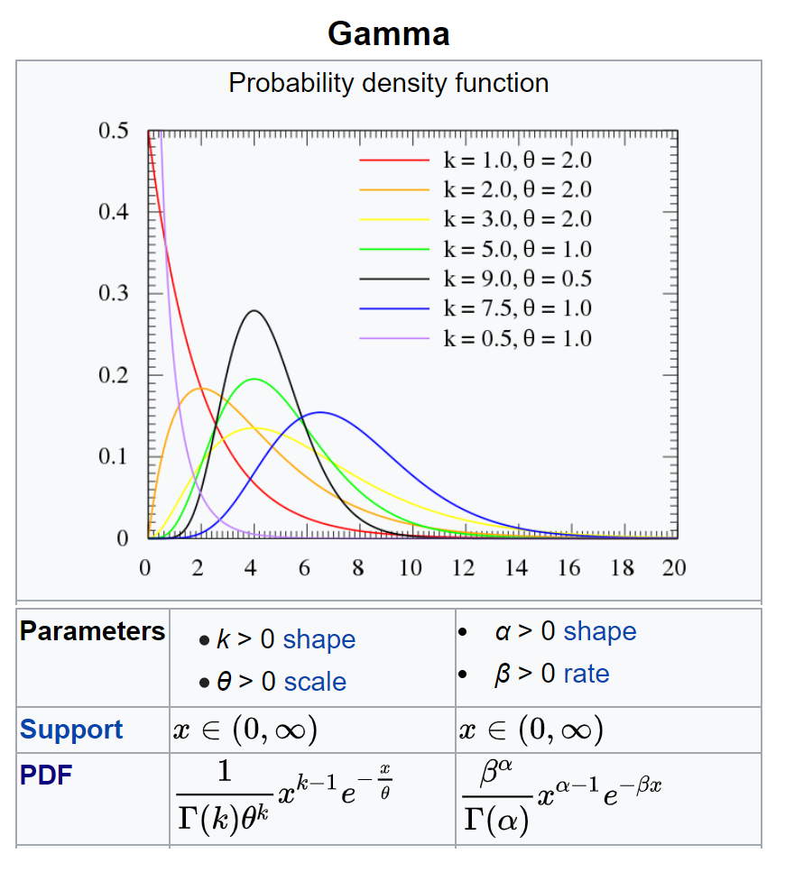

## Fact

**Why did we invent Gamma distribution?**
Answer: To predict the wait time until future events.
  Hmmm ok, but I thought that’s what the exponential distribution is for.
  Then, what’s the difference between exponential distribution and gamma distribution?
  The exponential distribution predicts the wait time until the *very first* event. The gamma distribution, on the other hand, predicts the wait time until the *k-th* event occurs.

-- [Aerin Kim, Gamma Distribution -- Intuition, Derivation, and Examples](https://towardsdatascience.com/gamma-distribution-intuition-derivation-and-examples-55f407423840)

Examples:  

  -   The time I wait to receive an interview might follow an exponential. Now, I am waiting not for my first interview offer but my third interview offer. How long must I wait? This waiting time can be described by a gamma.   
  -   I missed the first and second CTA train to go to the campus. Now, how long I am able to catch the third train?   
  
## Gamma function

  In the lecture series of Statistics 110, [Lecture 24: Gamma distribution and Poisson process | Statistics 110](https://www.youtube.com/watch?v=Qjeswpm0cWY&t=28s&ab_channel=HarvardUniversity), Prof. Joe Blitzstein had connected the $n!$ function to the Gamma function. Why?

Let's see the Gamma function

  The Gamma function $\Gamma$ is an extension of the factorial function, with its argument shifted down by 1, to real and complex numbers.

For positive integer $n$:
\[\Gamma(n) = (n-1)! = 1 \times 2 \times 3 \times ... \times (n-1)\]

One beautiful formula, Stirling formula to approximate the $n!$, actually an extremely good approximation:
\[ n! \approx \sqrt{2\pi n} \Big( \frac{n}{e}\Big)^n\]


```{r}
n <- c(1:6)
y <- vector(mode = "numeric", length = length(n))
y[1] <- 1
for(i in 2:length(n)) {
  y[i] = y[i-1] * i
}
dta <- as.data.frame(cbind(n,y))
library(ggplot2)
ggplot(dta, aes(n, y)) + 
  geom_point() +
  scale_x_discrete(limits=c("1","2","3","4","5","6")) +
  theme_bw()
```

  Then _how we connect the dots_. There are many ways to do it, but there's a philosophical way to do it by 
__Gamma function__, which is defined for all complex numbers except the non-positive integers by the integral:

\[\Gamma(t) = \int_0^{\infty} x^t e^{−x} \frac{dx}{x} \]  


## Definition

From the Gamma function, how we got the PDF of Gamma distribution. We would normalize the Gamma distribution, which means from:

\[ \Gamma(k) = \int_0^{\infty} x^{k} e^{−x} \frac{dx}{x} \]

to,  

\[ 1 = \int_0^{\infty} \frac{1}{\Gamma(k)} x^{k} e^{−x} \frac{dx}{x} \]

Then, $X = \frac{1}{\Gamma(k)} x^{k} e^{−x} \frac{1}{x}$ $\sim$ $Gamma(k, 1)$ which has `shape` of $k$ and `scale` of $1$.

__How we turn the `scale` of $1$ to a general `scale` of $\theta$?__

Imagine that $Y \sim \frac{X}{\theta}$ where $X \sim \ Gamma(k,1)$

$f_Y(y) = f_X(x) \frac{dx}{dy} = \frac{1}{\Gamma(k)} (\theta y)^{k} e^{−\theta y} \frac{1}{\theta y} \theta$ where $\frac{dx}{dy} = \theta$

Thus, $f(y) = \frac{1}{\Gamma(k) \theta^{k}} (y)^{k} e^{−\theta y} \frac{1}{y}$

## Parameters of Gamma: a shape with a scale or a rate

```{r model diagram, fig.align = 'center', out.width = "100%", fig.cap = "From https://en.wikipedia.org/wiki/Gamma_distribution"}
 
```

For ($\alpha$, $\beta$) parameterization: Using our notation $k$ (the # of events) & $\lambda$ (the rate of events), simply substitute $\alpha$ with $k$, $\beta$ with $\lambda$. The PDF stays the same format as what we’ve derived.    

For ($k$, $\theta$) parameterization: $\theta$ is __a reciprocal of the event rate $\lambda$__, which is __the mean wait time (the average time between event arrivals)__.

## Plots

```{r, include=FALSE}
library(ggplot2)
```

I plotted the gamma distribution with the `shape` of $k$, and constantly `rate` = $1$ 

```{r}
T <- seq(0,20,by=2.5)

df <- data.frame(T)
ggplot(data=df, aes(x=T))+
  stat_function(fun=dgamma, args=list(shape=1, rate=1), aes(colour = "k= 1")) + 
  stat_function(fun=dgamma, args=list(shape=5, rate=1), aes(colour = "k= 5")) +
  stat_function(fun=dgamma, args=list(shape=10, rate=1), aes(colour = "k=10")) +
  scale_y_continuous(limits=c(0,0.40)) +
  scale_colour_manual("", values = c("palegreen", "yellowgreen", "olivedrab")) + 
  ylab("Probability Density") +
  ggtitle("PDF of Gamma Distribution") + 
  theme_bw() + 
  theme(plot.title = element_text(hjust = 0.5))
```

I plotted the gamma distribution with the constantly shape of k = 10, and variant rate from 1 to 3.

```{r}
ggplot(data=df, aes(x=T))+
  stat_function(fun=dgamma, args=list(shape=10, rate=1), aes(colour = "r=1")) + 
  stat_function(fun=dgamma, args=list(shape=10, rate=2), aes(colour = "r=2")) +
  stat_function(fun=dgamma, args=list(shape=10, rate=3), aes(colour = "r=3")) +
  scale_y_continuous(limits=c(0,0.40)) +
  scale_colour_manual("", values = c("gold", "burlywood", "darkorange")) + 
  ylab("Probability Density") +
  ggtitle("PDF of Gamma Distribution (k=10)") + 
  theme_bw() + 
  theme(plot.title = element_text(hjust = 0.5))
```

