# Motivation

- While working on project Harmony at MRC-IHRP, my primary task is building an R package to build the tables and plots from alignment analysis designed for the multi-factor categorical case by extracting the Mplus output's information. Since I have a chance to expose myself to M*plus*, why don't I self-learn a new tool and share it on my blog?

  The M*plus* and I see that a change to dive into Social Psychology Research. What on earth? The same concepts with statistics but a whole new world of terminology!!!

  - These can separate into five parts (equivalent to 5 days, then I divided into five topics) of taking notes on Structural Equation and Multilevel Modeling in the M*plus* workshop of [Prof. Michael Zyphur](https://findanexpert.unimelb.edu.au/profile/238494-michael-zyphur).
  
  - Here's a first part (1) of the so-called 'A Crash Course on Social Psychology Research.'


# Course outline  

[Structural Equation and Multilevel Modeling in Mplus](https://fbe.unimelb.edu.au/mplus)

- Day 1 - Introducing Mplus  
  * [Regression, Covariation, and Statistical Models](https://www.youtube.com/watch?v=PBY_lYlw3Yc&t=1s&ab_channel=MichaelZyphurMichaelZyphur)  
  * [Mplus and Parameter Estimation](https://www.youtube.com/watch?v=4Rz4sbfBZDg&ab_channel=MichaelZyphur)  
  * [Path Analysis](https://www.youtube.com/watch?v=mb1t9ZSdlaE&ab_channel=MichaelZyphur)  
  * [Model Fit and Model Selection](https://www.youtube.com/watch?v=BREP9HTZIqI&ab_channel=MichaelZyphur)  

- Day 2 - Path Analysis  
  * Mediation  
  * Instrumental Variable Methods  
  * Moderation  
  * Moderated Mediation  

- Day 3 - SEM  
  * Latent Variables  
  * Confirmatory Factor Analysis  
  * Structural Equation Modeling  
  * Model Identification  

- Day 4 - MLM  
  * Multilevel Data and Regression  
  * Multilevel Path Analysis  
  * Multilevel Confirmatory Factor Analysis and Structural Equation Modeling  
  * Random Slopes  

- Day 5 - LGM  
  * Longitudinal Data and Processes  
  * Latent Growth Models as Multilevel Models  
  * Latent Growth Models as Structural Equation Models  
  * Dynamic Latent Growth Modeling  

 
The material can be downloaded [here](https://melbourne.figshare.com/articles/media/Mplus_Workshop_at_The_University_of_Melbourne_February_4-8_2019_5_Days_/7797620)  

~~~
Reminder:
  - Path analysis: regression for observed variables  
  - CFA: regression from latent --> observed variables  
  - SEM: regression among latent variables  
  - Multilevel models: regression at multiple 'levels'  
  - Letant growth: model change with latent variables  
~~~

# Part 1: Means, (Co)Variances, Regression  

## Distributions Imply Rules

- Parameters depend on the distributions we model  
- Assuming a normal distribution for y, we have:  
  * Mean $\mu_y$: a location parameter  
  * Variance $\sigma^2_y$ : a scale parameter  

```{r, include=F}
library(ggplot2)
```

```{r}
p <- seq(-5,5,by=0.1)

df <- data.frame(p)
ggplot(data=df, aes(x=p))+
  stat_function(fun=dnorm, args=list(mean=0, sd=sqrt(.2)), aes(colour = "mu=0,sigma2=.2")) + 
  stat_function(fun=dnorm, args=list(mean=0, sd=sqrt(1.0)), aes(colour = "mu=0,sigma2=1.0")) +
  stat_function(fun=dnorm, args=list(mean=0, sd=sqrt(5.0)), aes(colour = "mu=0,sigma2=5.0")) +
  stat_function(fun=dnorm, args=list(mean=-2, sd=sqrt(2.0)), aes(colour = "mu=-2,sigma2=2")) +
  scale_y_continuous(limits=c(0,1.0)) +
  scale_colour_manual("", values = c("palegreen", "orange", "olivedrab", "blue")) + 
  ylab("Density") +
  ggtitle("PDF of Normal Distribution") + 
  theme_bw() + 
  theme(plot.title = element_text(hjust = 0.5))
```

## A variance $\sigma^2$  

- Tells us the spread of scores along a variable  
- To estimate a variance, we assume variation is ‘random’ or due to ‘chance’  
- This allows using distributions & their rules  
- Either way, a variable varies (by definition)  
  * To model a variable y, we model its variation  
  * To speak of a variable is to speak of variance!  

## Graphical

- We’ll show models with diagrams  
  * Squares and rectangles are observed variables  
  * Variance is double-headed arrow on one variable  
  * For concision, we will be selective about what we diagram  

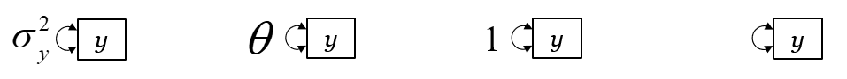

- To refer to y’s variance in Mplus, we will write “y”

## Multivariate Parameters  
- For multiple variables x and y:  
  * Multivartiate mean vector $\mu$ for x and y  
  * Covariance $\Sigma$ as matrix of 2 variances and a covariance  

```{r, eval=FALSE}
#generate the data
gibbs<-function (n, rho) {
    mat <- matrix(ncol = 2, nrow = n)
    x <- 0
    y <- 0
    mat[1, ] <- c(x, y)
    for (i in 2:n) {
        x <- rnorm(1, rho * y, (1 - rho^2))
        y <- rnorm(1, rho * x, (1 - rho^2))
        mat[i, ] <- c(x, y)
    }
    mat
}
bvn <- gibbs(10000, 0.98)

#setup
library(rgl) # plot3d, quads3d, lines3d, grid3d, par3d, axes3d, box3d, mtext3d
library(car) # dataEllipse

#process the data
hx <- hist(bvn[,2], plot=FALSE)
hxs <- hx$density / sum(hx$density)
hy <- hist(bvn[,1], plot=FALSE)
hys <- hy$density / sum(hy$density)

## [xy]max: so that there's no overlap in the adjoining corner
xmax <- tail(hx$breaks, n=1) + diff(tail(hx$breaks, n=2))
ymax <- tail(hy$breaks, n=1) + diff(tail(hy$breaks, n=2))
zmax <- max(hxs, hys)

#Basic scatterplot on the floor
## the base scatterplot
plot3d(bvn[,2], bvn[,1], 0, zlim=c(0, zmax), pch='.',
       xlab='X', ylab='Y', zlab='', axes=FALSE)
par3d(scale=c(1,1,3))

#Histograms on the back walls
## manually create each histogram
for (ii in seq_along(hx$counts)) {
    quads3d(hx$breaks[ii]*c(.9,.9,.1,.1) + hx$breaks[ii+1]*c(.1,.1,.9,.9),
            rep(ymax, 4),
            hxs[ii]*c(0,1,1,0), color='gray80')
}
for (ii in seq_along(hy$counts)) {
    quads3d(rep(xmax, 4),
            hy$breaks[ii]*c(.9,.9,.1,.1) + hy$breaks[ii+1]*c(.1,.1,.9,.9),
            hys[ii]*c(0,1,1,0), color='gray80')
}

#Summary Lines
## I use these to ensure the lines are plotted "in front of" the
## respective dot/hist
bb <- par3d('bbox')
inset <- 0.02 # percent off of the floor/wall for lines
x1 <- bb[1] + (1-inset)*diff(bb[1:2])
y1 <- bb[3] + (1-inset)*diff(bb[3:4])
z1 <- bb[5] + inset*diff(bb[5:6])

## even with draw=FALSE, dataEllipse still pops up a dev, so I create
## a dummy dev and destroy it ... better way to do this?
###dev.new()
de <- dataEllipse(bvn[,1], bvn[,2], draw=FALSE, levels=0.95)
###dev.off()

## the ellipse
lines3d(de[,2], de[,1], z1, color='green', lwd=3)

## the two density curves, probability-style
denx <- density(bvn[,2])
lines3d(denx$x, rep(y1, length(denx$x)), denx$y / sum(hx$density), col='red', lwd=3)
deny <- density(bvn[,1])
lines3d(rep(x1, length(deny$x)), deny$x, deny$y / sum(hy$density), col='blue', lwd=3)

#Beautifications
grid3d(c('x+', 'y+', 'z-'), n=10)
box3d()
axes3d(edges=c('x-', 'y-', 'z+'))
outset <- 1.2 # place text outside of bbox *this* percentage
mtext3d('P(X)', edge='x+', pos=c(0, ymax, outset * zmax))
mtext3d('P(Y)', edge='y+', pos=c(xmax, 0, outset * zmax))
```


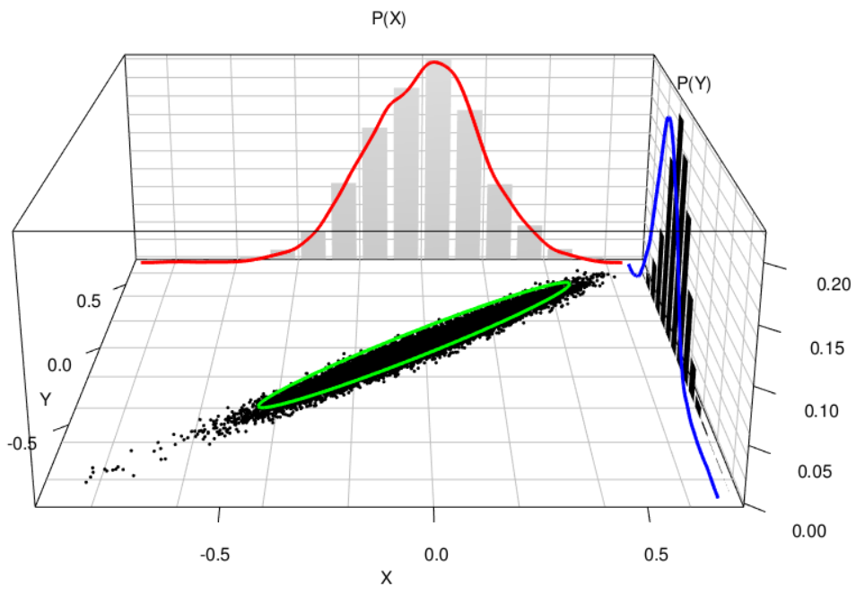

## Covariance $\sigma_{xy}$

- Tells us how two variables ‘hang together’  
  * Correlation is just a standardized covariance  

- If we assume variation is random …  
  * Covariance implies a non-causal relationship  
  * No predictor or outcome, x and y simply co-vary  
    + Blue eyes & blond hair?  

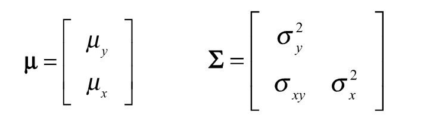

- In Mplus we will write “y **with** x” or “x **with** y”
If the relationship is non-causal, does it matter?

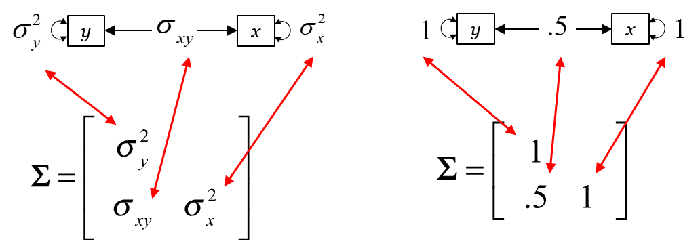

## A Linear Regression Model

- What is the rule $\beta$ ? Our linear model

\[ y_i = \nu + \beta x_i + \epsilon_i \]

- $y$ and $x$  are variables
- $\epsilon$  is a variable: unobserved residual/error
- $\nu$ and $\beta$ are constants/fixed that we estimate  

## In Terms of Distributions?

- y is decomposed into parts  
- How is the mean of $y$ modeled?  
      \[ \nu = \mu_y — \beta \mu_x \]
- How is $y$,$x$ covariance modeled? 
      \[ \beta = \frac{\sigma_{xy}}{\sigma^2_x} \]      
- How is the variance of $y$ modeled?
      \[  \sigma^2_y =  \sigma^2_y R^2 + \sigma^2_{\epsilon} \]

## Why Regression? Causality

- Causal statements are helpful for action

- Conditions for  $x \rightarrow y$  causality
  * $x$ precedes $y$ in time
  * $x$ and $y$ are related
  * $x \rightarrow y$ effect isn’t due to a third variable z

Regression assesses the second, and helps with the third

## Controlling for variables

- Removing the effect of  $z$  in $x \rightarrow y$ effect is  
  * Controlling for $z$  
  * Holding $z$ constant (it no longer varies)  
  * The ‘independent effect’ of $x$ on $y$  
  * We ‘partial out’ the effect of $z$  

- These all mean the same thing:  
  We somehow make  $z$  irrelevant for $x \rightarrow y$  


- Allows estimating independent effects

\[ y_i = \nu + \beta_1 x_i + \beta_2 z_i+ \epsilon_i \]

- Effects are independent and additive
- Read it left to right: $y$ depends **ON** $x$  $z$
- In Mplus simply write “**y ON x z**” 
- Does it matter if “**y ON x z**” or “**y ON z x**” ? 
- Each $\beta$  is just a slope, and $\nu$ is intercept on y-axis

## With Path Diagrams

- Regression effects & residual as single-headed arrows  

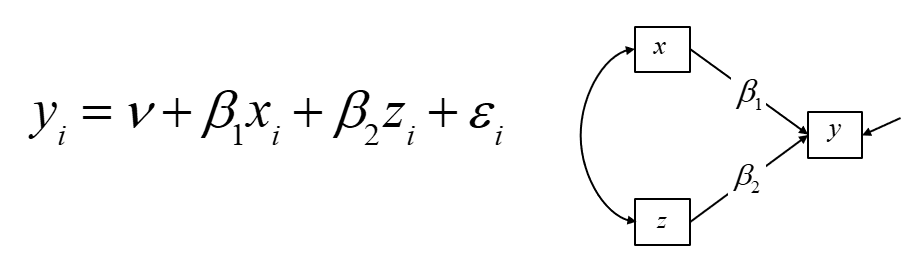

- Residual indicated as single-headed arrow w/out predictor  
- Regress “y ON x z” reads the equation left-to-right  
- Note: Predictors correlated by default in regression  
  * The whole point is that the predictors are correlated  

## Summary 

- We estimate rules/parameters to test theory    
  * Means, (co)variances, & causal effects  
- Mplus has a simply language for these  
  * Name of variable “**y**” refers to variance  
  * “**With**” refers to covariance  
  * “**On**” refers to a regression slope  
- We use multiple predictors to control for each (i.e., we estimate independent effects)  


# Part 2: M*plus* and Estimation  

M*plus* Team

- Bengt Muthen  
  * Former president of psychometrics society  
  * Ph.D. in stats (Utrecht)  
  * Adviser: Joreskög  
- Linda Muthen  
  * Ph.D. in education (UCLA)  
- Tihomir Asparouhov  
  * Ph.D. in stats (Cal Tech)  

- Statmodel.com has a message board!  
  * statmodel.com/discussion/messages/board-topics.html   
  
M*plus* Overview

- Solves for unknowns in regression equations:   
  * All observed/manifest variables  
    + Path Analysis and traditional regression  

- Continuous latent variables   
  * SEM (latent variables are factors)  
  * Multilevel/random effects/hierarchical linear models  
  * Survival and other analyses with latent frailties/liabilities  

- Discrete latent variables (i.e., categorical)    
  * Latent profile analysis: continuous observed variables  
  * Latent class (cluster) analysis: discrete observed variables  
  * Various forms of finite mixture models (LTA/Markov)  

M*plus* Features

- Observed variables  
  * Continuous: normal, skew-normal, t-distributed, skew-t, censored  
  * Categorical & Count: ordered, nominal, zero-inflated  
- Linking functions: Identity, logit, probit  
- Estimators  
  * ULS, WLS, GLS, ML, MLR, MLF, BAYES, etc…   
- Simulation with Monte Carlo & Bootstrap  
- Read the manual -- many examples!  

M*plus* Caveat  

- Input is done by hand  
  * There is a diagrammer, but we want a stick shift!  
- Very little input is needed  
  * This means many default options are used  
- Each part of Mplus input has defaults  
  * Check the manual, read model descriptions, look at output & parameter matrices ($TECH_1$ option)
  
Example

```
Title: 
    Start input section with the heading and a colon, then type specific commands/options and end each statement with a semi-colon;
    * To ignore a command line, start it with an asteriks
Data: 
    File is data.dat;
Variable: 
    Names are employ salary education height weight;
    Usevariables are employ salary height education;
Analysis:
    Estimator = ML;
Model:
    Employ salary education on height;
Output:
    Standardized;
```
[Input Command Headings](https://www.statmodel.com/html_ug.shtml)

- Title: [Ch. 15](https://www.statmodel.com/HTML_UG/chapter15v8.htm)
- Data: [Ch. 15](https://www.statmodel.com/HTML_UG/chapter15v8.htm)
- Variable: [Ch. 15](https://www.statmodel.com/HTML_UG/chapter15v8.htm)
- Define: [Ch. 15](https://www.statmodel.com/HTML_UG/chapter15v8.htm)
- Analysis: [Ch. 16](https://www.statmodel.com/HTML_UG/chapter16V8.htm)
- Model: [Ch. 17](https://www.statmodel.com/HTML_UG/chapter17V8.htm)  
  * Model Indirect, Model Constraint, Model Priors  
- Output: [Ch. 18](https://www.statmodel.com/HTML_UG/chapter18V8.htm)
- Savedata: [Ch. 18](https://www.statmodel.com/HTML_UG/chapter18V8.htm)
- Plot: [Ch. 18](https://www.statmodel.com/HTML_UG/chapter18V8.htm)
- MonteCarlo: [Ch. 19](https://www.statmodel.com/HTML_UG/chapter19V8.htm)

## Data
- Indicates location of datafile
  * Store in same folder as Mplus input file
- Indicates format of data
  * Individual data or summary data 
    + Correlations, SDs, means
  * Default is individual data
- Mplus requires numeric data only
  * Do not save data with variable names
  * For missing data I use -999
  * Can save from SPSS, Stata, Excel, etc…
  * Must be tab-delimited or CSV
    + Each variable is a column, separated by tabs or commas
    + Missing data are -999
    + Where are the variables names?
- Contains 
  * Mplus input files

`Individual example.inp`
    
```{r comment=''}
cat(readLines('Examples/Day 1, Session 2 (Mplus and Estimation)/Individual Example.inp'), sep = '\n')
```    

`Summary example.inp`
    
```{r comment=''}
cat(readLines('Examples/Day 1, Session 2 (Mplus and Estimation)/Summary Example.inp'), sep = '\n')
```    
    
  * Individual dataset   
  
`Individual.dat`

```{r comment=''}
cat(readLines('Examples/Day 1, Session 2 (Mplus and Estimation)/individual.dat', n = 20), sep = '\n')
```

  * Summary dataset
    + Summary.dat
    
```{r comment='', warning=FALSE}
cat(readLines('Examples/Day 1, Session 2 (Mplus and Estimation)/summary.dat'), sep = '\n')
```    

<aside>
Note: Great! We can get the parameter estimates from the data with means, 
standard deviations and correlation matrix besides the `individual data. 
Furthermore, we can simulate data from 'summary' information (using Monte Carlo methods).
</aside>

- Other options allowed (see [manual](https://www.statmodel.com/html_ug.shtml))

## Variable

- All info about our variables
  * Names are arbitrary, but the number of names must match the number of columns in data file
    + Names are y x1 x2;
  * Type of variable distribution
    + Continuous normal assumed, but you can say other
  * Which variables will we use?
    - `Usevariables are` y x1 x2;
  * Weighting variables
  * Many other options

## Define

- Creates new variables that can be used
  * You must list them with `Usevariables are`
- Logical & arithmetic operators & functions
- Conditional statements (to recode)
  * IF ___ then ___;
- Transformations of various kinds
  * Centering (grand-mean or group-mean)
  * Cluster_Mean, Sum, Mean, Cut
- Define:
  x1x2 = x1*x2;

## Analysis

- Options
  * Type = nature of model desired
    + `Type = General` is default
    + `Type = Twolevel` or `Threelevel` means multilevel
    + `Type = Random` implies random slopes
- Estimators, Algorithms
    + `Estimator = ML`, or `Estimator = Bayes`
- Bootstrapping
- Linking functions (logit or probit)
- Many options for ML and Bayes estimation

## Estimation and Inference   

**Frequentist**: Estimation uses data & model  

- Typical estimators, such as OLS or ML  
- Iterative process trying to find best parameter estimates  
  * Iteratively alters estimates to find the ‘most likely’ values  
  * This means probability of data is being maximized (i.e., ML)   
- Convergence achieved when estimates change very little   
- Mplus gives the estimates, _SE_, _p-values_, & _CIs_ upon request   
- But, even ‘most likely’ estimates may not be very likely  
  * Your model and its estimates may be the best of a bad lot!  
  * This is why we’ll look at fit statistics  

**Bayes**: Estimation uses data, model, & _prior prob_.  

- Default is ‘uninformative prior’, so results **# ML**  
- Iterative process that computes ‘posterior probabilities’  
  * It uses MCMC estimation in at least two separate ‘chains’  
  * The estimates produce a posterior distribution for each parameter  
- Convergence achieved when chains agree (*PSR < 1.05*)  
  * Median/mode of each distribution is like an ML estimate  
  * The SD is like the SE  
  * Gives Bayesian p-value and ‘credibility interval’  
- Again, bad models/estimates may agree across chains  


## Model

Model: __`ON`__ Command

- `ON` refers to a regression slope $\beta$  
  * y ON x;
    \[ y_i = \nu + \beta_1 x_i + \epsilon_i \]
    + Regress y on x
    + Reads the equation from left to right
- Think of “y ON x” as  $x \rightarrow y$
- Freely estimates a $\beta$ 
  * The single-headed arrow from nowhere is a residual

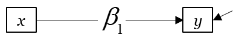

Model: __`WITH`__ Command  

- `WITH` refers to covariance $\Theta$  or  $\Psi$
  * y1 WITH y2;
    + Estimates covariance among y1 and y2
  * What if y1 and y2 are dependent variables?
    + Then we estimate a residual covariance

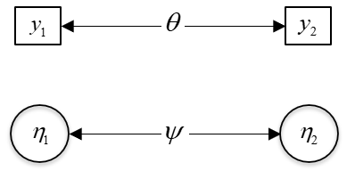

Model: __`BY`__ Command

- `BY` refers to factor loadings (slopes)
  * f1 BY y1 y2 y3; 
    + latent variable “f1” is indicated by y1, y2, y3
  * Huh BY y1 y2 y3 
    + latent variable is called “Huh”… name is irrelevant
  * Freely estimate $\lambda$ for each observed variable
    + Except first loading is fixed to 1.0 by default

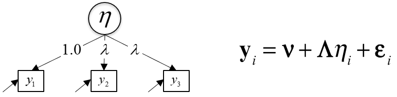

<span style="text-decoration:underline">__Model notation__</span>

- Typical SEM notation for vectors/matrices
  * $B$: matrix of regression coefficients, elements $\beta$
  * $\Lambda$: matrix of factor loadings, elements $\lambda$
  * $\eta$: vector of latents (factors/random effects)  
  * $\Psi$: matrix of latent (co)variances, elements ψ
  * $\Theta$: matrix of observed (co)variances, elements $\theta$
  * $\nu$: intercepts, $\alpha$ is latent intercepts or means

- All commands will tell Mplus to either:
  * Freely estimate an element in vector/matrix
    + This is what our Model commands do
  * Fix an element in vector/matrix to some value
  * Mplus defaults often do this for us

<span style="text-decoration:underline">__Mplus notation for freeing and fixing estimates__</span>

  `y ON x;`  
  * freely-estimated $\beta$  
	`y ON x@.5;`  
  * $\beta$ is NOT estimated, but fixed to .5  
	`[y@0];`    
  * an intercept for y1 constrained to 0.0  
	`f1 BY y*;`  
  * * = freely estimate, so estimates factor loading for y on factor “f1”  
	`f1 BY y1-y5@1;`  
  * factor loadings for “f1” = 1 for variables y1, y2, y3, y4, y5  

<span style="text-decoration:underline">__Labeling and constraining/fixing estimates__</span>  

- Labels are put in parentheses  
	`y ON x (b1);`  
  * Now, the slope is called “b1” and can be used later  
- If parameters have the same label, it’s like they’re the same thing  
	`y ON x z (b2);`  
  * Now x$\rightarrow$y and z$\rightarrow$y slopes are constrained to equality  
  * Mplus will estimate them but keep them equal  

<span style="text-decoration:underline">__Model Constraint__</span>

- Here we play with labeled parameters
  * Allows linear/non-linear model constraints
    + b1+b2=0;
  * Play with parameters labeled in Model command

- Too much creativity to describe, but:
  * Can create new “phantom” parameters
    + See manual for the “New” command
    + Check [example 5.21](https://www.statmodel.com/HTML_UG/chapter5V8.htm) 

```
TITLE:     this is an example of a two-group twin
           model for  continuous outcomes using parameter constraints

DATA:      FILE = ex5.21.dat;

VARIABLE:  NAMES = y1 y2 g;
           GROUPING = g(1 = mz 2 = dz);

MODEL:     [y1-y2]    (1);
           y1-y2      (var);
           y1 WITH y2 (covmz);

MODEL dz:  y1 WITH y2 (covdz);

MODEL CONSTRAINT:
           NEW(a c e h);
           var = a**2 + c**2 + e**2;
           covmz = a**2 + c**2;
           covdz = 0.5*a**2 + c**2;
           h = a**2/(a**2 + c**2 + e**2);
```

<span style="text-decoration:underline">__Model Priors__</span>

- For Bayes, we can specify prior probabilities  
- These are distributions…  
- Model:  
  `y2 ON y1 (b1);`  
- Model Priors:  
  `b1~N(.25, 1);`  

- We say “b1” is distributed as ($\sim$) normal ($N$) with mean and variance ($\mu, \sigma^2$) of .25 and 1  
- Mplus has defaults that are ‘diffuse priors’  
  * Eg, regression coefficients are  $\sim N(0,10^10)$  

<span style="text-decoration:underline">__Model Indirect__</span>

- Computes mediation effects to show  
  * “Decomposition” of total and indirect effects  
  * Use bootstrapping in Analysis command with ML to get bootstrapped indirect effects  
  * Bayesian estimation gives distribution of effects, so no bootstrapping required  

## Output, Savedata, Plot, Montecarlo

- Output
  * TECH, Standardized
- Savedata
  * Estimated data: factor scores, co(var) matrices
- Plot
  * Helpful for various models
- MonteCarlo
  * Data generation facility… allows parametric bootstrap
  * Makes running simulations a snap
    + Empirically-derived estimates of power
    + Can publish from this if you’re inclined

## Summary

Our job is to  

- Tell Mplus about data and estimation method   
- Specify a statistical model to reflect our theory  
- Use ML or Bayes to estimate parameters  
- Use results to make inferences  


# Part 3: Path Analysis

## History

- Developed by Sewell Wright in 1918 (1921)  
  * Geneticist modeling relations of family members  
  * Brother Philip borrows to create ‘simultaneous equations’ with IVs in 1928 (S&D of flaxseed)  

- Taken up in health, biological, and social sciences to model complex relationships
  * Subsumes simultaneous equation analysis

## Show case

### Structural Model Specification

- Specify causal model of interest
  * Grandey & Cropanzano (1999). The conservation of resources model applied to work–family conflict and strain. Journal of Vocational Behavior, 54, 350-370.

- Causal effects (regression)
  * Work role stress $\rightarrow$ Job distress
  * Work role stress $\rightarrow$ Work-family conflict
  * Work-family conflict $\rightarrow$ Job distress
  * Job distress $\rightarrow$ Turnover intentions
  * Job distress $\rightarrow$ Life distress

- Stochastic, non-causal relationships
  * Turnover intentions$\leftrightarrow$Life distress

### Model diagram

```{r, include=FALSE}
library(DiagrammeR)
```

```{r}
grViz("
digraph causal{

  # a 'graph' statement
  graph [overlap = true, fontsize = 10]

  # several 'node' statements
  node  [shape = box,
         fontname = Helvetica]
WRS [label = 'Work Role Stress (WRS)']
WFC [label = 'Work Family Conflict (WFC)']
JD [label = 'Job Distress (JD)']
TI [label = 'Turnover Intentions (TI)']
LD [label = 'Life Distress (LD)']

# Edges
edge[color=black, arrowhead=vee]
WRS->WFC [label=<&beta;<SUB>1</SUB>>]
WRS->TI [label=<&#946;<SUB>2</SUB>>]
WRS->JD [label=<&#946;<SUB>3</SUB>>]
WFC->JD [label=<&#946;<SUB>4</SUB>>]
WFC->LD [label=<&#946;<SUB>5</SUB>>]
JD->TI [label=<&#946;<SUB>6</SUB>>]
JD->LD [label=<&#946;<SUB>7</SUB>>]
TI->LD[dir=both, label=<&psi;>]
d1->WFC
d1 [shape=plaintext,label='']
d2->JD
d2 [shape=plaintext,label='']
d3->TI
d3 [shape=plaintext,label='']
d4->LD
d4 [shape=plaintext,label='']

{rank = same; WRS; WFC}
{rank = same; TI; LD}
}")
```

<span style="text-decoration:underline">__Variable:__</span>

  - Names are WRS FRS WFC FWC JD FD LD TI PPH SE;  
  - Usevariables are WRS TI WFC JD LD;  

<span style="text-decoration:underline">__Model:__</span>  

TI on JD WRS;  
LD on JD WFC;   
JD on WRS WFC;  
WFC on WRS;  

OR 

TI LD on JD;  
JD on WRS WFC;  
TI WFC on WRS; LD on WFC;  

<aside>
Note: for 2 dependent variables which are not predicting anything else, just the outcomes. Mplus will automatically covariance for us. If not estimate the residual covariance would only hurt the model fit. In other words, if there is a residual covariance there and we do not estimat them, it would drive the model fit down.
</aside>

<span style="text-decoration:underline">__Code in Mplus:__</span>

```{r comment=''}
cat(readLines('Examples/Day 1, Session 3 (Path Analysis)/Grandey & Cropanzano 1999_Hai.inp'), sep = '\n')
``` 

<aside>
Note: here's again we use the 'summary' data from the article instead of 'individual' data (don't have it!!!)
</aside>

<span style="text-decoration:underline">__Mplus output__</span>

```{r comment=''}
cat(readLines('Examples/Day 1, Session 3 (Path Analysis)/Grandey & Cropanzano 1999_Hai.out'), sep = '\n')
```

<span style="text-decoration:underline">__What’s $R^2$ for our variables?__</span>

  - (1 – standardized residual variance)
  - Can also just look at bottom of output

### Report

```{r}
grViz("
digraph causal{

  # a 'graph' statement
  graph [overlap = true, fontsize = 10]

  # several 'node' statements
  node  [shape = box,
         fontname = Helvetica]
WRS [label = 'Work Role Stress (WRS)']
WFC [label = 'Work Family Conflict (WFC)']
JD [label = 'Job Distress (JD)']
TI [label = 'Turnover Intentions (TI)']
LD [label = 'Life Distress (LD)']

# Edges
edge[color=black, arrowhead=vee]
WRS->WFC [label=<&beta;<SUB>1</SUB>=.63/.49**>]
WRS->TI [label=<&#946;<SUB>2</SUB>=.09/.08>]
WRS->JD [label=<&#946;<SUB>3</SUB>=.38/0.38**>]
WFC->JD [label=<&#946;<SUB>4</SUB>=.30/.38**>]
WFC->LD [label=<&#946;<SUB>5</SUB>=.19/.22**>]
JD->TI [label=<&#946;<SUB>6</SUB>=.54/.44**>]
JD->LD [label=<&#946;<SUB>7</SUB>=.68/.63**>]
TI->LD[dir=both, label=<&psi;=-.006/-.013>]
d1->WFC
d1 [shape=plaintext,label='']
d2->JD
d2 [shape=plaintext,label='']
d3->TI
d3 [shape=plaintext,label='']
d4->LD
d4 [shape=plaintext,label='']

{rank = same; WRS; WFC}
{rank = same; TI; LD}
}")
```
<span style="text-decoration:underline">For example: $\beta_7$ = .68/.63**</span>, i.e. unstandardized/standardized both Y and X estimates and significance of p-value


## What Does This Mean? How to Specify It?

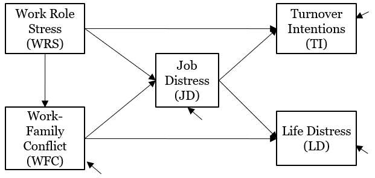

```{r comment=''}
cat(readLines('Examples/Day 1, Session 3 (Path Analysis)/Grandey & Cropanzano 1999 (no covariance).inp'), sep = '\n')
```


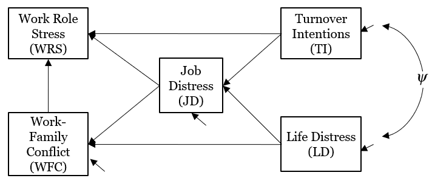

```{r comment=''}
cat(readLines('Examples/Day 1, Session 3 (Path Analysis)/Grandey & Cropanzano 1999 (new model1).inp'), sep = '\n')
```


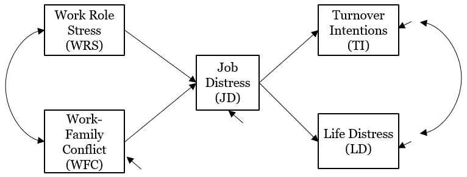

```{r comment=''}
cat(readLines('Examples/Day 1, Session 3 (Path Analysis)/Grandey & Cropanzano 1999 (new model2).inp'), sep = '\n')
```

## Summary

- Path models specify regression/covariation among observed variables  
- Regression represents causality `ON`  
  * So reduces magnitude of DV’s variance  
- Covariation simply indicates `WITH`   
  * So does not account for variance (there is no IV/DV)  
- We can draw and specify any diagram  
- Mplus then gives us parameter estimates  


# Part 4: Model Fit, Selection, Modification, & Equivalence

## Model fit

- Lots of literature & many indices for ML estimator  
  * Issue of Personality & Individual Differences (2007), lead by Barrett  
  * Many cite Hu & Bentler (1999)  
- Absolute fit  
  * How well does our model explain our observed data?  
- Relative/Incremental/Comparative fit  
  * Compares fit of different models using same dataset  
- Information Criteria  
  * Measure info entropy, or info lost when using an estimated model rather than the data  
- Bayesians have less work on the topic …  

- In statistics programs we get fit from:
  * Analysis/Estimated model ($H_0$ in Mplus output)
    + Model we specify and estimate
  * Baseline/Independence/Null model
    + Worst fitting model (or at least all covariances = 0)
  * Unrestricted/Saturated ($H_1$ in Mplus output)
    + Best fitting model (all parameters freely estimated)

- For comparing models that we estimate:
  * Null model ($H_0$): more-constrained model
    + Fewer parameters estimated, so more parsimonious
  * Alternate model ($H_1$): less-constrained model

## ML Estimator

- Information we have vs. what’s estimated  
  * How many parameters implied by our data?  
    + k  means, k variances, and k$\times$(k-1)/2  covariances  
  * How many parameters are estimated?  
    + Intercepts, (residual) variances, slopes/covariances  
- The difference is our degrees of freedom (df)  

- What about data/model fit ?  
    + For ML, we have model log Likelihood (LL)  
      * It turns out, -2$\times$LL is $\chi^2$ distributed  
      * The difference between two $\chi^2$ values is $\chi^2$ distributed  


## Model Build

|Analysis/Estimated model ($H_0$)   | Unrestricted/Saturated/Alternate model ($H_1$) |
|-----------------------------------|------------------------------------------------|
|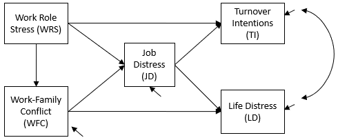                   | 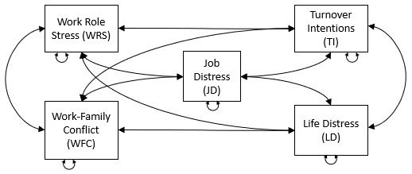                               |
|Model:</br>TI on JD WRS;</br>LD on JD WFC;</br>JD on WRS WFC;</br>WFC on WRS;|Model:</br>JD LD TI WRS WFC with JD LD TI WRS WFC;|

| Baseline/Null Model   |
|-----------------------|
|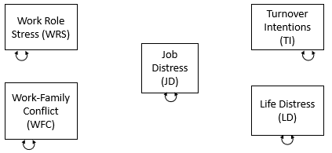       |
|Model:                 |


## Model Diagnostics

<aside>
Contrasting Models

- Chi-square testing of nested models
- Can use change in relative fit indices
- Non-nested model comparisons possible with AIC/BIC
</aside>


### Absolute Fit: A Models’ $\chi^2$

- Unrestricted vs Analysis model gives us $\chi^2$
  * $df$  is difference in estimated model & unrestricted
- If our model is good, the difference should be small
- Conducting NHST with the $\chi^2$
  * What’s the null vs. alternate hypothesis?
- Issues
  * Sensitive to sample size
  * Rarely taken seriously… unless it’s non-significant!
  * We want to “accept the null” ???

- If you want to look good on a relative basis… ??


<span style="text-decoration:underline">__Using $\chi^2$ to Compare Estimated Models__</span>

- Get $\chi^2$ and $df$ for different estimated models
- Subtract $\chi^2$  and subtract $df$, use diff. for NHST: $\Delta \chi^2$ or $-2\times LL$
  * Recall the null is model with fewer parameters
- Model must be nested: null must be subset of alt.


### Absolute Fit: SRMR

- Standardized Root Mean Square Residual
- Standardized difference between observed and model-implied data
  * Residual in this case is the difference
- Less than .05 is good, Hu & Bentler say that .08 isn’t too bad…

### Absolute Fit: RMSEA

- Root mean squared error of approximation
  * Like an adjusted root mean square standardized residual
- Takes model parsimony into account
  * Penalized for estimating too many parameters
  * Puts a positive value on df

\[ \frac{\sqrt{\chi^2_{Estimated} - df_{Estimated}}}{\sqrt{df\times (N-1)}}\]

- Less than .06 or .07 good (CI usually given)
  * Steiger (2007), Understanding the limitations of global fit…

### Relative Fit: CFI

- Comparative Fit Index
  * Compares $\chi^2$ of estimated model to $\chi^2$ of baseline
  * Adjusts for $df$ to reward parsimony

\[ \frac{\sqrt{(\chi^2_{Baseline} - df_{Baseline}) - (\chi^2_{Estimated} - df_{Estimated})}}{\sqrt{\chi^2_{Baseline} - df_{Baseline}}}\]


- .95 or higher generally accepted as cut-off


### Relative Fit: TLI/NNFI

- Tucker-Lewis Index/Non-Normed Fit Index  
- Similar to CFI but different penalization  

\[ \frac{\chi^2_{Baseline}/df_{Baseline} - \chi^2_{Estimated}/df_{Estimated}}{\chi^2_{Baseline}/ df_{Baseline} - 1}\]


- Will always be smaller than CFI  
  * To some decimal place  
- .95 often thought of as cut-off  

### Information Criteria: AIC

- Akaikes Information Criterion  
- k is number of estimated parameter  
- A weighting of accuracy versus model complexity  
- Only useful for comparing two estimated models  
- Lower values are better  

\[ \chi^2_{Estimated} + k\times (k-1) - 2\times df_{Estimated} \]

### Information Criteria: BIC

- Bayesian Information Criterion & Adjusted BIC  
- Similar to AIC, except weights for sample size  
- Only useful for comparing two estimated models  
- Smaller values are better---BIC, then aBIC here:  

\[ \chi^2_{Estimated} + ln(N)\times k\times (k-1)/2 - df_{Estimated} \]

\[ \chi^2_{Estimated} + ln((N+2)/24)\times k\times (k-1)/2 - df_{Estimated} \]

For both AIC and BIC, no significance tests… see recommendations in interpreting differences  

<aside>
These are all Global Measures  

- They collapse across all model parts  
- Some authors call for separate fit measures  
- Whatever… fit is necessary but insufficient  
  * The model must make theoretical sense  
</aside>


## Modification Indices

- `MODINDICES` command in Mplus
- Indicate change in model fit by estimating additional parameters
- Heated debates here
  * For frequentists this capitalizes on chance
  * Can lead to nonsensical models, bias/variance tradeoff
- Useful for understanding sources of misfit
- Let’s try it with our path model…

```{r comment=''}
cat(readLines('Examples/Day 1, Session 4 (Model Fit)/Grandey & Cropanzano 1999 (ML) modindices.inp'), sep = '\n')
```

## Bayesian Estimates of Fit

- Not as well developed
  * Bayes was unpopular for much of $20^{th}$ Century
- Less obvious how to proceed 
  * The idea of sampling from a population not formalized in the same way (so no $\chi^2$)
- Mplus offers a few that are useful…


```{r comment=''}
cat(readLines('Examples/Day 1, Session 4 (Model Fit)/Grandey & Cropanzano 1999 (Bayes).inp'), sep = '\n')
```

### Posterior Predictive Checking

- Steps required during model estimation
  * 1) Sample parameters from posteriors
  * 2) Generate data with parameters
  * 3) Estimate fit of generated vs. observed data
- If model is good, generated data should fit better/worse about half the time
- Get Predictive Posterior p-value (PPP)
  * How often the generated data fit better
  * PPP < .05 bad, PPP ≈ .50 good, PPP > .95 weird

### Deviance Information Criterion

- Like other information criteria  
- Penalizes for model complexity, rewards fit  
- Smaller values = less deviance (i.e., better fit)  
- Can compare models with different priors  

## Model Selection

- How do we choose the models we publish?
- Selecting models
  * Can build them based on scripted steps9,10
  * Give your model of interest a shot and look at fit
  * If that doesn’t work, try different theory-driven models
  * Look at sources of misfit and sort out what’s going on

- Is this an ethical issue?
  * Scientific models are serious things
  * People/groups use results for their own purposes
  * When considering which model to estimate, consider the social & political implications

# Further Readings

## Part 1

Grace, J. B., & Bollen, K. A. (2005). Interpreting the results from multiple regression and structural equation models. Bulletin of the Ecological Society of America, 86, 283-295.  

Cohen, Cohen, West, & Aiken (2003). Applied Multiple Regression/Correlation Analysis for the Behavioral Sciences (3rd). Lawrence Erlbaum & Associates.  

Myers, Well, & Lorch (2010). Research Design and Statistical Analysis (3rd). Routledge Academic.  

Tabachnick & Fidell (2006). Using Multivariate Statistics (5th). Allyn & Bacon.  

Fisher, R. A. (1922). On the mathematical foundations of theoretical statistics. Philosophical Transactions of the Royal Society of London, Series A 222, 309–368.  

## Part 2

[Mplus User's Guide and Diagrammer Documentation](https://www.statmodel.com/ugexcerpts.shtml) 

## Part 3

Streiner, D. L. 2005. Finding Our Way: An Introduction to Path Analysis. Canadian Journal of Psychiatry, 50, 115-122.

Wright, S. (1921). Correlation and causation. J. Agricultural Research 20: 557–585.

Wright, S. (1934). The method of path coefficients. Annals of Mathematical Statistics 5: 161–215.

Angrist, J. D., & Krueger, A. B. (2001). Instrumental variables and the search for identification: From supply and demand to natural experiments. Journal of Economics Perspectives, 15: 69-85.

Muthén, B. (2002). Beyond SEM: General latent variable modeling. Behaviormetrika, 29, 81-117.


## Part 4

Hu & Bentler (1999). Cutoff criteria for fit indexes in covariance structure analysis: Conventional criteria versus new alternatives, Structural Equation Modeling, 6(1), 1-55.

Personality and Individual Differences, Volume 42, Issue 5. 2007. 

Neyman, J., & Pearson, E. S. 1933. On the problem of the most efficient tests of statistical hypotheses. Philosophical Transactions of the Royal Society, A, 231, 289-337.

Raftery, A. E. (1995). Bayesian model selection in social research. Sociological Methodology, 25, 111-16

Kass, R. E., & Raftery, A. E. (1995). Bayes factors. Journal of the American Statistical Association, 90, 773-795.

McDonald, R. P. (2010). Structural models and the art of approximation. Perspectives on Psychological Science, 5, 675-686.

Cheung, G. W., & Rensvold, R. B. (1999). Testing factorial invariance across groups: a reconceptualization and proposed new method. Journal of Management, 25, 1–27.

Cheung, G. W., & Rensvold, R. B. (2002). Evaluating goodness-of-fit indexes for testing measurement invariance. Structural Equation Modeling, 9, 233–255.

Anderson, J. C., & Gerbing, D. W. (1988). Structural equation modeling in practice: A review and recommended two-step approach. Psychological Bulletin, 103, 411-423.

Mulaik, S. A., & Millsap, R. E. (2000). Doing the four-step right. Structural Equation Modeling, 7, 36-73. (see other papers in the same issue).

Shapin, S. 2008. The scientific life: A moral history of a late modern vocation. Chicago University Press.

Porter, T. M. 1995. Trust in Numbers: The Pursuit of Objectivity in Science and Public Life. 

Poovey, M. 1997. A History of the Modern Fact: Problems of Knowledge in the Sciences of Wealth and Society. Chicago.

McCloskey, D. N. 1992. If you’re so smart: The narrative of economic expertise. University of Chicago Press.

McCloskey, D. N. 1992. The Cult of Statistical Significance: How the Standard Error Costs Us Jobs, Justice, and Lives.

Asparouhov, T., Muthén, B. & Morin, A. J. S. 2015. Bayesian structural equation modeling with cross-loadings and residual covariances: Comments on Stromeyer et al. Journal of Management, 41, 1561-1577. 


