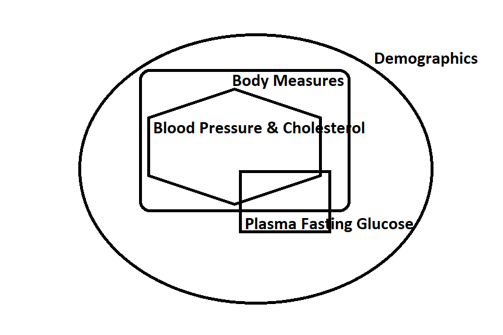
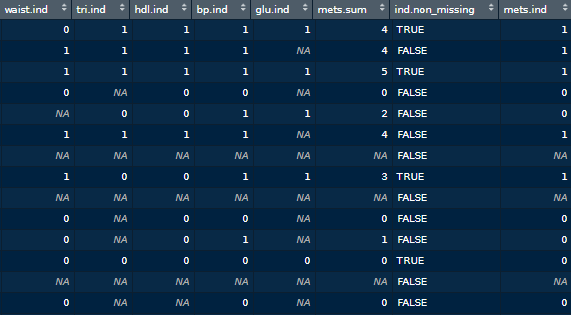
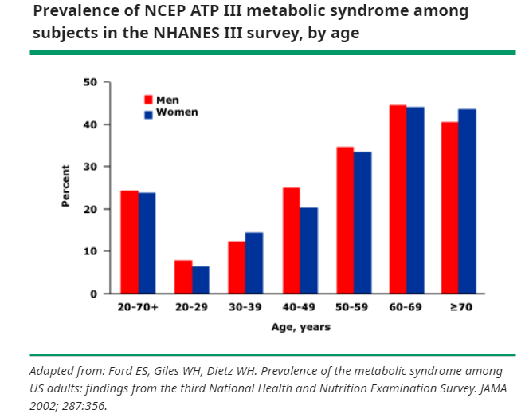

I need to use these packages:

- `tidyverse`: data management (tidyr, dplyr) and plots (ggplot2)  
- `foreign`: reading xport files  
- `survey`: for using survey weights # survey::svydesign, svymean, svyglm  

```{r setup, warning=FALSE, message=FALSE}
library(tidyverse)
library(foreign) 
library(survey) 
options(survey.lonely.psu='adjust')
library(kableExtra)
```

- Display Version Information

```{r}
#cat("R package versions:\n")
for (p in c("base", "survey","tidyverse")) { 
  cat(p, ": ", as.character(packageVersion(p)), "\n")
}
```

# NHANES Cycle 2013/2014

## Import data from NHANES cycle 2013/2014

Code for data import was adapted from [a NHANES tutorials example](https://wwwn.cdc.gov/nchs/data/tutorials/module3_examples_R.r).

- function to download the required survey cycles for a component file

```{r import function, eval=FALSE}
downloadNHANES <- function(fileprefix){
  print (fileprefix)
  outdf <- data.frame(NULL)
  for (j in 1:length(letters)){
    urlstring <- paste('https://wwwn.cdc.gov/nchs/nhanes/',yrs[j],'/',fileprefix,letters[j],'.XPT', sep='')
    download.file(urlstring, tf <- tempfile(), mode="wb")
    tmpframe <- foreign::read.xport(tf)
    outdf <- bind_rows(outdf, tmpframe)
  }
  return(outdf)
}
```

- Import NHANES cycle 2013/2014

```{r 2013/2014, eval=FALSE}
# Specify the survey cycles required, with corresponding file suffixes
yrs <- c('2013-2014')
letters <- c('_h')

# Download data for each component
# (1) Demographic (DEMO)
DEMO <- downloadNHANES('DEMO') # 10175
# (2) Blood Pressure & Cholesterol
BPQ <- downloadNHANES('BPQ') # 6464
# (3) Diabetes 
DIQ <- downloadNHANES('DIQ') # 9770
# (4) Blood Pressure
BPX <- downloadNHANES('BPX') # 9813
# (5) Body Measures
BMX <- downloadNHANES('BMX') # 9813
# (6) Cholesterol - High - Density Lipoprotein
HDL <- downloadNHANES('HDL') # 8291
# (7) Cholesterol - Low-Density Lipoproteins (LDL) & Triglycerides (TRIGLY_J)
TRIGLY <- downloadNHANES('TRIGLY') # 3329
# (8) Plasma Fasting Glucose (GLU_J)
GLU <- downloadNHANES('GLU') # 3329
```

- Merge all datasets, preserve all observations



```{r, eval=FALSE}
# Merging using "piping" 
nhanesdata.merged <- left_join(DEMO, BPQ, by="SEQN") %>% 
  left_join(DIQ, by="SEQN") %>% 
  left_join(BPX, by='SEQN') %>% 
  left_join(BMX, by='SEQN') %>%
  left_join(HDL, by='SEQN') %>%
  left_join(TRIGLY, by='SEQN') %>%
  left_join(GLU, by='SEQN') # 10175 obs
```

## Data Processing

- Select necessary variables  
- Create indicator for overall summary `one`  
- Create age categories for adults aged 18 and over: ages 18-39, 40-59, 60 and over  
- Re-code the levels of variables: gender, ethnicity/race, marital status, medication prescription due to 'refuse to answer' or 'don't know' (to missing)  

```{r, eval=FALSE}
nhanes.vbls <- nhanesdata.merged %>%
  select(SEQN, # Respondent sequence number
         RIDAGEYR, # Age in years at screening
         RIAGENDR, # Gender

         RIDRETH3, # Race/Hispanic origin w/ NH Asian
         DMDMARTL, # Marital status
         DMDEDUC2, # Education level - Adults 20+
         
         # Survey design variables
         SDMVPSU, # Masked variance pseudo-PSU
         SDMVSTRA, # Masked variance pseudo-stratum
         WTMEC2YR, # Full sample 2 year MEC exam weight
         WTINT2YR, # Full sample 2 year interview weight
         
         BPXSY1, # Systolic: Blood pres (1st rdg) mm Hg
         BPXDI1, # Diastolic: Blood pres (1st rdg) mm Hg
         BPXSY2, # Systolic: Blood pres (2nd rdg) mm Hg
         BPXDI2, # Diastolic: Blood pres (2nd rdg) mm Hg
         BPXSY3, # Systolic: Blood pres (3rd rdg) mm Hg
         BPXDI3, # Diastolic: Blood pres (3rd rdg) mm Hg
         BPXSY4, # Systolic: Blood pres (4th rdg) mm Hg
         BPXDI4, # Diastolic: Blood pres (4th rdg) mm Hg
         LBXGLU, # Fasting Glucose (mg/dL)
         LBDHDD, # Direct HDL-Cholesterol (mg/dL)
         LBXTR, # Triglyceride (mg/dL)
         BMXWAIST, # Waist Circumference (cm)
         
         BPQ090D, # Told to take prescription for cholesterol
         BPQ040A, # Taking prescription for hypertension
         DIQ070 # Take diabetic pills to lower blood sugar
         ) %>%
  mutate(# create indicator for overall summary
         one = 1,
         id = SEQN,
         psu = SDMVPSU, strata = SDMVSTRA, 
         persWeight = WTINT2YR, persWeightMEC= WTMEC2YR,
         age = RIDAGEYR,
         # Create age categories for adults aged 18 and over: ages 18-39, 40-59, 60 and over
        ageCat = cut(RIDAGEYR,
                    breaks = c(19, 29, 39, 49, 59, 69, Inf),
                    labels = c('20-29','30-39', '40-49', '50-59', '60-69', '70+')),
         female = factor(if_else(RIAGENDR == 1, 0, 1)), # 1:male ==> 0
         ethnicity = case_when(
           RIDRETH3 %in% c(1,2) ~ 0, # Hispanic
           RIDRETH3 == 3 ~ 1, # Non-Hispanic White
           RIDRETH3 == 4 ~ 2, # Non-Hispanic Black
           RIDRETH3 == 6 ~ 3, # Non-Hispanic Asian
           RIDRETH3 == 7 ~ 4, # Multi-Racial
         is.na(RIDRETH3) ~ NA_real_
         ),
         chol.prsn = case_when(
           BPQ090D == 2 ~ 0, # No
           BPQ090D == 1 ~ 1, # Yes
           BPQ090D %in% c(7,9) ~ NA_real_
         ),
         bp.prsn = case_when(
           BPQ040A == 2 ~ 0, # No
           BPQ040A == 1 ~ 1, # Yes
           BPQ040A %in% c(7,9) ~ NA_real_
         ),
         glu.prsn = case_when(
           DIQ070 == 2 ~ 0, # No
           DIQ070 == 1 ~ 1, # Yes
           DIQ070 %in% c(7,9) ~ NA_real_
         ),
         dia = rowMeans(.[, c("BPXDI1","BPXDI2","BPXDI3","BPXDI4")], na.rm = TRUE),
         sys = rowMeans(.[, c("BPXSY1","BPXSY2","BPXSY3","BPXSY4")], na.rm = TRUE),
         glu = LBXGLU,
         hdl = LBDHDD,
         tri = LBXTR,
         waist = BMXWAIST
        ) %>%
  select(one, id, psu, strata, persWeight, persWeightMEC, age, ageCat, female, ethnicity, sys, dia, glu, hdl, tri, waist, bp.prsn, chol.prsn, glu.prsn) # 10175
```


## Define metabolic syndrome

According to @RN795, the presence of any 3 of 5 risk factors constitutes a diagnosis of metabolic syndrome: 

1)	elevated waist circumference (≥88 cm for women and ≥102 cm for men),  
2)	elevated triglycerides (≥150 mg/dL) or drug treatment for elevated triglycerides *(there was no variable indicating the medication for lower triglycerides)*,  
3)	low HDL cholesterol (<40 mg/dL for men and <50 mg/dL for women) or drug treatment for low HDL cholesterol,  
4)	elevated blood pressure (systolic ≥130 mm Hg, or diastolic ≥85 mm Hg, or both) or antihypertensive drug treatment for a history of hypertension, and 
5)	elevated fasting glucose (≥100 mg/dL) or drug treatment for elevated glucose.” (Moore et al., 2017; Preventing Chronic Disease). 

Besides, I intentionally created the indicators for missing data:
- return NA if all indicators are NA for `mets.sum`: when I summed up all 5 MetS indicators, if all are NA, so sum should be NA (not 0)  
- `ind.non_missing`: return TRUE if none of indicators are none-NA, otherwise FALSE

Finally, `mets.ind` (MetS indicator) would be binary of 1 and 0 if sum of 5 indicators above greater or equal to 3.

```{r, eval=FALSE}
nhanes.MetS <- nhanes.vbls %>%
  mutate(waist.ind = case_when(waist >= 88  & female == 1 ~ 1, #condition 1
                               waist >= 102 & female == 0 ~ 1, #condition 2
                               is.na(waist) | is.na(female) ~ NA_real_, #condition 3
                               TRUE ~ 0), #all other cases
         tri.ind = case_when(tri >= 150 | chol.prsn == 1 ~ 1,
                             is.na(tri) ~ NA_real_,
                             TRUE ~0),
         hdl.ind = case_when((hdl < 40 & female == 0) | chol.prsn == 1 ~ 1,
                             (hdl < 50 & female == 1) | chol.prsn == 1 ~ 1,
                             is.na(hdl) | is.na(female) ~ NA_real_,
                             TRUE ~ 0),
         bp.ind = case_when(sys >= 130 | dia >= 85 | bp.prsn == 1 ~ 1,
                            is.na(sys) & is.na(dia) ~ NA_real_,
                            TRUE ~ 0
                            ),
         glu.ind = case_when(glu >= 100 | glu.prsn == 1 ~ 1,
                             is.na(glu) ~ NA_real_,
                             TRUE ~ 0)
         ) # 10175 obs


nhanes.MetS$mets.sum = rowSums(nhanes.MetS[20:24], na.rm = T) # from waist.ind to glu.ind # 20:24
nhanes.MetS$mets.sum[rowSums(!is.na(nhanes.MetS[20:24])) == 0] <- NA # return NA if all indicators are NA
nhanes.MetS$ind.non_missing <- !rowSums(!is.na(nhanes.MetS[20:24])==0) # create an indicator in which none of criteria is none NA
nhanes.MetS$mets.ind <- ifelse(nhanes.MetS$mets.sum >= 3, 1, 0) # 10175 obs
```

Here we can get the sense of data for all indicators created:



## Define sub-population of interest 

- `age` of 20+
  Reasons for the consistency in comparison:  
  @RN801 used NHANES III, 1988 to 1994 based on 2001 Adult Treatment Panel III (ATP III) criteria (same as Moore et al.) with age groups.  
  
  
  
  @RN796 did not specify the age range but they used the same criteria for adults (e.g. "Metabolic syndrome was defined according to NCEP ATPIII (National Cholesterol Education Program Adult Treatment Panel III) criteria.").  
  
  - `inAnalysis1`: age of 20+ and none of missing of MetS indicator    
    `inAnalysis2`: age of 20+ and none of indicators are none-NA  

```{r, eval=FALSE}
nhanes.MetS <- nhanes.MetS %>% 
  mutate(
    #  Define sub-population of interest 
    inAnalysis1 = (age >=20 & !is.na(mets.ind)),
    inAnalysis2 = (age >=20 & ind.non_missing)
    ) # 10175 obs
```


```{r, eval=F}
saveRDS(nhanes.MetS, file = "data/nhanesMetS13_14snd.rds")
```

```{r, include=FALSE}
nhanes.MetS <- readRDS(file = "data/nhanesMetS13_14snd.rds")
```

Our sample size would be if I subset data on:  

- inAnlysis1: `r table(nhanes.MetS$inAnalysis1)[[2]]`   
- inAnlysis2: `r table(nhanes.MetS$inAnalysis2)[[2]]`  

## MetS proportion in the random sample (unweighted)
  
### With all `age` *groups*

```{r}
nhanes.MetS %>%
  group_by(mets.ind) %>% 
  summarise(n=n()) %>% 
  mutate(prop=round(n/sum(n)*100,1)) %>%
  kbl(col.names = c('Metabolic syndrome', 'Freq', 'Percent')) %>% 
  kable_material(c("striped", "hover"))
```

### With all `age` *groups* & none missing of MetS indicator

```{r}
nhanes.MetS %>%
  filter(!is.na(mets.ind)) %>% 
  group_by(mets.ind) %>% 
  summarise(n=n()) %>% 
  mutate(prop=round(n/sum(n)*100,1)) %>%
  kbl(col.names = c('Metabolic syndrome', 'Freq', 'Percent')) %>% 
  kable_material(c("striped", "hover"))
```

### With `age` 20+ & none missing of MetS indicator

```{r}
nhanes.MetS %>% 
  filter(age>=20 & !is.na(mets.ind)) %>% 
  group_by(mets.ind) %>% 
  summarise(n=n()) %>% 
  mutate(prop=round(n/sum(n)*100,1)) %>%
  kbl(col.names = c('Metabolic syndrome', 'Freq', 'Percent')) %>% 
  kable_material(c("striped", "hover"))
```  

### With `age` 20+ and `ind.non_missing` is TRUE:

> Note: `ind.non_missing` was created an indicator in which none of criteria is none NA

```{r}
nhanes.MetS %>% 
  filter(age>=20 & ind.non_missing) %>% 
  group_by(mets.ind) %>% 
  summarise(n=n()) %>% 
  mutate(prop=round(n/sum(n)*100,1)) %>%
  kbl(col.names = c('Metabolic syndrome', 'Freq', 'Percent')) %>% 
  kable_material(c("striped", "hover"))
```  

## MetS prevalence with weighted

~~~
Note:  
psu = SDMVPSU, 
strata = SDMVSTRA, 
persWeight = WTINT2YR, 
persWeightMEC= WTMEC2YR
~~~

- Apply weights then subset data

```{r}
# Define survey design for overall dataset 
NHANES_all <- svydesign(data=nhanes.MetS, id=~psu, strata=~strata, weights=~persWeightMEC, nest=TRUE)
# Create a survey design object for the subset of interest 
# Subsetting the original survey design object ensures we keep the design information about the number of clusters and strata
NHANES <- subset(NHANES_all, inAnalysis1==1)
```

### Proportion and SE, for adults aged 20+

```{r}
#' Proportion and standard error, for adults aged 20 and over
svyby(~mets.ind, ~one, NHANES, svymean) %>% mutate(mets.ind = round(mets.ind*100, digits=1), se=round(se*100, digits=1))
```

### Proportion and SE, for adults age groups 

```{r}
#' Proportion and standard error, for adults age groups
svyby(~mets.ind, ~ageCat, NHANES, svymean) %>% mutate(mets.ind = round(mets.ind*100, digits=1), se=round(se*100, digits=1))
```


### Proportion and SE, for adults aged 20+ by race and Hispanic origin

```{r}
#' Proportion and standard error, for adults aged 20+ by race and Hispanic origin
svyby(~mets.ind, ~ethnicity, NHANES, svymean) %>% mutate(mets.ind = round(mets.ind*100, digits=1), se=round(se*100, digits=1))
```

# Cycle 2015/2016

I processed the same procedures as the cycle 2013/2014. Then saved as RDS file. Here I just showed the prevalence after reading the RDS data into R using weights.

```{r, include=FALSE, eval=FALSE}
yrs <- c('2015-2016')
letters <- c('_i')
DEMO <- downloadNHANES('DEMO')
BPQ <- downloadNHANES('BPQ')
DIQ <- downloadNHANES('DIQ')
BPX <- downloadNHANES('BPX')
BMX <- downloadNHANES('BMX')
HDL <- downloadNHANES('HDL')
TRIGLY <- downloadNHANES('TRIGLY')
GLU <- downloadNHANES('GLU') 
nhanesdata.merged <- left_join(DEMO, BPQ, by="SEQN") %>% 
  left_join(DIQ, by="SEQN") %>% 
  left_join(BPX, by='SEQN') %>% 
  left_join(BMX, by='SEQN') %>%
  left_join(HDL, by='SEQN') %>%
  left_join(TRIGLY, by='SEQN') %>%
  left_join(GLU, by='SEQN') # 9971 obs

nhanes.vbls <- nhanesdata.merged %>%
  select(SEQN, RIDAGEYR, RIAGENDR, RIDRETH3, DMDMARTL, 
         DMDEDUC2, SDMVPSU, SDMVSTRA, WTMEC2YR, WTINT2YR, 
         BPXSY1, BPXDI1, BPXSY2, BPXDI2, 
         BPXSY3, BPXDI3, BPXSY4, BPXDI4, 
         LBXGLU, LBDHDD, LBXTR,  BMXWAIST,
         BPQ090D, BPQ040A, DIQ070 
         ) %>%
  mutate(one = 1, id = SEQN, psu = SDMVPSU, strata = SDMVSTRA, 
         persWeight = WTINT2YR, persWeightMEC= WTMEC2YR,
         age = RIDAGEYR, 
         ageCat = cut(RIDAGEYR,
                    breaks = c(19, 29, 39, 49, 59, 69, Inf),
                    labels = c('20-29','30-39', '40-49', '50-59', '60-69', '70+')),
         female = factor(if_else(RIAGENDR == 1, 0, 1)),  
         ethnicity = case_when(
           RIDRETH3 %in% c(1,2) ~ 0,  
           RIDRETH3 == 3 ~ 1,  
           RIDRETH3 == 4 ~ 2,  
           RIDRETH3 == 6 ~ 3,  
           RIDRETH3 == 7 ~ 4,  
         is.na(RIDRETH3) ~ NA_real_
         ),
         chol.prsn = case_when(
           BPQ090D == 2 ~ 0,  
           BPQ090D == 1 ~ 1,  
           BPQ090D %in% c(7,9) ~ NA_real_
         ),
         bp.prsn = case_when(
           BPQ040A == 2 ~ 0,  
           BPQ040A == 1 ~ 1,  
           BPQ040A %in% c(7,9) ~ NA_real_
         ),
         glu.prsn = case_when(
           DIQ070 == 2 ~ 0,  
           DIQ070 == 1 ~ 1,  
           DIQ070 %in% c(7,9) ~ NA_real_
         ),
         dia = rowMeans(.[, c("BPXDI1","BPXDI2","BPXDI3","BPXDI4")], na.rm = TRUE),
         sys = rowMeans(.[, c("BPXSY1","BPXSY2","BPXSY3","BPXSY4")], na.rm = TRUE),
         glu = LBXGLU, hdl = LBDHDD, tri = LBXTR, waist = BMXWAIST
        ) %>%
  select(one, id, psu, strata, persWeight, persWeightMEC, age, ageCat, female, ethnicity, sys, dia, glu, hdl, tri, waist, bp.prsn, chol.prsn, glu.prsn) # 9971

nhanes.MetS <- nhanes.vbls %>%
  mutate(waist.ind = case_when(waist >= 88  & female == 1 ~ 1, 
                               waist >= 102 & female == 0 ~ 1, 
                               is.na(waist) | is.na(female) ~ NA_real_, 
                               TRUE ~ 0), 
         tri.ind = case_when(tri >= 150 | chol.prsn == 1 ~ 1,
                             is.na(tri) ~ NA_real_,
                             TRUE ~0),
         hdl.ind = case_when((hdl < 40 & female == 0) | chol.prsn == 1 ~ 1,
                             (hdl < 50 & female == 1) | chol.prsn == 1 ~ 1,
                             is.na(hdl) | is.na(female) ~ NA_real_,
                             TRUE ~ 0),
         bp.ind = case_when(sys >= 130 | dia >= 85 | bp.prsn == 1 ~ 1,
                            is.na(sys) & is.na(dia) ~ NA_real_,
                            TRUE ~ 0
                            ),
         glu.ind = case_when(glu >= 100 | glu.prsn == 1 ~ 1,
                             is.na(glu) ~ NA_real_,
                             TRUE ~ 0)
         ) # 9971 obs
nhanes.MetS$mets.sum = rowSums(nhanes.MetS[20:24], na.rm = T) 
nhanes.MetS$mets.sum[rowSums(!is.na(nhanes.MetS[20:24])) == 0] <- NA 
nhanes.MetS$ind.non_missing <- !rowSums(!is.na(nhanes.MetS[20:24])==0) 
nhanes.MetS$mets.ind <- ifelse(nhanes.MetS$mets.sum >= 3, 1, 0) # 9971 obs
nhanes.MetS <- nhanes.MetS %>% 
  mutate( 
    inAnalysis1 = (age >=20 & !is.na(mets.ind)),
    inAnalysis2 = (age >=20 & ind.non_missing)
    ) # 9971 obs
saveRDS(nhanes.MetS, file = "data/nhanesMetS15_16.rds")
```


```{r, include=TRUE}
nhanes.MetS <- readRDS(file = "data/nhanesMetS15_16.rds")
NHANES_all <- svydesign(data=nhanes.MetS, id=~psu, strata=~strata, weights=~persWeightMEC, nest=TRUE)
NHANES <- subset(NHANES_all, inAnalysis1==1)
```

## Proportion and SE, for adults aged 20+

```{r}
#' Proportion and standard error, for adults aged 20 and over
svyby(~mets.ind, ~one, NHANES, svymean) %>% mutate(mets.ind = round(mets.ind*100, digits=1), se=round(se*100, digits=1))
```

## Proportion and SE, for adults age groups 

```{r}
#' Proportion and standard error, for adults age groups
svyby(~mets.ind, ~ageCat, NHANES, svymean) %>% mutate(mets.ind = round(mets.ind*100, digits=1), se=round(se*100, digits=1))
```


## Proportion and SE, for adults aged 20+ by race and Hispanic origin

```{r}
#' Proportion and standard error, for adults aged 20+ by race and Hispanic origin
svyby(~mets.ind, ~ethnicity, NHANES, svymean) %>% mutate(mets.ind = round(mets.ind*100, digits=1), se=round(se*100, digits=1))
```

# Cycle 2017/2018

```{r, include=FALSE, eval=FALSE}
yrs <- c('2017-2018')
letters <- c('_j')
DEMO <- downloadNHANES('DEMO')
BPQ <- downloadNHANES('BPQ')
DIQ <- downloadNHANES('DIQ')
BPX <- downloadNHANES('BPX')
BMX <- downloadNHANES('BMX')
HDL <- downloadNHANES('HDL')
TRIGLY <- downloadNHANES('TRIGLY')
GLU <- downloadNHANES('GLU')

nhanesdata.merged <- left_join(DEMO, BPQ, by="SEQN") %>% 
  left_join(DIQ, by="SEQN") %>% 
  left_join(BPX, by='SEQN') %>% 
  left_join(BMX, by='SEQN') %>%
  left_join(HDL, by='SEQN') %>%
  left_join(TRIGLY, by='SEQN') %>%
  left_join(GLU, by='SEQN')  

nhanes.vbls <- nhanesdata.merged %>%
  select(SEQN, RIDAGEYR, RIAGENDR, RIDRETH3, DMDMARTL, 
         DMDEDUC2, SDMVPSU, SDMVSTRA, WTMEC2YR, WTINT2YR, 
         BPXSY1, BPXDI1, BPXSY2, BPXDI2, 
         BPXSY3, BPXDI3, BPXSY4, BPXDI4, 
         LBXGLU, LBDHDD, LBXTR,  BMXWAIST,
         BPQ090D, BPQ040A, DIQ070 
         ) %>%
  mutate(one = 1, id = SEQN, psu = SDMVPSU, strata = SDMVSTRA, 
         persWeight = WTINT2YR, persWeightMEC= WTMEC2YR,
         age = RIDAGEYR, 
         ageCat = cut(RIDAGEYR,
                    breaks = c(19, 29, 39, 49, 59, 69, Inf),
                    labels = c('20-29','30-39', '40-49', '50-59', '60-69', '70+')),
         female = factor(if_else(RIAGENDR == 1, 0, 1)),  
         ethnicity = case_when(
           RIDRETH3 %in% c(1,2) ~ 0,  
           RIDRETH3 == 3 ~ 1,  
           RIDRETH3 == 4 ~ 2,  
           RIDRETH3 == 6 ~ 3,  
           RIDRETH3 == 7 ~ 4,  
         is.na(RIDRETH3) ~ NA_real_
         ),
         chol.prsn = case_when(
           BPQ090D == 2 ~ 0,  
           BPQ090D == 1 ~ 1,  
           BPQ090D %in% c(7,9) ~ NA_real_
         ),
         bp.prsn = case_when(
           BPQ040A == 2 ~ 0,  
           BPQ040A == 1 ~ 1,  
           BPQ040A %in% c(7,9) ~ NA_real_
         ),
         glu.prsn = case_when(
           DIQ070 == 2 ~ 0,  
           DIQ070 == 1 ~ 1,  
           DIQ070 %in% c(7,9) ~ NA_real_
         ),
         dia = rowMeans(.[, c("BPXDI1","BPXDI2","BPXDI3","BPXDI4")], na.rm = TRUE),
         sys = rowMeans(.[, c("BPXSY1","BPXSY2","BPXSY3","BPXSY4")], na.rm = TRUE),
         glu = LBXGLU, hdl = LBDHDD, tri = LBXTR, waist = BMXWAIST
        ) %>%
  select(one, id, psu, strata, persWeight, persWeightMEC, age, ageCat, female, ethnicity, sys, dia, glu, hdl, tri, waist, bp.prsn, chol.prsn, glu.prsn) 

nhanes.MetS <- nhanes.vbls %>%
  mutate(waist.ind = case_when(waist >= 88  & female == 1 ~ 1, 
                               waist >= 102 & female == 0 ~ 1, 
                               is.na(waist) | is.na(female) ~ NA_real_, 
                               TRUE ~ 0), 
         tri.ind = case_when(tri >= 150 | chol.prsn == 1 ~ 1,
                             is.na(tri) ~ NA_real_,
                             TRUE ~0),
         hdl.ind = case_when((hdl < 40 & female == 0) | chol.prsn == 1 ~ 1,
                             (hdl < 50 & female == 1) | chol.prsn == 1 ~ 1,
                             is.na(hdl) | is.na(female) ~ NA_real_,
                             TRUE ~ 0),
         bp.ind = case_when(sys >= 130 | dia >= 85 | bp.prsn == 1 ~ 1,
                            is.na(sys) & is.na(dia) ~ NA_real_,
                            TRUE ~ 0
                            ),
         glu.ind = case_when(glu >= 100 | glu.prsn == 1 ~ 1,
                             is.na(glu) ~ NA_real_,
                             TRUE ~ 0))  
nhanes.MetS$mets.sum = rowSums(nhanes.MetS[20:24], na.rm = T) 
nhanes.MetS$mets.sum[rowSums(!is.na(nhanes.MetS[20:24])) == 0] <- NA 
nhanes.MetS$ind.non_missing <- !rowSums(!is.na(nhanes.MetS[20:24])==0) 
nhanes.MetS$mets.ind <- ifelse(nhanes.MetS$mets.sum >= 3, 1, 0) 
nhanes.MetS <- nhanes.MetS %>% 
  mutate(
    inAnalysis1 = (age >=20 & !is.na(mets.ind)),
    inAnalysis2 = (age >=20 & ind.non_missing)
    )  
saveRDS(nhanes.MetS, file = "data/nhanesMetS17_18.rds") # 9254 obs
```


```{r, include=TRUE}
nhanes.MetS <- readRDS(file = "data/nhanesMetS17_18.rds")
NHANES_all <- svydesign(data=nhanes.MetS, id=~psu, strata=~strata, weights=~persWeightMEC, nest=TRUE)
NHANES <- subset(NHANES_all, inAnalysis1==1)
```

## Proportion and SE, for adults aged 20+

```{r}
#' Proportion and standard error, for adults aged 20 and over
svyby(~mets.ind, ~one, NHANES, svymean) %>% mutate(mets.ind = round(mets.ind*100, digits=1), se=round(se*100, digits=1))
```

## Proportion and SE, for adults age groups 

```{r}
#' Proportion and standard error, for adults age groups
svyby(~mets.ind, ~ageCat, NHANES, svymean) %>% mutate(mets.ind = round(mets.ind*100, digits=1), se=round(se*100, digits=1))
```


## Proportion and SE, for adults aged 20+ by race and Hispanic origin

```{r}
#' Proportion and standard error, for adults aged 20+ by race and Hispanic origin
svyby(~mets.ind, ~ethnicity, NHANES, svymean) %>% mutate(mets.ind = round(mets.ind*100, digits=1), se=round(se*100, digits=1))
```

# Summary  

```{r, warning=FALSE}
Cycle <- c("2013-2014","2015-2016","2017-2018")
Prevalence <- c(36, 37.7, 38.2)
year.prl <- as.tibble(data.frame(Cycle, Prevalence))

Age.Categories <- c('20-29','30-39','40-49','50-59','60-69','70+')
Prevalence.Cycle.13_14 <- c(7,21.6,30,45.7,59.8,67.2)
Prevalence.Cycle.15_16 <- c(9.2,19.3,33.2,48.1,61.7,66.7)
Prevalence.Cycle.17_18 <- c(9,18.4,31.1,49.2,60.5,71.3)
age.g.p <- as.tibble(data.frame(Age.Categories,Prevalence.Cycle.13_14,Prevalence.Cycle.15_16,Prevalence.Cycle.17_18))
age.g.p.l <- gather(age.g.p, Prevalence, Percent, Prevalence.Cycle.13_14:Prevalence.Cycle.17_18)

Race.Ethnic.Categories <- c('Hispanic','White','Black','Asian','Multi-Racial')
Prevalence.Cycle.13_14 <- c(34.0,40.1,34.0,23.9,43.9)
Prevalence.Cycle.15_16 <- c(34.0,40.1,34.0,23.9,43.9)
Prevalence.Cycle.17_18 <- c(34.5,40.3,33.5,32.1,42.5)
r.e.g.p <- as.tibble(data.frame(Race.Ethnic.Categories,Prevalence.Cycle.13_14,Prevalence.Cycle.15_16,Prevalence.Cycle.17_18))
r.e.g.p.l <- gather(r.e.g.p, Prevalence, Percent, Prevalence.Cycle.13_14:Prevalence.Cycle.17_18)
```

```{r}
year.prl %>% ggplot(aes(x = Cycle, y = Prevalence)) + 
  geom_point() +
  geom_line(aes(group=1)) +
  geom_text(label=paste0(Prevalence,"%"), hjust=1.5, vjust=0) +
  ylim(30, 45) +
  theme_bw()
```

```{r}
age.g.p.l %>% ggplot(aes(fill=Prevalence, y=Percent, x=Age.Categories)) + 
  geom_bar(position="dodge", stat="identity") +
  theme_bw()
```


```{r}
r.e.g.p.l %>% ggplot(aes(fill=Prevalence, y=Percent, x=Race.Ethnic.Categories)) + 
  geom_bar(position="dodge", stat="identity") +
  theme_bw()
```

- Metabolic syndrome at the cycle 2013-2014 was close to @RN796 (NHANES 2013-2014 with **31.5%** in which the authors defined MetS using the criteria established by Lee, Gurka and DeBoer (Expert Rev. Cardiovasc. Ther, 2016), which takes into account racial and age-specific differences in populations, resulting in a complex formula to determine a score so they perhaps got the lower MetS cases), and @RN797 reported **34.2%** in 2007–2012 (also applying in NHANES data).  
- Metabolic syndrome is on the rise. 
- The rise emphasized on the older age groups.
- More recently, Asian groups rose the most in metabolic syndrome.

# References