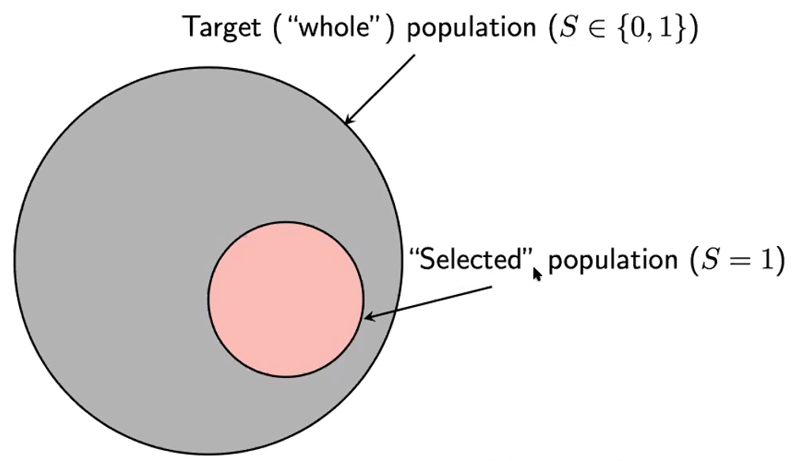
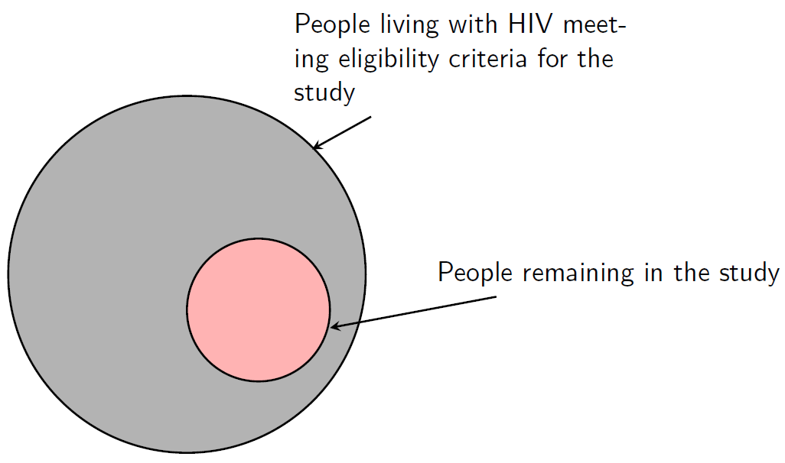

__Selection bias__ occurs when some part of the target population is not in 
the sampled population, or, more generally, when some population units are 
sampled at a different rate than intended by the investigator. A good sample 
will be as free from selection bias as possible.  

  --- Sharon L. Lohr, Sampling: Design and Analysis 2nd


__Selection bias__ happens in different fields. Everything can be "selection bias"  

- Model selection  
  * Problems with statistical inference  
- Confounding  
  * In certain fields... "selection into treatment"  
- Non-generalizability/transportability  
  * Effect in sample not the same as in target population  
- Collider stratification (worst form of selection bias)  
  * Bias for causal effects even within sample and under the null  
  
Some other names refer to __"selection bias"__    

- Berkson's bias  
- Healthy worker effect  
- Censoring/truncation  
- Non-response bias  
- Prevalent-user bias  
- Volunteer bias  
- Incidence-prevalence bias  
- Index-event bias  
- Survivor bias  

## Selection bias: set up  

$X$: exposure of interest  
$Y$: outcome of interest  
$S$: selection into study (S = 1 if selected)  

We can estimate
\[ RR^s_{XY} = \frac{Pr(Y = 1 \mid X = 1; S = 1)}{Pr(Y = 1 \mid X = 0; S = 1)} \]

which may not equal $RR^t_{XY}$

$s$: subject to bias  
$t$: true

What is $RR^t_{XY}$? $RR^t_{XY}$ is the true causal effect in the target population.



We will assume that if we estimated $\frac{Pr(Y =1\mid X=1)}{Pr(Y =1\mid X=0)}$ , 
this is what we'd get

## Selection bias happens when? ~ Examples
      
  --- [@RN782]

Consider a randomized trial of anti-retroviral therapy ($X$) among people living with HIV, with a goal of preventing the development of AIDS ($Y$)  

- $\frac{Pr(Y = 1 \mid X = 1)}{Pr(Y = 1 \mid X = 0)}$ is the risk ratio among people randomized to the intervention arm vs. standard of care  

- If some people drop out of the study, we estimate $\frac{Pr(Y = 1 \mid X = 1; S = 1)}{Pr(Y = 1 \mid X = 0; S = 1)}$  

```{r, out.height='70%',out.width='70%'}
library(DiagrammeR) #grViz
grViz("
digraph causal{

node[shape=none]
X 

node [shape = box,
      fontname = Helvetica]
S

node[shape=none]
Y
}")
```


  

### What's the target population?

__Target population__ The complete collection of observations we want to study. Defining
the target population is an important and often difficult part of the study. For
example, in a political poll, should the target population be all adults eligible to vote?
All registered voters? All persons who voted in the last election? The choice of target
population will profoundly affect the statistics that result.  
    --- Sharon L. Lohr, Sampling: Design and Analysis, 2nd  
    
The study participants are not a random sample of all people living with HIV ... is that a problem?   

  - Perhaps, if we're trying to estimate how effective treatment would be in another context.  
   
But _not_ when it comes to estimating valid causal effects. With complete follow-up, we can estimate 
the effect of the drug in the target population from which the participants came.   

  - Without loss to follow-up, we can't even estimate that --- not to mention generalize to another context.

### Why not?

The participants who were lost to follow-up are not a random sample of all participants   

  - Perhaps the most severely immunocompromised people have trouble coming to study visits  
  - They are also at higher risk of developing AIDS  
  - Perhaps people experiencing side effects of treatment no longer want to participate  
  

```{r, out.height='70%',out.width='70%'}
grViz("
digraph causal{

node [shape = box]
S

node[shape=none]
X; Y; U;

subgraph U{
  rankdir=TB; edge[dir=back]
  S -> U
  Y -> U
}

subgraph C{
  rank=same;
  X -> S
  S -> Y [color = white]
  edge[color=gray]
  X -> Y 
}
}")
```
  
### Conditioning on a collider 

Selection bias can occur when a non-causal X-Y path is opened by conditioning on $S$

```{r, out.height='70%',out.width='70%'}
grViz("
digraph causal{

node [shape = box]
S

node[shape=none]
X; Y; U;

subgraph U{
  rankdir=TB; edge[dir=back, color = red]
  S -> U 
  Y -> U
}

subgraph C{
  rank=same;
  X -> S [color = red]
  S -> Y [color = white]
  edge[color=gray]
  X -> Y 
}
}")
```


### Common structure

Does Zika virus infection ($X$) increase the risk of microcephaly ($Y$)?   

  - We only assess microcephaly among live births ($S$ = 1).   
  - Elective terminations are not included ($S$ = 0).   


```{r, out.height='70%',out.width='70%'}
grViz("
digraph causal{

node[shape=none]
X 

node [shape = box,
      fontname = Helvetica]
S

node[shape=none]
Y
}")
```


### Is the selected group different?  

We might assume that   

  - People who have more exposure to the virus are more likely to
choose to end their pregnancies (worried about risks)    
  - People with less access to health care are less likely to have
access to abortion services   
  - There are factors that affect risk of microcephaly that are
correlated with access to health care   


### Conditioning on a collider

Intuitively, pregnancies are either in our study if:   

  - They have lower-than-average probability of exposure to Zika
virus (but average risk of microcephaly)   
  - The have higher-than-average risk of microcephaly (but
average risk of Zika exposure)   

The already low-risk pregnancies also have lower exposure to the
virus.... It looks like exposure to Zika virus is associated with
microcephaly.   

## A note about confounding  

- There are also confounders of the $X - Y$ relationship, of
course, since this study is observational    
    * i.e., other reasons why people might be simultaneously at high
risk of Zika exposure and microcephaly    
- Some of those might be the same factors causing selection
bias  
    * If we properly adjust for them to control confounding, we also
control selection bias  
- If there are additional factors leading to selection bias that
aren't confounders, we may not plan to measure or adjust for
them   
- We'll tie confounding and selection bias (and
misclassification!) together at the end   

## More examples

- Consider a pharmacoepidemiology study comparing outcomes ($Y$)
in current users vs. never users of a drug ($X$):

If people more at risk ($U_2$) of outcome $Y$ also have more side
effects $U_1$, they are more likely to discontinue the drug and not be
included in the study ($S$ = 0).

```{r, out.height='70%',out.width='70%'}
grViz("
digraph causal{

node [shape = box]
S

node[shape=none]
X; Y; U1; U2

subgraph U{
  rankdir=TB; edge[dir=back]
  U1 -> U2 
  Y -> U2
}

subgraph C{
  rank=same;
  X -> U1 -> S
  S -> Y [color = white]
  
  edge[color=gray]
  X -> Y 
}
}")
```

- Consider a case-control study of coffee consumption ($X$) and
pancreatic cancer ($Y$), in which controls are chosen from the same
hospital:

Selection is based on case status ($Y$). If controls with
gastrointestinal disease are used ($U$), the fact that they are more
likely to avoid coffee can make coffee look like it causes cancer.


```{r, out.height='70%',out.width='70%'}
grViz("
digraph causal{

node [shape = box]
S

node[shape=none]
X; Y; U

subgraph U{
  rankdir=TB; edge[dir=back]
  X -> U 
  S -> U
}

subgraph C{
  rank=same;
  edge[color=gray]
  X -> Y 
  edge[color=black]
  Y -> S
}
}")
```

- Consider a study of the effect of antidepressants ($X$) on lung
cancer ($Y$) among people with coronary artery disease ($S$):

If depression ($U1$) causes $X$ and $S$, and smoking ($U_2$) causes $S$
and $Y$ , selection bias ("$M$-bias") can result.


```{r, out.height='70%',out.width='70%'}
grViz("
digraph causal{

node [shape = box]
S

node[shape=none]
X; Y; U1; U2

subgraph C{
  rank=same;
  edge[color=gray]
  X -> Y 
}

subgraph U{
  rankdir=TB; edge[dir=back]
  X -> U1
  Y -> U2
  S -> U1
  S -> U2
}
}")
```

  --- [@RN782] and [@RN794]
  
  
## What to do? 


- Go back to the drawing board  
    * Design a better study ...   
    * Track down those lost to follow-up   
- Attempt to correct for it  
    * Measure the variables causing bias  
    * Modeling assumptions  
- Redefine question  
    * Consider interpretability  
    
OR  

Sensitivity analysis!