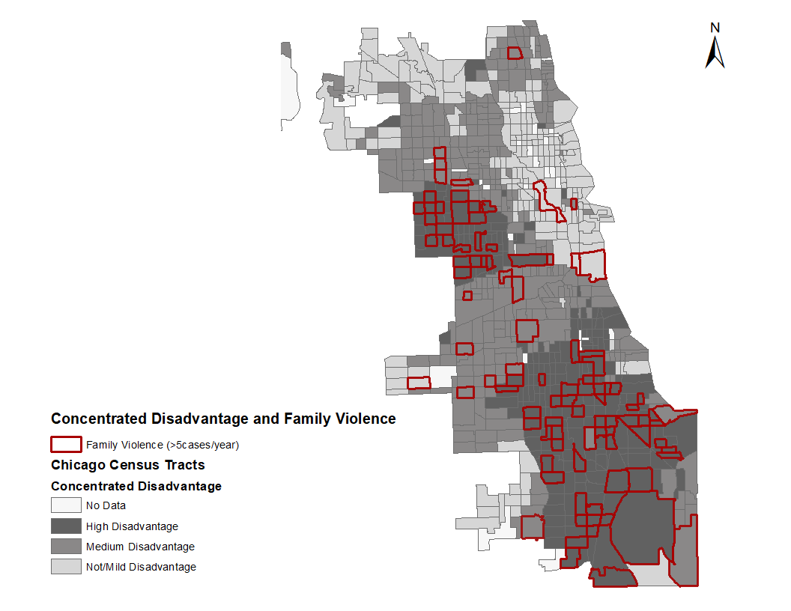

```{r setup, warning=FALSE, message=FALSE}
library(mclust)
library(tidyverse)
library(nFactors)
```

## Story

[Chicago is famous of diverse neighborhood areas](https://chicagomap.zolk.com/). It's one thing, but how we can measure each neighborhood area based on the socioeconomic status of each area.  

The written compose (including step-by-step in coding and explanation) walk us through how to cluster each neighborhood using a modern method: Latent Profile Analysis. However, the method would have some barriers (_model selection criteria, homogeneity and separation, normality assumption_) in which we need to use another technique to overcome.   

Outline:

1- Prepare ACS data    
2- What is LPA  
3- Barriers of LPA and the Steps to solve it  
4- Mapping  
5- LPA with covariate(s)   

## Prepare data

### The American Community Survey

The American Community Survey (ACS) is a unique data product that includes all the estimates and margins of error from geographies that are published for the ACS. 

Data contained demographic, social, economic, and housing subject areas. All Detailed Tables for the ACS 1-year or 5-year estimates. Here we deal with the ACS 5-year estimates which are published for all geographic areas, including census tracts, block groups, American Indian areas, core based statistical areas, combined statistical areas, Congressional districts, and state legislative districts.


### ACS data

The summary of the data __"Chicago Census Data by Tract_American Census Survey (ACS)"__. Data includes Census tract characteristics of 2010-2014 5-year ACS estimates that easy to download from https://data.census.gov/cedsci/.

We will use the following $11$ variables in the exploratory factor analysis:

|Variable name			|Labeling									|  
|:----------------------|:------------------------------------------|  
|* AgeDependencyRatio: 	|_age dependency ratio_                     |  
|* LimitedEngProf5andUP:|_limited English proficiency_              |  
|* LessThanHS: 			|_less than high school in education level_ |  
|* Unemployment         |                                           |  
|* PctForeignBorn: 		|_percentage of foreign born_               |  
|* FemaleHHPct: 		|_percentage of female per household_       |  
|* MedianIncomeHH: 		|_median income per household_              |  
|* AllOcc2009Pct: 		|_percentage of all occupants in 2009_      |  
|* PctVacHousing: 		|_percentage of vacant housing_             |  
|* PctBelowPoverty: 	|_percentage below poverty_                 |  
|* PublicAssistancePct: |_percentage of public assistance_          |    

```{r data manipulation 1}
census <- read.csv("data/Chicago Census Data by Tract_ACS 2015.csv", header = TRUE) %>% 
  select(tract, AgeDependencyRatio, LimitedEngProf5andUP, LessThanHS, Unemployment, 
         PctForeignBorn, FemaleHHPct, MedianIncomeHH, AllOcc2009Pct, PctVacHousing, 
         PctBelowPoverty, PublicAssistancePct)
```


```{r data manipulation 2}  
# recode into % to scale to other variables
df <- census %>% mutate(
  PctForeignBorn = PctForeignBorn*100,
  FemaleHHPct = FemaleHHPct*100,
  # MedianIncomeHH1Kinv = (max(MedianIncomeHH, na.rm=TRUE) - MedianIncomeHH)/1000,
  # we would not use 1Kinv because of weird distribution (multi-mode)
  MedianIncomeHH1K = MedianIncomeHH/1000,
  AllOcc2009Pct = AllOcc2009Pct*100,
  PctVacHousing = PctVacHousing*100,
  PublicAssistancePct = PublicAssistancePct*100
) %>% 
  select(tract, AgeDependencyRatio, LimitedEngProf5andUP, LessThanHS, Unemployment, 
         PctForeignBorn, FemaleHHPct, MedianIncomeHH1K, AllOcc2009Pct, PctVacHousing, 
         PctBelowPoverty, PublicAssistancePct)

df2 <- df.fa <- df[complete.cases(df),]
``` 
 
```{r summary}
summary(df2)
```

## Correlation matrix

```{r, layout="l-body-outset"}
cortab <- round(Hmisc::rcorr(as.matrix(df2[,-1]))[[1]],2)
rmarkdown::paged_table(as.data.frame(cortab), options = list(rows.print = 11, cols.print = 11))
```

```{r fig1, fig.height = 14, fig.width = 14, warning=FALSE, message=FALSE}
corrplot::corrplot(cor(df2[,-1]))
```

As we can see, there are some factors having much association (Unemployment, FemaleHHPct, PctBelowPoverty, PublicAssistancePct), meanwhile some is not.   

## Introduction to Latent Profile Analysis

- Individuals can be divided into subgroups based on unobservable construct  

   * The construct of interest is the latent variable  
   * Subgroups are called latent classes  
   
- Latent profile analysis: static, categorical latent variable measured with continuous items

- True class membership is unknown   

   * Unknown due to measurement error  
   * Measurement of the construct is typically based on several continuous, normally-distributed indicators 

- Latent classes are mutually exclusive & exhaustive

- Class-specific means in LPA are analogous to factor loadings  

   * Factor loadings are $\beta$-weights  
   * In LPA, we have means and variances  

- Mathematical model
   
   * $p$ variables used as indicators ($i = 1, ..., p$)  
   * $K$ classes ($j = 1, ..., K$)  
   * $\eta_j$ = latent class membership probability  
   * $x_i$ = observed response  
   * $\mu_{ij}$ = within-class mean for observed responses  
   * $\sigma_{ij}^2$ = within-class variance for observed responses  
   
   \[f(x_i) = \sum_{j=1}^K \eta_j \prod_{i=1}^p \frac{1}{\sqrt(2\pi\sigma_{ij}^2)}\text{exp}\Big[\frac{-(x_i-\mu_{ij})^2}{\sigma_{ij}^2}\Big]\]
   
## What if running Latent Profile Analysis with all 11 indicators

```{r overall mclust, out.width='1200px', out.hight='1200px'}
X <- as.matrix(df2[,-1])
mod <- Mclust(X)
```

We could use both BIC and ICL. But let's see the BIC firstly

```{r}
summary(mod$BIC)
plot(mod, what = "BIC", ylim = range(mod$BIC[,-(1:2)], na.rm = TRUE),
       legendArgs = list(x = "bottomleft"))
```

It's the same if I also used integrated complete-data likelihood (ICL) criterion:

```{r}
ICL <- mclustICL(X)
plot(ICL)
```

We run Mclust for all 11 indicators, the data-driven would produce up to 8, 9 clusters. 

```{r}
# tabulate class-membership numbers
table(summary(mod)$classification)
drmod <- MclustDR(mod, lambda = 1)
plot(drmod, what = "contour")
```

<span style="text-decoration:underline">__Why happening?__</span>

- Latent profile homogeneity: even homogeneity is not as straightforward as it is in LCA and FA, latent profile homogeneity is tied to both the within-class mean and the amount of within-class variance for each manifest variable. Meanwhile, the latent profile separation is the degree to which the latent profiles can clearly be distinguished from each other. We can see that some means of classes are very close to each other; so the homogeneity may overlap and hard to separate (for example, the variables Unemployment, PctVacHousing). 

```{r, layout="l-body-outset"}
# display the means per class
rmarkdown::paged_table(as.data.frame(round(mod$parameters$mean,2)), 
                       options = list(rows.print = 11, cols.print = 9))
```

- Latent profile indicators are continuous and normally distributed within classes. If they are not normally distributed, simulation studies in the context of GMM suggest you will over-extract the number of classes. Obviously, we can see that we had very skewed distribution from each indicators (not sure about normally joint distribution!?).

```{r, figures-side, fig.show="hold", out.width="50%"}
par(mar = c(4, 4, .1, .1))
plot(density(df2$Unemployment))
plot(density(df2$PctBelowPoverty))
```


Thus, with the homogeneity and separation concepts: 

- Homogeneity analogous to concept of saturation in factor analysis  

- Latent class separation analogous to concept of simple structure in factor analysis  

- We can have  
   
   * High homogeneity, high latent class separation 
   * High homogeneity, low latent class separation   
   * Low homogeneity, low latent class separation  
   * But not low homogeneity, high latent class separation

$\Rightarrow$ We want to increase the homogeneity. For this purpose, we would use factor analysis to select covariates in the first components.

## Factor Analysis

### Determine Number of Factors to Extract

```{r scree plot, message=FALSE, warning=FALSE}
ev <- eigen(cor(df.fa[,-1])) # get eigenvalues
ap <- parallel(subject=nrow(df.fa[,-1]), var=ncol(df.fa[,-1]), rep=100,cent=.05)
nS <- nScree(x=ev$values, aparallel=ap$eigen$qevpea)
plotnScree(nS) 
```

### Running EFA

When we run a factor analysis, we need to decide on three things:

1. the number of factors
2. the method of estimation
3. the rotation

$\Rightarrow$ Maximum Likelihood Factor Analysis (bullet 2) entering raw data and extracting 3 factors (bullet 1), with `varimax` rotation (bullet 3)  

```{r fa}
fit.f <- factanal(x = df.fa[,-1], factors = 3, n.obs = 797, rotation="varimax")
print(fit.f, digits=2, cutoff=.3, sort=TRUE)
```

* In general, we’d like to see low uniquenesses or high communalities (subtract the uniquenesses from 1---The communality is the proportion of variance of the $i^{th}$ variable contributed by the $m$ (here's 3) common factors)

* At the conclusion of a factor analysis of census data, we might determine that the census measures 3 factors: (1) "mixed" social poverty disparity strength, (2) education strength, (3) age-housing disparity strength

* Factor analysis seeks to model the correlation matrix with fewer variables called factors. If we succeed with, said here, 3 factors, we are able to model the correlation matrix using only 3 variables instead of 11. Just remember these 3 variables, or factors, are unobserved. We give them names like "latent variables". They are not subsets of our original variables.

* Given the data matrix $X$, consider it's covariance matrix $cov(X)=\sum$ and obtain the matrix $V$ of eigenvectors from $\sum$. This matrix $V$ is what you call the loadings.

### Applying factor scores

* This set of eigenvectors define an orthogonal change of basis matrix that maximize the variance from X. This means that, if I project X into the subspace generated by V I will obtain a matrix U by simply solving XV=U. This matrix U is what you call the scores (for each factor, we would have its own score).

* In our case, we would manipulate a little bit due to we use only variables in the first factor. Thus, if the absolute value of loadings less than or equal 0.5, it would not contribute to the score

We calculate and show FA scores -- The concentrated disadvantage index scores:

```{r concentrated disadvantage--fa score, layout="l-body-outset"}
df.fa$concdisadv <- as.matrix(df.fa[,-1]) %*% (fit.f$loadings[,1]*(abs(fit.f$loadings[,1])>0.5))

# print out the scores
rmarkdown::paged_table(cbind(tract = df.fa[1:20,1], 
                             condisadv_fascore = df.fa[1:20,13], 
                             df.fa[1:20,2:12]), 
                       options = list(rows.print = 20, cols.print = 13))
```

## Latent Profile Analysis

### Data to run LPA

The latent profile analysis (normal mixture) will use variables loaded on factor 1 identified from the factor analysis:  

1- AgeDependencyRatio  
2- Unemployment   
3- FemaleHHPct  
4- MedianIncomeHH1K  
5- PctVacHousing  
6- PctBelowPoverty  
7- PublicAssistancePct  
8- LessThanHS  

<aside>
    If we run Mclust for all 11 indicators, the data-driven would produce up to 8, 9 clusters. Indeed, we have seen the LPA above with all indicators. Now we select covariates in the first components.  
</aside>

```{r data manipulation 3}  
# recode into % to scale to other variables
df3 <- df2 %>% 
  select(tract, AgeDependencyRatio, Unemployment, FemaleHHPct, 
         MedianIncomeHH1K, PctVacHousing, PctBelowPoverty,  
         PublicAssistancePct, LessThanHS
         )
``` 

### Check how many clusters should create?

```{r selected mclust, out.width='1200px', out.hight='1200px'}
X <- as.matrix(df3[,-1])
ICL <- mclustICL(X)
summary(ICL)
plot(ICL)
``` 

<aside>
BIC tends to select the number of mixture components needed to reasonably approximate the density, rather than the number of clusters as such. For this reason, we likely use the integrated complete-data likelihood (ICL) criterion
</aside>

* In the above Mclust() function call, the number of mixing components and the covariance parameterization are selected using the integrated complete-data likelihood (ICL) criterion. A summary showing the top-three models and a plot of the ICL traces (the first fig.) for all the models considered is then obtained.

* Note: with BIC criteria

```{r}
modBIC <- Mclust(X)
summary(modBIC$BIC)
plot(modBIC, what="BIC", ylim=range(modBIC$BIC[,-(1:2)], na.rm=TRUE), 
     legendArgs = list(x = "bottomright"))
```

* We got at least 4 to 7 classes with the BIC criteria.

* Let see the contour plot of estimated mixture densities.

```{r}
drmod <- MclustDR(mod, lambda = 1)
plot(drmod, what = "contour")
```

```{r}
mod.3 <- Mclust(X, G = 3)
drmod.3 <- MclustDR(mod.3, lambda = 1)
plot(drmod.3, what = "contour")
```

* We would use the indication of a __3-component mixture__ with covariances having different shapes, volume and orientation (VVV). The use can be confirmed by the plot above, there are no clear regions of 7 or 6-component on the plot.

### Fitted a 3-components GMM with unconstrained covariance matrices (VVV)

```{r 3-comp VVV, out.width='1200px', out.hight='1200px'}
mod.3 <- Mclust(df2[,-1], G=3, modelNames = "VVV") 
summary(mod.3) 
```

Mixture probabilities and mean (sd in separate table below) for Census tract characteristics

```{r}
sum.mod.3 <- summary(mod.3, parameters = TRUE)

rbind(Component = c("Class 1","Class 2","Class 3"),
      `Mix Probability` = paste0(round((sum.mod.3$pro)*100,1),"%"),
      round(sum.mod.3$mean,1),
      Labels = c("Affluent","Poor","Distressed")
)
```

```{r}
sd.class1 <- round(sqrt(diag(sum.mod.3$variance[,,1])),1)
sd.class2 <- round(sqrt(diag(sum.mod.3$variance[,,2])),1)
sd.class3 <- round(sqrt(diag(sum.mod.3$variance[,,3])),1)
cbind(sd.class1,sd.class2,sd.class3)
```

## Applying the clustering to mapping on Chicago Neighborhood map

### Clustering in class number

```{r}
df2$ConcDisadv_cluster <- mod.3$classification #13th in order
with(df2, table(ConcDisadv_cluster))
```

### Probability for each tract in each class

```{r}
df2[,14:16] <- mod.3$z
names(df2)[14:16] <- c("ConcDisadv_prob1", 
                       "ConcDisadv_prob2", 
                       "ConcDisadv_prob3")
```


Concentrated Disadvantage Clustering Selection based on the highest probability

```{r, layout="l-body-outset"}
rmarkdown::paged_table(cbind(tract = df2[1:20,1], 
                             `Concentrated Disadvantage` = df2[1:20,13],
                             df2[1:20,14:16],
                             df2[1:20,2:12]),
                       options = list(rows.print = 20, cols.print = 13))
```

With the level:  

* Class 1: not/mild disadvantage   
* Class 2: medium disadvantage   
* Class 3: highly disadvantage  

We can map on Chicago Neighborhood map (using ArcGIS) as such  

  

## Classification by race-ethnicity

```{r}
r_eth.df <- read.csv("data/Chicago Census Data by Tract_ACS 2015.csv", header = TRUE) %>% 
  select(tract, PctBlack,PctAsian,PctHispanicLatino,PctWhiteNonHisp)

dff <- merge(df2, r_eth.df, by="tract")
```

<!-- https://rpubs.com/Dee_Chiluiza/821124 -->

```{r, fig.align='center', out.width="100%"}
mclust1Dplot(dff[,"PctBlack"], parameters = mod.3$parameters, z = mod.3$z, 
             what = "classification", main = FALSE)
title("Percent Black")
mclust1Dplot(dff[,"PctAsian"], parameters = mod.3$parameters, z = mod.3$z, 
             what = "classification", main = FALSE)
title("Percent Asian")
mclust1Dplot(dff[,"PctHispanicLatino"], parameters = mod.3$parameters, z = mod.3$z, 
             what = "classification", main = FALSE)
title("Percent Hispanic Latino")
mclust1Dplot(dff[,"PctWhiteNonHisp"], parameters = mod.3$parameters, z = mod.3$z, 
             what = "classification", main = FALSE)
title("Percent White")
```

We can see that:

- black (bottom): joint of 3 classes  
- grean: class 3 (highly disadvantage)  
- red: class 2 (medium)  
- blue: class 1 (none disadvantage)

Thus, neighborhoods with high percent Black focus on class 3 (the first graph). It's quite contradict with high percent White (i.e. neighborhoods with high percent White focus on class 1, the last graph).

Now, how can we turn the visualization into an analysis.   
I will discuss this in a future post.   

## Further readings

Pugach, Oksana. 2018. "Latent Profile Analysis of Chicago Neighborhoods" Unpublished Work. Chalk Talk - Institute for Health Resereach; Policy - Methodology Research Core.

University of Virginia Library, Research Data Services + Sciences. "Getting Started with Factor Analysis" - https://data.library.virginia.edu/getting-started-with-factor-analysis/

Stats Stackexchange. "How to calculate the loading matrix from the score matrix and a data matrix X (PCA)?" - https://stats.stackexchange.com/questions/447952/how-to-calculate-the-loading-matrix-from-the-score-matrix-and-a-data-matrix-x-p 

Luca Scrucca. 2020. "A quick tour of mclust" - https://cran.r-project.org/web/packages/mclust/vignettes/mclust.html

Luca Scrucca, Michael Fop, T. Brendan Murphy,Adrian E. Raftery. "mclust 5: Clustering, Classification and Density Estimation Using Gaussian Finite Mixture Models." R J. 2016 August ; 8(1): 289-317
