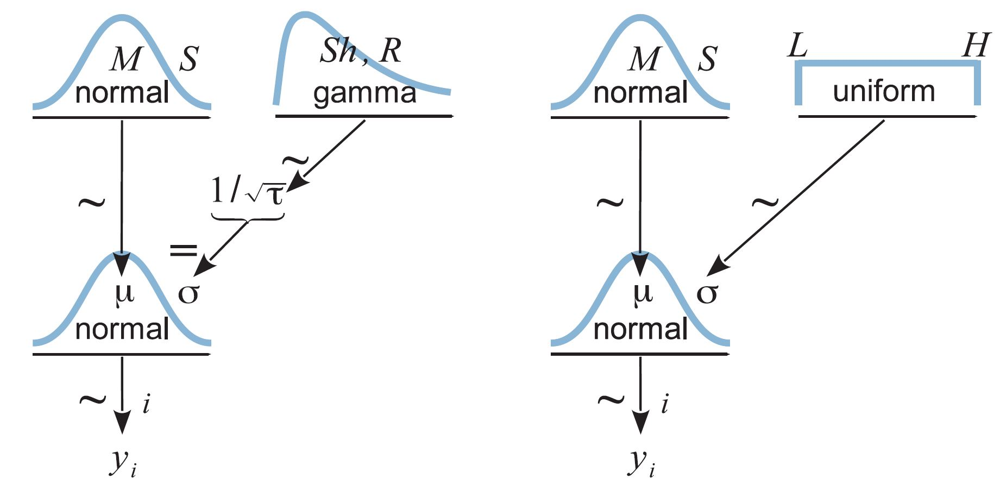

```{r setup, include=FALSE}
library(HDInterval) #For calculation of HDI use hdi() from HDInterval
library(rjags) #Run JAGS
library(rstan) #Run STAN
library(coda)
options(mc.cores = parallel::detectCores())
rstan_options(auto_write = TRUE)
```

How to fitting an unconditional model (without predictors)? From here, we can see the philosophy of the Bayesian's perspective.

## Typical response distribution

|Scale y       |Dist. $y \sim f(\mu, ...)$       |Inverse link $\mu = g^{-1}(\eta)$       |
|:------|:-----:|:-----:|
|Metric       |$y \sim dnorm(\mu,\sigma)$       |$\mu = \eta$       |
|Binary       |$y \sim dbern(\mu)$       |$\mu = logistic(\eta)$       |
|Nominal       |$y \sim dmultinom(\mu_1, ...,\mu_p)$      |$\mu_k = \frac{exp(\eta_k)}{\sum_j exp(\eta_j)}$       |
|Ordinal       |$y \sim dmultinom(\mu_1, ...,\mu_p)$       |$\mu = \Phi(\frac{\theta_k - \eta}{\sigma}) - \Phi(\frac{\theta_{k-1} - \eta}{\sigma})$       |
|Count       |$y \sim dpois(\mu)$       |$\mu = exp(\eta)$       |

## Fitting normal model for 1 group with no predictors

We just need to estimate both parameters of normal distribution for random variable $y$.

  

```{r generating normal dist}
# preparing data
set.seed(03172021)
y <- rnorm(100, mean = 6, sd = 3)
Ntotal = length(y)
```

Create a data list, include sample mean and standard deviation in it.

```{r}
dataList = list(
  y = y ,
  Ntotal = Ntotal ,
  mean_mu = mean(y) ,
  sd_mu = sd(y)
)
```

### Running in JAGS

Specify the model. 

Recall that in JAGS [@RN733] normal distribution is specified by precision $\frac{1}{\sigma^2}$ instead of standard deviation or variance.
Select an uninformative prior for $\sigma$ and normal (conjugate) prior for $\mu$.

What do we suggest as parameters of the normal distribution based on the sample?
\[ 
y_i \sim N(\mu,\tau), \ \text{where} \ \tau = \frac{1}{\sigma^2} \\
\mu \sim N(M,S) \\
\sigma \sim Uniform[Lw,Mx] \ \text{OR} \ Gamma(\alpha, \beta)
\]

```{r}
modelString = "
  model {
    for (i in 1:Ntotal) {
      y[i] ~ dnorm(mu , 1/sigma^2) #JAGS uses precision
    }
    # mu ~ dnorm(mean_mu , 1/(100*sd_mu)^2)
    mu ~ dnorm(mean_mu , Ntotal/sd_mu^2) #JAGS uses precision
    sigma ~ dunif(sd_mu/1000, sd_mu*1000)
  }
  " # close quote for modelString
```

```{r}
# Write out modelString to a text file
writeLines(modelString, con="data/TEMPmodel.txt")
```

Initialize chains.

```{r initialize chains}
initsList <- function(){
   upDown <- sample(c(1,-1),1)
   m <- mean(y)*(1+upDown*.05)
   s <- sd(y)*(1-upDown*.1) 
   list(mu = m, sigma = s)
}
```


Run the chains.  
 
  1. Set parameters:  

```{r}
# Create, initialize, and adapt the model:
parameters = c("mu", "sigma")     # The parameters to be monitored
adaptSteps = 500               # Number of steps to "tune" the samplers
burnInSteps = 1000
numSavedSteps = 50000
nChains = 4 
thinSteps = 1
nIter = ceiling((numSavedSteps*thinSteps)/nChains )
```

  2. Send model to JAGS:  
  
```{r}
jagsModel = jags.model("data/TEMPmodel.txt", data=dataList, inits=initsList,
                       n.chains=nChains, n.adapt=adaptSteps)
```

  3. Burn in and run:
  
```{r}
# Burn-in:
update(jagsModel, n.iter=burnInSteps)

# Run it
# The saved MCMC chain:
codaSamples = coda.samples(jagsModel, variable.names=parameters,
                           n.iter=nIter, thin=thinSteps)
```

Check how chains converged.

```{r}
summary(codaSamples)
```

The parameters are estimated close to what we simulated and very similar to what point estimation would give.

```{r}
mean(y)
sd(y)
```

The plot of the samples and the densities of the parameters.

```{r}
plot(codaSamples)
```

Plot autocorrelations.  

```{r}
autocorr.plot(codaSamples, ask = F)
```

Autocorrelation function plot shows that standard deviation effective size must be pretty small.   
In fact:  

```{r}
effectiveSize(codaSamples)
```

Shrink factor shows that even with long memory for standard deviation distributions converged:  

```{r}
gelman.diag(codaSamples)
gelman.plot(codaSamples)
```

Observed HDIs of the chains:  

```{r}
lapply(codaSamples,function(z) hdi(as.matrix(z)))
```

### Running in Stan


```{r}
modelString = "
data {
    int<lower=1> Ntotal;
    real y[Ntotal];
    real mean_mu;
    real sd_mu;
}
transformed data {
    real unifLo;
    real unifHi;
    real normalSigma;
    unifLo = sd_mu/100;
    unifHi = sd_mu*100;
    normalSigma = sd_mu*100;  // 100*10 times larger than MLE
}
parameters {
    real mu;
    real<lower=0> sigma;
}
model {
    sigma ~ uniform(unifLo, unifHi);
    mu ~ normal(mean_mu, normalSigma); 
    y ~ normal(mu, sigma);
}
" # close quote for modelString
```

Create a DSO and save it to disk to reuse later or just keep it in memory.

```{r, eval=FALSE}
stanDso <- stan_model(model_code = modelString)
save(stanDso, file = "data/DSONormal1.Rds")
```

If saved DSO is used load it, then run the chains.

```{r}
load(file= "data/DSONormal1.Rds")
```

Run chains by either using the existing DSO:

```{r}
stanFit <- sampling(object=stanDso,
                    data = dataList,
                    pars=c('mu', 'sigma'),
                    chains = 2,
                    cores= 2,
                    iter = 5000,
                    warmup = 200, 
                    thin = 1)
```

Or alternatively, use the description of the model saved in `ch16_1.stan` directly:

```{r, eval=FALSE}
# fit model
fit <- stan(file = "modelString.stan", 
            data = list(Ntotal = length(y),
                        y = y,
                        meanY=mean(y),
                        sdY=sd(y)), 
            pars=c('mu', 'sigma'),
            # control=list(adapt_delta=0.99),
            iter=5000, chains = 2, cores = 2
            )
```

Objects `fit` and `stanFit` should return very similar results.
The difference between `stan()` and `sampling()` is in the argument `object` which is DSO.
If you expect to repeat same calculations with different data compiling a DSO and reusing it with `sampling()` is faster.

```{r}
# text statistics:
print (stanFit)
# estimates & hdi:
plot(stanFit)
# samples
traceplot(stanFit, ncol=1, inc_warmup=F)
pairs(stanFit, pars=c('mu','sigma'))
stan_scat(stanFit, c('mu', 'sigma'))
stan_hist(stanFit)
stan_dens(stanFit)
# autocorrelation:
stan_ac(stanFit, separate_chains = T)
```

```{r}
# or work with familiar coda class:
stan2coda <- function(fit) {
    # apply to all chains
    mcmc.list(lapply(1:ncol(fit), function(x) mcmc(as.array(fit)[,x,])))
}
codaSamples <- stan2coda(stanFit)
summary(codaSamples)
plot(codaSamples)
autocorr.plot(codaSamples) 
effectiveSize(codaSamples)
gelman.diag(codaSamples)
gelman.plot(codaSamples)
```

```{r}
plot(density(codaSamples[[1]][,1]),xlim=c(0,8),ylim=c(0,3))  # mu, 1st chain
lines(density(codaSamples[[1]][,2]))                         # sigma, 1st chain
lines(density(codaSamples[[2]][,1]),col="red")               # mu, 2nd chain
lines(density(codaSamples[[2]][,2]),col="red")               # sigma, 2nd chain
```

Or you can use shinystan to do similar analysis of fitted model:

```{r, eval=FALSE}
launch_shinystan(fit)
```

## Robust estimation using t-distribution

Create a sample with heavy tails in order to check robust estimation of parameters of normal distribution.

Refer this simulation of [Leptokurtic Distributions](https://www.investopedia.com/terms/l/leptokurtic.asp).

```{r}
nSample<-1000
sd.Values<-c(2,3.4,.8,2.6)
sd.process<-rep(c(rep(sd.Values[1],50),
                  rep(sd.Values[2],75),
                  rep(sd.Values[3],75),
                  rep(sd.Values[4],50)), 4)
            
plot(sd.process,type="l")
```

Variable `sd.process` is a deterministically changing standard deviation.
Simulating perfect normal and independent realizations with such different standard deviations make a leptokurtic distribution.

```{r}
set.seed(05062022)
y <- rnorm(nSample)*sd.process
y <- y[1:300]
plot(y, type="l")

den <- density(y)
plot(den)
lines(den$x, dnorm(den$x, mean(y), sd(y)), col="red")
```


```{r}
Ntotal = length(y)
```

Density plot clearly shows fat tails that will be most likely identified as outliers under the assumption of normal distribution.

Create data list.

```{r}
dataList = list(
   y = y ,
   Ntotal = Ntotal ,
   mean_mu = mean(y) ,
   sd_mu = sd(y)
   )
```

### Generalized Student distribution

Student distribution with $\nu$ degrees of freedom appears in a sampling scheme from Gaussian distribution with unknown mean and variance.  

In such case the variable
\[ X \sim N(\mu, \sigma)\]
has the $z$-score
\[z = \frac{X - \hat{\mu}}{s/\sqrt{n}} = \frac{X - \hat{\mu}}{\hat{\sigma}} \]
where $s^2 = \frac{1}{n-1} \sum_{i=1}^n (X_i - \hat{\mu})^2$, has   
$t$-distribution with 
$n-1$ degrees of freedom.

Then random variable
\[ X = \hat{\mu} + \hat{\sigma}z\]

has generalized Student distribution with location parameter $\hat{\mu}$, scale parameter $\hat{\sigma}$ and the number of degrees of freedom $\nu$.  
The parameters $\hat{\mu}$ and $\hat{\sigma}$ are not exactly corresponding to the corresponding parameters of Gaussian distribution, but $\hat{\mu} \rightarrow \mu$, $\hat{\sigma} \rightarrow \sigma$ as $\nu$ becomes small and $t$-distribution becomes Gaussian.  
Interpretation of the parameters:  

* $\hat{\mu}$ - location  
* $\hat{\sigma}$ - scale  
* $\nu$ - amount of mass in the tails.  

### JAGS

```{r, eval=FALSE}
modelString = "
model {
   for ( i in 1:Ntotal ) {
      y[i] ~ dt(mu,1/sigma^2,nu)
   }
   mu ~ dnorm( mean_mu , 100/sd_mu^2 )
   sigma ~ dunif( sd_mu/1000 , sd_mu*1000 )
   nu ~ dexp(1/30.0)
}
" # close quote for modelString
# Write out modelString to a text file
writeLines(modelString , con="data/TEMPmodel-jags.txt")
```

Initialize the model with MLE.

```{r}
initsList <-function() {
   upDown<-sample(c(1,-1),1)
   m <- mean(y)*(1+upDown*.05)
   s <- sd(y)*(1-upDown*.1) 
   list(mu = m, sigma = s, nu=2)
   }
```

```{r}
parameters = c("mu", "sigma", "nu")     # The parameters to be monitored
adaptSteps = 500               # Number of steps to "tune" the samplers
burnInSteps = 1000
nChains = 3 
thinSteps = 1
numSavedSteps=50000
(nIter = ceiling((numSavedSteps*thinSteps)/nChains))
```

```{r}
# Create, initialize, and adapt the model:
jagsModel = jags.model("data/TEMPmodel-jags.txt", data=dataList, inits=initsList, 
                       n.chains=nChains, n.adapt=adaptSteps )
```

Run the chains.

```{r}
# Burn-in:
update(jagsModel, n.iter=burnInSteps)
# The saved MCMC chain:
codaSamples = coda.samples(jagsModel, variable.names=parameters , 
                           n.iter=nIter, thin=thinSteps)
```

Explore the results.

```{r}
summary(codaSamples)
mean(y)
sd(y)
```

Note that the robust estimate of $\mu$ is similar, but $\sigma$ is significantly smaller.

```{r}
plot(codaSamples)
summary(sd.process)
autocorr.plot(codaSamples,ask=F)
effectiveSize(codaSamples)
gelman.diag(codaSamples)
gelman.plot(codaSamples)
head(codaSamples[1])
(HDIofChains<-lapply(codaSamples,function(z) hdi(as.matrix(z))))
```

Non-robust estimate of $\sigma$ is outside the HDI for all the chains.

### Stan

Adapt the model description to t-distribution with additional parameter $\nu$.

```{r}
modelString = "
data {
    int<lower=1> Ntotal;
    real y[Ntotal];
    real mean_mu;
    real sd_mu;
}
transformed data {
    real unifLo;
    real unifHi;
    real normalSigma;
    real expLambda;         //New: parameter of prior for nu 
    unifLo = sd_mu/1000;
    unifHi = sd_mu*1000;
    normalSigma = sd_mu*100;
    expLambda=1/29.0;      //New: setting value for expLambda
}
parameters {
    real<lower=0> nuMinusOne; //New: definition of additional parameter nu
    real mu;
    real<lower=0> sigma;
}
transformed parameters {
    real<lower=0> nu;           //New: new parameter nu
    nu=nuMinusOne+1;           //New: shifting nu to avoid zero
}
model {
    sigma ~ uniform(unifLo, unifHi);
    mu ~ normal(mean_mu, normalSigma);
    nuMinusOne~exponential(expLambda);      //New: exponential prior for nu
    y ~ student_t(nu, mu, sigma);           //New: student_t distribution for nu
}
" # close quote for modelString
```

Create DSO.

```{r, eval=FALSE}
stanDso <- stan_model(model_code = modelString)
save(stanDso,file = "data/DSONormal2.Rds")
```

```{r}
load(file = "data/DSONormal2.Rds")
```

Run MCMC.

```{r}
stanFitRobust <- sampling( object=stanDso , 
                     data = dataList ,
                     pars=c('nu','mu', 'sigma'),
                     chains = 3,
                     cores= 3,
                     iter = 50000,
                     warmup = 300, 
                     thin = 1 )
```


Explore the results.

```{r}
# text statistics:
print(stanFitRobust)
# estimates & hdi:
plot(stanFitRobust)
# samples
class(stanFitRobust)
rstan::traceplot(stanFitRobust, ncol=1, inc_warmup=F)
pairs(stanFitRobust, pars=c('nu','mu','sigma'))
stan_scat(stanFitRobust, c('nu','mu'))
stan_scat(stanFitRobust, c('nu','sigma'))
stan_scat(stanFitRobust, c('mu','sigma'))
stan_hist(stanFitRobust)
stan_dens(stanFitRobust)
# autocorrelation:
stan_ac(stanFitRobust, separate_chains = T)
stan_diag(stanFitRobust,information = "sample")
stan_diag(stanFitRobust,information = "stepsize",chain = 0)
stan_diag(stanFitRobust,information = "treedepth",chain = 0)
stan_diag(stanFitRobust,information = "divergence",chain = 0)
```

There seems to be a pattern in relationship between $\sigma$ and $\nu$.  
Check if there is dependency.  

```{r}
stanRobustChains <- extract(stanFitRobust)
names(stanRobustChains)
plot(stanRobustChains$nu,stanRobustChains$sigma)
plot(rank(stanRobustChains$nu),rank(stanRobustChains$sigma))
```

Interpret the dependency: Degrees of freedom $\nu$ are related to sample size $(n-1)$. If the df increases, it also stands that the sample size is increasing; the graph of the t-distribution will have skinnier tails, pushing the critical value towards the mean.

$\Rightarrow$ t-copulas (guess from empirical copulas)

Explore shiny object.

```{r, eval=FALSE}
launch_shinystan(stanFitRobust)
```

# Further reading 

  - Bayesian Methods, UC's lecture   
  - Gelman, A., Carlin, J., Stern, H., Dunson, D., Vehtari, A., & Rubin, D. (2013). Bayesian Data Analysis, Third Edition, 3rd Edition (3rd edition ed.): CRC Press.   
  - Kutner, M. H. (2005). Applied linear statistical models (5th ed. ed.). Boston: McGraw-Hill Irwin.   
  - Kruschke, John K. Doing Bayesian Data Analysis: a Tutorial with R, JAGS, and Stan. 2nd ed., Academic Press is an imprint of Elsevier, 2015. 