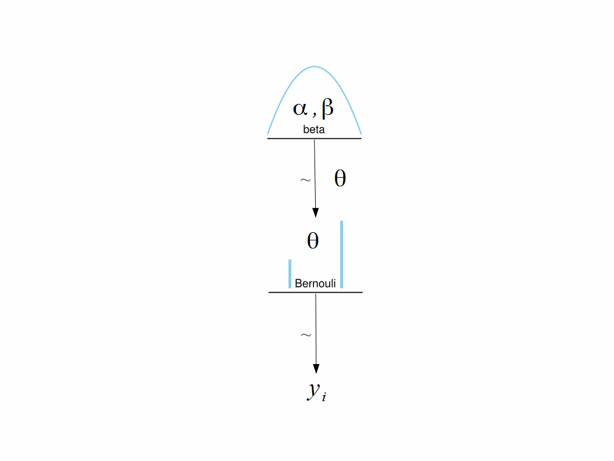

```{r setup, include=FALSE}
library(HDInterval) #For calculation of HDI use hdi() from HDInterval
library(rjags) #Run JAGS
library(rstan) #Run STAN
library(coda)
library(shinystan)
options(mc.cores = parallel::detectCores())
rstan_options(auto_write = TRUE)
```

# Review of MCMC: binomial model



Model description contains 2 parts:  

\[y_i \sim \text{Binom} (p = \theta, \ size = 1) \\
\theta \sim \text{Beta}(A_{prior},B_{prior})\]

where $\theta$  is the unknown probability of success with prior beta distribution with fixed parameters $A,\ B$.

To check the results of simulation use analytical formulas for posterior distribution: if prior beta distribution has parameters $A_{prior},B_{prior}$ and the data contain number of successes $s$,

\[s = \sum_{i=1}^k y_i\]

out of $k$ observations then posterior beta distribution has parameters  

\[A_{post} = A_{prior} + s; \ B_{post} = B_{prior} + k − s\]


## Data

Create vector of $0$ and $1$ of length $k=20$  and probability of success $\theta = 0.6$

```{r}
# Y <- rbinom(41, size=1, p=.32)
flips = 41
heads = 13
a <- 10; b <- 10
```

Recall that __Metropolis-Hastings MCMC__ algorithm consists of the following steps:

- Generate new proposal using some convenient distribution.

- Decide whether the proposal `theta_prop` is accepted or rejected  

## Running MCMC

<!--
Reference at:  
https://bookdown.org/ajkurz/DBDA_recoded/markov-chain-monte-carlo.html
https://github.com/ICI3D/RTutorials/blob/master/ICI3D_Lab7_MCMC-Binomial.R
-->

   To do that follow the logic:  

   - If posterior probability density at `theta_prop` is greater than posterior probability density at `theta_curr` then accept `theta_prop` into the chain sample.  
   - If posterior probability density at `theta_prop` is smaller than posterior probability density at `theta_curr` then accept `theta_prop` with probability  

   \[p_{dec} = \frac{p(\theta_{prop} \mid y)}{p(\theta_{curr} \mid y)} = \frac{p(y \mid \theta_{prop}) \ p(\theta_{prop} \mid A, B)}{p(y \mid \theta_{curr}) \ p(\theta_{curr} \mid A, B)} \]

   and reject `theta_prop` with probability `$1-p_{dec}$`.  

   - Acceptance decision is made by simulating uniform random variable on $U_{[0,1]}$ and comparing it with $p_{dec}$. If $U < p_{dec}$ then `theta_prop` is accepted.

```{r}
metropolis_algorithm <- function(samples, theta_seed, sd){
   theta_curr <- theta_seed
   # Create vector of NAs to store sampled parameters
   posterior_thetas <- rep(NA, times = samples)
   for (i in 1:samples){
      # Typically new proposals are generated from Gaussian distribution centered at the current value 
      # of Markov chain with sufficiently small variance.
      theta_prop <- rnorm(n = 1, mean = theta_curr, sd = sd) # Proposal distribution
      # If the proposed parameter is outside its range then set it equal to its current
      # value. Otherwise keep the proposed value
      theta_prop <- ifelse((theta_prop < 0 | theta_prop > 1), theta_curr, theta_prop)
      
      # Bayes' numerators
      posterior_prop <- dbeta(theta_prop, shape1 = a, shape2 = b) * dbinom(heads, size = flips, prob = theta_prop)
      posterior_curr <- dbeta(theta_curr, shape1 = a, shape2 = b) * dbinom(heads, size = flips, prob = theta_curr)
      # Calculate probability of accepting
      p_accept_theta_prop <- min(posterior_prop/posterior_curr, 1.0)
      rand_unif <- runif(n = 1)
      # Probabilistically accept proposed theta
      theta_select <- ifelse(p_accept_theta_prop > rand_unif, theta_prop, theta_curr)
      posterior_thetas[i] <- theta_select
      # Reset theta_curr for the next iteration of the loop
      theta_curr <- theta_select
   }
   return(posterior_thetas)
}
```

## Checking results

```{r}
set.seed(12423)
posterior_thetas <- metropolis_algorithm(samples = 10000, theta_seed = 0.9, sd = 0.05)
```

After simulating Markov chain check the results. 

### Analytical solution

Compare prior parameters and posterior parameters given by formulas  

It was due to since the beta distribution is conjugate to the binomial distribution (above), we can see how close our sampled posterior distribution approximates the exact posterior for $\theta$. Recall that with a $Beta(10, 10)$ prior and with $13$ heads in $41$ flips, the posterior distribution is also beta distributed with $a = 10+13$ and $b = 10+(41−13)$.
So, let’s overlay the exact posterior distribution on our previous graph also.

```{r}
opar <- par()
par(mar=c(2.5,3.5,3,2.1), mgp = c(1.7, 1, 0))
d <- density(posterior_thetas)
plot(d,
     main = expression(paste('Kernel Density Plot for ', theta)),
     xlab = expression(theta),
     ylab = 'density',
     yaxt = 'n',
     cex.lab = 1.3
     )
polygon(d, col='dodgerblue1', border='dark blue')

exactb <- rbeta(n = 10000, shape1 = 23, shape2 = 38)
lines(density(exactb),                             # Plot of randomly drawn beta density
     type = 's', col = 'red')
```

```{r}
hdi(posterior_thetas, credMass = 0.95)
```

### Histograms of accepted and rejected values

# Gaussian distribution, one sample: known variance, unknown mean

## Data

Simulate single sample from Gaussian distribution with `unknown mean` $\theta$ and `known standard deviation` $\sigma$.

```{r}
mu <- 120  
si <- 25
nSample <- 200
set.seed(05152022)
Y <- rnorm(nSample, mean = mu, sd = si)
Theoretical.data <- c(Mean = mu, Sd = si)
plot(Y)
```

## FNP approach

Estimate mean of the distribution, check histogram, test hypothesis $H_0$: $\mu = 120$ against two-sided alternative $H_a$: $\mu \neq 120$.

```{r}
meanMLE <- mean(Y)
hist(Y, freq = F)
plot(density(Y))
```

```{r}
(zStat <- (meanMLE - Theoretical.data["Mean"])/(Theoretical.data["Sd"]/sqrt(nSample)))
(sSidedP <- pnorm(zStat,lower.tail = F) + pnorm(-zStat,lower.tail = T))
```

Finally, distribution of the data estimated by FNP:

```{r}
(MLE.data <- c(Mean = meanMLE, Sd = Theoretical.data["Sd"]))
```

## Bayesian approach by formula, weak prior

Set the model as
\[y_i \sim N(\theta, \sigma)\]

where $\theta$ is unknown and $\sigma = 25$.  
Set prior distribution for the mean value as low informative Gaussian with parameters $M = 100$, $\sigma_{\mu} = 200$, i.e.  

\[ \theta \sim N(M, \sigma_{\mu})\]


```{r}
M <- 100
priorParamWeak <- c(Mean = M, Sd = 200)
```

Obtain posterior distribution using formulas for conjugate Gaussian distribution:

\[ \mu_{post} = \frac{\mu_{prior} \gamma_{prior} + \bar{y} \gamma_{data}}{\gamma_{prior} + \gamma_{data}} = \frac{M \gamma_{prior} + \bar{y} \gamma_{data}}{\gamma_{prior} + \gamma_{data}} = M \frac{\gamma_{prior}}{\gamma_{prior} + \gamma_{data}} + \bar{y} \frac{\gamma_{data}}{\gamma_{prior} + \gamma_{data}} \]  

\[ \sigma_{post}^2 = \frac{1}{\gamma_{prior} + \gamma_{data}} \]

where $n$ is the sample size and $\gamma_{data}$ and $\gamma_{prior}$ are data precision and prior precision, correspondingly:

\[ \gamma_{data} ; \gamma_{prior} = \frac{1}{\sigma_{\mu}^2} \]

```{r}
precision_prior <- 1/200^2
precision_data <- nSample/25^2
pSigmasq <- 1/(precision_prior + precision_data)
pSd <- sqrt(pSigmasq)
pMean <- 100*precision_prior*pSigmasq + meanMLE*precision_data*pSigmasq
(posterParamWeak <- c(Mean = pMean, Sd = pSd))
```

Bayesian estimate is obtained as $\mu_{post}$ = `r pMean`, showing no compromise between likelihood `r meanMLE` and prior `r M`.

Plot theoretical (simulated), estimated by MLE and estimated by Bayesian analysis densities.

```{r}
Bayes.dataWeak <- c(posterParamWeak["Mean"], Theoretical.data["Sd"])
X <- seq(from = 115, to = 125, by = 1)
plot(X, dnorm(X, Theoretical.data[1], Theoretical.data[2]),
     type="l", xlab="X", ylab="Density")
lines(X, dnorm(X,meanMLE,si), col="orange", lwd=3)
lines(X, dnorm(X,posterParamWeak[1],si), col="blue")
legend("topright",
       legend = c("Theoretical", "MLE", "Bayesian"),
       col = c("black", "orange", "blue"),
       lty = 1)
```

For the sample length $200$ and low informative prior Bayesian estimate is very close to MLE in comparison with the prior.
In addition standard deviation of the posterior distribution collapsed from $200$ to `r pSd`.

```{r}
rbind(Theoretical.data, MLE.data, Bayes.dataWeak)
rbind(priorParamWeak, posterParamWeak)
```

## Bayesian approach by formula, strong prior

Repeat Bayesian analysis with stronger prior $M = 100, \  \sigma_{\mu} = 2$.

```{r}
priorParamStrong <- c(Mean = M, Sd = 2)
precision_prior <- 1/2^2
precision_data <- nSample/25^2
pSigmasq <- 1/(precision_prior + precision_data)
pSd <- sqrt(pSigmasq)
pMean <- 100*precision_prior*pSigmasq + meanMLE*precision_data*pSigmasq
posterParamStrong <- c(Mean = pMean, Sd = pSd)
rbind(priorParamStrong, posterParamStrong)
```

Bayesian estimate of the mean shifted towards mode of the prior distribution: now the mean of posterior distribution is obtained by `r pMean`  

Shift of the lower level parameter towards mode of the higher level parameter is __shrinkage__.

## Using JAGS to estimate mean of normal distribution with known variance

### Data

Prepare the data list `dataList` in the format required by JAGS

```{r}
dataList <- list("Y" = Y, #data vector
                 "Ntotal" = nSample) # length of the sample
```

### Preparation of the model for JAGS

The model diagram:


Interpretation of the diagram starts from the bottom.
Each arrow of the diagram corresponds to a line of description code for the model.  

Line 1 of the model describes generation of the data according to the likelihood function: $y_i \sim N(\mu, \sigma)$.  
Line 2 of the model describes generation of the parameter θ from the prior distribution: $\mu \sim N(M, \sigma_{\mu})$.  
In this case parameters of the prior distribution should be defined. For example, like above set $M = 100, \sigma_{\mu} = 200$.  

The format of the model description for JAGS is a string of the form:

```{r}
model1NormalSample= "
  model { 
    # Description of data
    for (i in 1:Ntotal){
      Y[i] ~ dnorm(mu, 1/sigma^2) #tau = 1/sigma^2
    }
    # Description of prior
    mu ~ dnorm(100 , Ntotal/200^2)
    #tau <- pow(sigma, -2) #JAGS uses precision
    sigma <- 25
  }
"
```

Data are described as `for` loop.  
Prior is described as typical formula:  
"lower order parameter `$\sim$` density(higher order parameters)".   

**Note.** In JAGS normal distribution is specified with mean value and precision, i.e. instead of `$dnorm(\mu, \sigma)$` use `$dnorm(\mu, \frac{1}{\sigma^2})$`.  

Note that variables names for the data and data length `Y`, `nSample` in the description have to match the names of the data list.

The next step of preparation of the model description for JAGS is saving it to a temporary text file `Tempmodel.txt`.

```{r}
writeLines(model1NormalSample, con="Tempmodel.txt")
```

### Initializing Markov chains

To initialize trajectories define a list of lists with several values or create a function that returns an init value every time it is called.  
JAGS will call this function when it starts a new chain.

General syntax of initiation function is:

```{r}
initsList<-function() {
  # Definition of mu and sigma Init
  upDown<-sample(c(1,-1),1)
  m <- mean(Y)*(1+upDown*.05)
   
  list(mu = m)
}
```

For example, select starting point from normal distribution centered at MLE with some reasonable standard deviation.  

Check how initiation works by running the function several times.

```{r}
initsList()
```

### Sending information to JAGS

Next step is getting all information to JAGS using `jags.model()` from library `rjags`.  
This function transfers the data, the model specification and the initial values to JAGS and requests JAGS to select appropriate sampling method.

```{r}
jagsModel <- jags.model(file = "TempModel.txt", data = dataList, n.chains = 3, n.adapt = 500)
```

In `jags.model` parameter `n.chains` specifies the number of chains to run (defaults to 1) and parameter `n.adapt` sets the number of steps JAGS can take to tune the sampling method (defaults to 1000).

The object returned by `jags.model` contains all information that we need to communicate to JAGS about the problem in the format suitable for JAGS.

### Running MCMC in JAGS: burn in and main run

Now run JAGS chains for 600 steps to complete burn in, i.e. transition to a stable distribution of Markov chain.

```{r}
update(jagsModel,n.iter=600)
```

After completing burn in generate MCMC trajectories representing the posterior distribution for the model.

```{r}
codaSamples <- coda.samples(jagsModel, variable.names=c("mu"), n.iter = 3334)
list.samplers(jagsModel)
head(codaSamples)
```

Besides the model specification object `coda.samples()` takes a vector of character strings corresponding to the names of parameters to record `variable.names` and the number of iterations to run `n.iter`.    
In this example there are 3 chains, to the total number of iterations will be about 10,000.  
Use function `list.samplers` to show the samplers applied to the model.  

### Analyzing convergence

Analyze convergence of chains using following tools:

1. Summary  

```{r}
summary(codaSamples)
```

2. Traceplot  

```{r}
coda::traceplot(codaSamples)
densplot(codaSamples)
plot(codaSamples)
```

3. Autocorrelation and effective size

```{r}
autocorr.plot(codaSamples,ask=F)
effectiveSize(codaSamples)
```

The _ESS_ number is consistent with the autocorrelation function.  

4. Shrink factor

```{r}
gelman.diag(codaSamples)
gelman.plot(codaSamples)
```

### Analyzing and interpreting the results

1. Find the mean values and standard deviations of posterior distributions corresponding to different chains and compare them with MLE:

```{r}
chainMeans <- lapply(codaSamples,function(z) mean(z))
chainSd <- lapply(codaSamples,function(z) sd(z))
rbind(Means = chainMeans, SD = chainSd)
```

Compare the posterior densities generated by 3 chains with analytical posterior distribution:

```{r}
(l<-min(unlist(codaSamples))-.05)
(h<-max(unlist(codaSamples))+.05)
histBreaks<-seq(l,h,by=.05)
postHist<-lapply(codaSamples,hist,breaks=histBreaks)
```

```{r}
plot(postHist[[1]]$mids,postHist[[1]]$density,type="l",
     col="black",lwd=2,ylab="Distribution Density",xlab="Theta")
lines(postHist[[2]]$mids,postHist[[2]]$density,type="l",col="red",lwd=2)
lines(postHist[[3]]$mids,postHist[[3]]$density,type="l",col="blue",lwd=2)
lines(postHist[[3]]$mids,
      dnorm(postHist[[3]]$mids,posterParamWeak["Mean"],posterParamWeak["Sd"]),
      type="l",col="green",lwd=3)
legend("topright",legend=c("Chain1","Chain2","Chain3","Theoretical"),col=c("black","red","blue","green"),lwd=2)
```

# Hierarchical model: two groups of Gaussian observations

Consider now two groups of Gaussian observations with unknown means $\mu_1, \mu_2$ and same known standard deviation $\sigma = 25$.

## Data

Create data, prepare them for JAGS.  
Keep the first group sample as in the previous section: theoretical mean 120 and theoretical known standard deviation 25.  
Simulate second sample with the same standard deviation and theoretical mean 150.  
Combine both samples together and add second column containing group number.   

```{r}
set.seed(05162022)
Y2 <- rnorm(nSample, mean = 150, sd = 25)
Y2 <- rbind(cbind(Y, rep(1, nSample)), cbind(Y2, rep(2, nSample)))
colnames(Y2) <- c("y","s")
den1 <- density(subset(Y2,Y2[,2]==1)[,1])
den2 <- density(subset(Y2,Y2[,2]==2)[,1])
plot(den1$x, den1$y, type="l", ylim=c(0,.02))
lines(den2$x, den2$y, col="blue")
```

The sample from both groups now is Y2.

Create data for JAGS.

```{r}
y <- Y2[,"y"]
s <- Y2[,"s"]
nSample <- length(y)
nGr <- length(unique(s))
dataList <- list(y = y, s = s, nSample = nSample, nGr = nGr)
names(dataList)
```

## Different mean values, common weak prior

In this section consider model structure with common weak prior for mean values of both groups.  
Think about situations in which common prior is a reasonable assumption.  

The model diagram convenient for coding it in JAGS or Stan looks like.


An equivalent diagram may help understanding difference between hierarchical model of random effects and non-hierarchical model of fixed effects. 


Select hyper-parameters of the common prior normal distribution as in the previous section: $M=100, \ \sigma_{\mu}=200$.

### Model description

Prepare the model string.  
The difference from one-group data description is that now prior distribution for $\mu$ is described in a loop over all groups.  

```{r}
model2NormalSample= "
  model { 
    # Description of data
    for (i in 1:nSample){
      y[i] ~ dnorm(mu[s[i]], 1/sigma^2) #tau = 1/sigma^2
    }
    # Description of prior
    #mu[1:nGr] <- c(100,100)
    for (j in 1:nGr) {      
      mu[j] ~ dnorm(M, nSample/sigma_mu^2) 
    }
    sigma <- 25
    M <- 100
    sigma_mu <- 200
  }
"
writeLines(model2NormalSample, con="Tempmodel2.txt")
```

### Initialization and sending the model to JAGS

Initialize chains randomly around MLE.

```{r}
initsList<-function() {
  # Definition of mu and sigma Init
   theta <- vector()
   for (i in 1:nGr){
      upDown<-sample(c(1,-1),1)
      theta[i] <- mean(Y2[which(s==i)],)*(1+upDown*.05)
   }
  list(theta = theta)
}
# Check initiation
initsList()
```

Send the model to JAGS.

Set main parameters:

- Define vector of parameters for monitoring and recording  
- Define number of steps for adaptation of samplers  
- Define number of burn-in steps  
- Define number of chains $n_{chains}$  
- Define number of saved steps of Markov chains $n_{steps}$  
- Define number of iterations per chain as $n_{iter} = \frac{n_{steps}}{n_{chains}}$  
Use `jags.model()` to transfer information to JAGS.
Arguments for this function are: model string, data list, initiation function name, number of chains and number of steps for adaptation.

```{r}
jagsModel2 <- jags.model(file = "data/Tempmodel2.txt", data = dataList, n.chains = 3, n.adapt = 500)
```

### Running the model

Run burn in by using `update()`.

```{r}
update(jagsModel2, n.iter = 600)
```

Make the main run by using `coda.samples()`.

```{r}
parameters <- c("mu")
nIter <- 10000
codaSamples2Groups1Prior = coda.samples(jagsModel2,
                                        variable.names = parameters,
                                        n.iter = nIter)
head(codaSamples2Groups1Prior)
list.samplers(jagsModel2)
```

### Analysis

Analyze convergence.

```{r}
summary(codaSamples2Groups1Prior)
plot(codaSamples2Groups1Prior)
autocorr.plot(codaSamples2Groups1Prior, ask = F)
effectiveSize(codaSamples2Groups1Prior)
gelman.diag(codaSamples2Groups1Prior)
gelman.plot(codaSamples2Groups1Prior)
```

Check estimated means.

```{r}
matrix(unlist(lapply(codaSamples2Groups1Prior,function(z) apply(z,2,mean))),ncol=3)
```

Plot posterior densities.

```{r}
plot(density(codaSamples2Groups1Prior[[1]][,1]),xlim=c(110,160),ylim=c(0,.25))
lines(density(codaSamples2Groups1Prior[[1]][,2]))
lines(density(codaSamples2Groups1Prior[[2]][,1]),col="orange")
lines(density(codaSamples2Groups1Prior[[2]][,2]),col="orange")
lines(density(codaSamples2Groups1Prior[[3]][,1]),col="blue")
lines(density(codaSamples2Groups1Prior[[3]][,2]),col="blue")
```

Calculate HDIs for each chain.

```{r}
lapply(codaSamples2Groups1Prior,function(z) hdi(as.matrix(z)))
```

Find differences between $\mu_1$ and $\mu_2$.

```{r}
chainDiffs <- lapply(codaSamples2Groups1Prior, function(z) z[,2]-z[,1])
lapply(chainDiffs, function(z) hdi(as.matrix(z)))
```

Find left 95% HDI boundaries for the chain differences and plot them.

```{r}
(leftBounds<-unlist(lapply(chainDiffs,function(z) hdi(as.matrix(z))[1])))
plot(density(chainDiffs[[1]]),xlim=c(15,35),ylim=c(0,.2),col="black")
lines(density(chainDiffs[[2]]),col="red")
lines(density(chainDiffs[[3]]),col="blue")
abline(v=leftBounds,col=c("black","orange","blue"))
```

For the given sample and prior distribution mean values of the 2 groups are clearly different based on 95% HDI for all 3 chains.

## Experimenting with prior hyperparameters

Repeat calculations with different prior hyperparameters.  

To do that organize all steps of running MCMC with JAGS in a function `runMCMC2Groups <- function(prMean, prSD, dat)`, where `prMean` and `prSD` are the the prior hyperparameters and `dat` is the data list.  

Note that in order to pass arguments of the function to JAGS model description you need to append them to the data list:

- First put them in a list `hyper <- list(hypeMean = prMean, hypeSD = prSD)`  
- Then combine list hyper with the data when run `jags.model()`:
`jags.model("TEMPmodel.txt", data=append(dat,hyper),...)`  
- After that parameters can be used in the description of the model as `dnorm(hypeMean, 1/hypeSD^2)`.  
The function should return the simulated chains.  

```{r}
runMCMC2Groups <- function(prMean, prSD, dat){
   model2NormalSamplesb = "
      model {
         for (i in 1:nSample){
         y[i] ~ dnorm(theta[s[i]], 1/25^2)
         }
         for (sIdx in 1:nGr) {# Different thetas from same prior
            theta[sIdx] ~ dnorm(hypeMean,1/hypeSD^2) 
         }
      }
   " # close quote for modelString
writeLines(model2NormalSamplesb, con="data/TEMPmodel3.txt")
   
parameters = c("theta") # The parameters to be monitored
adaptSteps = 500        # Number of steps to adapt the samplers
burnInSteps = 500       # Number of steps to burn-in the chains
nChains = 3             # nChains should be 2 or more for diagnostics 
numSavedSteps <- 50000
nIter = ceiling(numSavedSteps/nChains )
hyper <- list(hypeMean = prMean, hypeSD=prSD)

# Create, initialize, and adapt the model:
jagsModel = jags.model("data/TEMPmodel3.txt", 
                       data = append(dat,hyper), 
                       inits = initsList, 
                       n.chains = nChains, 
                       n.adapt = adaptSteps)

update(jagsModel , n.iter=burnInSteps)
codaSamplesResult <- coda.samples(jagsModel, 
                                  variable.names = parameters, 
                                  n.iter = nIter)
codaSamplesResult
}
```

#### Run: hypeMean=130; hypeSD=200

```{r}
Run.130.200 <- runMCMC2Groups(130, 200, dataList)
lapply(Run.130.200,function(z) apply(z, 2, mean))
chainDiffs<-lapply(Run.130.200,function(z) z[,2]-z[,1])
lapply(chainDiffs,function(z) hdi(as.matrix(z)))
```

### Run: hypeMean=130; hypeSD=0.2

```{r}
Run.130.2<-runMCMC2Groups(130, .2, dataList)
lapply(Run.130.2,function(z) apply(z,2,mean))
chainDiffs <- lapply(Run.130.2, function(z) z[,2]-z[,1])
lapply(chainDiffs,function(z) hdi(as.matrix(z)))
```

#### Run: hypeMean=100; hypeSD=0.2

```{r}
Run.100.2 <- runMCMC2Groups(100, .2, dataList)
lapply(Run.100.2, function(z) apply(z,2,mean))
chainDiffs <- lapply(Run.100.2, function(z) z[,2]-z[,1])
lapply(chainDiffs, function(z) hdi(as.matrix(z)))
```

### Run: hypeMean=160; hypeSD=0.2

```{r}
Run.170.2 <- runMCMC2Groups(170, .2, dataList)
lapply(Run.170.2,function(z) apply(z,2,mean))
chainDiffs <- lapply(Run.170.2, function(z) z[,2]-z[,1])
lapply(chainDiffs, function(z) hdi(as.matrix(z)))
```

Explain the results of running hierarchical model with different sets of hyperparameters:   
- more informative hypeSD would lead to narrow the difference between 2 means  
- with informative hypeSD, the poster would be mainly affected by the prior   

## FNP approach: ANOVA

Compare results with fixed effects ANOVA model.

```{r}
head(Y2)
mANOVA <- lm(y~as.factor(s), as.data.frame(Y2))
summary(mANOVA)
anova(mANOVA)
```

# Further reading 

  - Bayesian Methods, UC's lecture   
  - Gelman, A., Carlin, J., Stern, H., Dunson, D., Vehtari, A., & Rubin, D. (2013). Bayesian Data Analysis, Third Edition, 3rd Edition (3rd edition ed.): CRC Press.     
  - Kruschke, John K. Doing Bayesian Data Analysis: a Tutorial with R, JAGS, and Stan. 2nd ed., Academic Press is an imprint of Elsevier, 2015.   
