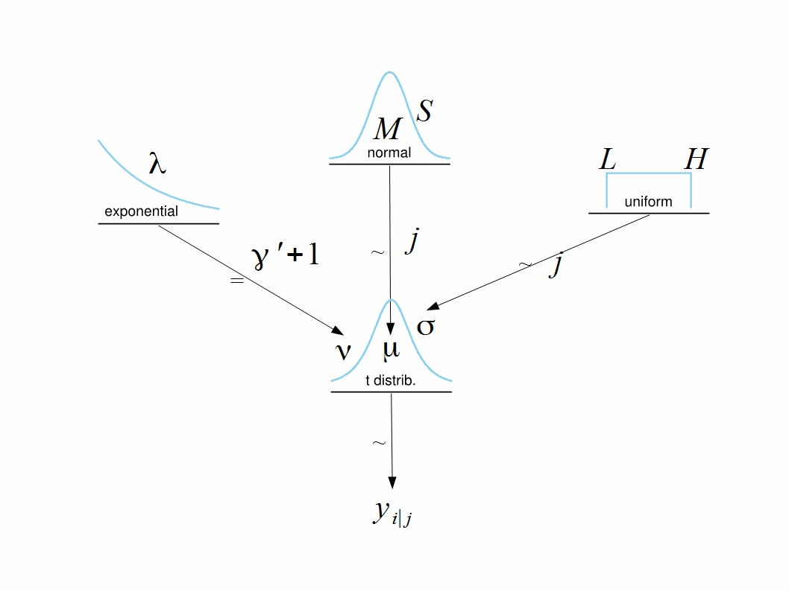

# Setting to compare two groups (w/ no predictors)

## IQ data

One example of two-groups problem is testing effect of a drug when one group receives a placebo and another receives the drug. The response variable is result of IQ test.

In this example we estimate mean and standard deviation for two groups using <span style="color:red">normal distribution</span>, then <span style="color:red">robust $t$-distribution</span> with common normality parameter $\lambda$.

 

### Data.

```{r dta}
dta <- read.csv("data/IQdrug.csv")
DT::datatable(dta)
```

### Prepare data

```{r prepare dta}
y <- as.numeric(dta[,"Score"])
x <- as.numeric(as.factor(dta[,"Group"]))

(xLevels <- levels(as.factor(dta[,"Group"])))
Ntotal = length(y)

# Specify the data in a list for JAGS/Stan:
dataList = list(
    y = y,
    x = x,
    Ntotal = Ntotal,
    meanY = mean(y),
    sdY = sd(y)
)
```

## Call `Stan`

```{r, warning=F, message=F}
#source("../DBDA2Eprograms/DBDA2E-utilities.R")
library(rstan)
options(mc.cores = parallel::detectCores())
rstan_options(auto_write = TRUE)
```

## Normal assumption

Assuming that both groups samples have normal distributions, estimate the parameters and compare them.

Write description of the model for stan.

$$
y_{i\mid j} \sim N(\mu_j, \sigma^2_j) \\
\mu_j \sim N(\bar{Y}, \frac{1}{100*SD_Y^2}) \\
\sigma_j \sim uniform(\frac{SD_Y}{1000}, SD_Y*1000)
$$

```{r}
# Use the description for Stan from file "ch16.2.stan"
modelString = "
data {
    int<lower=1> Ntotal;
    int x[Ntotal];
    real y[Ntotal];
    real meanY;
    real sdY;
}
transformed data {
    real unifLo;
    real unifHi;
    real normalSigma;
    unifLo = sdY/1000;
    unifHi = sdY*1000;
    normalSigma = sdY*100;
}
parameters {
    real mu[2];
    real<lower=0> sigma[2];
}
model {
    sigma ~ uniform(unifLo, unifHi);
    mu ~ normal(meanY, normalSigma);
    for ( i in 1:Ntotal ) {
        y[i] ~ normal(mu[x[i]] , sigma[x[i]]);
    }
}
"
```

If running the description in `modelString` for the first time create `stanDSONormal`, otherwise reuse it.

```{r, eval=FALSE}
stanDsoNormal <- stan_model(model_code=modelString)
```

If saved DSO is used load it, then run the chains.

```{r}
#saveRDS(stanDsoNormal, file="data/DSONormal1.Rds")
stanDsoNormal<-readRDS("data/DSONormal1.Rds")
```

Run MCMC.

```{r, eval=FALSE}
parameters = c("mu","sigma")     # The parameters to be monitored
adaptSteps = 500               # Number of steps to "tune" the samplers
burnInSteps = 1000
nChains = 4
thinSteps = 1
numSavedSteps = 5000
stanFitNormal <- sampling(stanDsoNormal,
                   data = dataList,
                   pars = parameters, # optional
                   chains = nChains,
                   iter = (ceiling(numSavedSteps/nChains)*thinSteps+burnInSteps),
                   warmup = burnInSteps,
                   init = "random", # optional
                   thin = thinSteps)
```

Save the fit object for further analysis.

```{r}
# save(stanFitNormal,file="data/StanNormalFit2Groups.Rdata")
load("data/StanNormalFit2Groups.Rdata")
```

__Then, we can explore the results.__

### Stan in regular way

```{r}
# text statistics:
print (stanFitNormal)
# estimates & hdi:
plot(stanFitNormal)
# samples
rstan::traceplot(stanFitNormal, ncol=1, inc_warmup=F)
pairs(stanFitNormal, pars=c('mu','sigma'))
stan_scat(stanFitNormal, c('mu[1]','mu[2]'))
stan_scat(stanFitNormal, c('mu[1]','sigma[1]'))
stan_scat(stanFitNormal, c('mu[1]','sigma[2]'))
stan_scat(stanFitNormal, c('mu[2]','sigma[1]'))
stan_scat(stanFitNormal, c('mu[2]','sigma[2]'))
stan_scat(stanFitNormal, c('sigma[1]','sigma[2]'))
stan_hist(stanFitNormal)
stan_dens(stanFitNormal)
# autocorrelation:
stan_ac(stanFitNormal, separate_chains = T)
stan_diag(stanFitNormal,information = "sample",chain=0)
stan_diag(stanFitNormal,information = "stepsize",chain = 0)
stan_diag(stanFitNormal,information = "treedepth",chain = 0)
stan_diag(stanFitNormal,information = "divergence",chain = 0)
```

### Coda

If we prefer output using coda class, reformat the chains into coda:

```{r}
library(coda)
stan2coda <- function(stanFitNormal) {
    # apply to all chains
    mcmc.list(lapply(1:ncol(stanFitNormal), function(x) mcmc(as.array(stanFitNormal)[,x,])))
}
codaSamples <- stan2coda(stanFitNormal)
summary(codaSamples)
plot(codaSamples)
autocorr.plot(codaSamples)
effectiveSize(codaSamples)
gelman.diag(codaSamples)
gelman.plot(codaSamples)

plot(density(codaSamples[[1]][,1]),xlim=c(10,120),ylim=c(0,.25),main="Posterior Densities")  # mu[1], 1st chain
lines(density(codaSamples[[1]][,2]))                         # mu[2], 1st chain
lines(density(codaSamples[[1]][,3]))                         # sigma[1], 1st chain
lines(density(codaSamples[[1]][,4]))                         # sigma[2], 1st chain
lines(density(codaSamples[[2]][,1]),col="red")               # mu[1], 2nd chain
lines(density(codaSamples[[2]][,2]),col="red")               # mu[2], 2nd chain
lines(density(codaSamples[[2]][,3]),col="red")               # sigma[1], 2nd chain
lines(density(codaSamples[[2]][,4]),col="red")               # sigma[2], 2nd chain
```

### Shinystan

Or you can use shinystan to analyze fitted model

```{r}
library(shinystan)
```

Launch shiny application with the loaded object.

```{r, eval=FALSE}
launch_shinystan(stanFitNormal)
```

## Robust assumption

Use the robust assumption of Student-t distribution instead of normal distribution.

```{r}
modelString = "
data {
    int<lower=1> Ntotal;
    int x[Ntotal];
    real y[Ntotal];
    real meanY;
    real sdY;
}
transformed data {
    real unifLo;
    real unifHi;
    real normalSigma;
    real expLambda ;
    unifLo = sdY/1000;
    unifHi = sdY*1000;
    normalSigma = sdY*100;
    expLambda = 1/29.0;
}
parameters {
    real<lower=0> nuMinusOne;
    real mu[2] ; // 2 groups
    real<lower=0> sigma[2] ; // 2 groups
}
transformed parameters {
    real<lower=0> nu ;
    nu = nuMinusOne + 1 ;
}
model {
    sigma  ~ uniform( unifLo , unifHi ) ; // vectorized 2 groups
    mu ~ normal( meanY , normalSigma ) ; // vectorized 2 groups
    nuMinusOne ~ exponential( expLambda ) ;
    for ( i in 1:Ntotal ) {
      y[i] ~ student_t(nu, mu[x[i]] ,sigma[x[i]]) ; // nested index of group
    }
}
"
```

If running the description in modelString for the first time create stanDSO, otherwise reuse it.

```{r, eval=FALSE}
stanDsoRobust <- stan_model(model_code=modelString) 
```

If saved DSO is used load it, then run the chains.

```{r}
# saveRDS(stanDsoRobust,file="data/DSORobust1.Rds")
stanDsoRobust<-readRDS(file="data/DSORobust1.Rds")
```

If necessary, initialize chains. Parameter `init` can be: one of digit 0, string "0" or "random", a function that returns a list, or a list of initial parameter values with which to indicate how the initial values of parameters are specified.

  - "0": initialize all to be zero on the unconstrained support     
  - "random": randomly generated   
  - list: a list of lists equal in length to the number of chains (parameter chains), where each list in the list of lists \* specifies the initial values of parameters by name for the corresponding chain.   
-   function: a function that returns a list for specifying the initial values of parameters for a chain. The function can take an optional parameter chain_id.   

Since Stan has pretty complicated parameter tuning process during which among other parameters it selects initial values, it may be a good idea to let Stan select default initial parameters until we get enough experience.

Run MCMC.

```{r, eval=F}
parameters = c( "mu" , "sigma" , "nu" )     # The parameters to be monitored
adaptSteps = 500               # Number of steps to "tune" the samplers
burnInSteps = 1000
nChains = 4 
thinSteps = 1
numSavedSteps<-5000
# Get MC sample of posterior:
stanFitRobust <- sampling( object=stanDsoRobust , 
                   data = dataList , 
                   pars = parameters , # optional
                   chains = nChains ,
                   cores=nChains,
                   iter = (ceiling(numSavedSteps/nChains)*thinSteps
                            + burnInSteps ) , 
                   warmup = burnInSteps , 
                   init = "random" , # optional
                   thin = thinSteps )
```

Save the fit object.

```{r}
# save(stanFitRobust,file="data/StanRobustFit2Groups.Rdata")
load("data/StanRobustFit2Groups.Rdata")
```

Explore the results.

```{r}
print(stanFitRobust)
plot(stanFitRobust)
rstan::traceplot(stanFitRobust, ncol=1, inc_warmup=F)
pairs(stanFitRobust, pars=c('nu','mu','sigma'))
stan_scat(stanFitRobust, c('nu','mu[1]'))
stan_scat(stanFitRobust, c('nu','mu[2]'))
stan_scat(stanFitRobust, c('nu','sigma[1]'))
stan_scat(stanFitRobust, c('nu','sigma[2]'))
stan_scat(stanFitRobust, c('mu[1]','sigma[1]'))
stan_scat(stanFitRobust, c('sigma[1]','sigma[2]'))
```

<aside>
Note correlation between the sigma parameters.   
**Is there's maybe no sign of correlation in non-robust approach!**   
**How can you explain positive correlation?**   

The difference of scales (i.e., $\sigma_2 − \sigma_1$) shows a credible
nonzero difference (*in the below*), suggesting that the smart drug causes greater variance than the placebo.
</aside>


```{r}
stan_hist(stanFitRobust)
stan_dens(stanFitRobust)
stan_ac(stanFitRobust, separate_chains = T)
stan_diag(stanFitRobust,information = "sample",chain=0)
stan_diag(stanFitRobust,information = "stepsize",chain = 0)
stan_diag(stanFitRobust,information = "treedepth",chain = 0)
stan_diag(stanFitRobust,information = "divergence",chain = 0)
```


```{r, eval=F}
launch_shinystan(stanFitRobust)
```

# Comparison of the groups

## Frequentist probability approach

For comparison decide whether the two groups are different or not, using the Frequentist approach.

Use t-test with unequal variances:

```{r}
qqnorm(y[x==1])
qqline(y[x==1])
  
qqnorm(y[x==2])
qqline(y[x==2])
```

```{r}
t.test(Score ~ Group , data=dta, var.equal=FALSE, paired=FALSE)
```

__Result:__ with 5% error I level the null (equality) hypothesis cannot be rejected.   
However, the case is not so clear: the p-value is at the marginal (*very close to 5%*).
The sample size is pretty small (*120 observations in both groups*), the result is not very conclusive.   
The test relies on the assumption that distributions of both samples are Gaussian. As we can see in qq-plots this assumption does not hold.   

## Bayesian approach

Now use Bayesian approach based on robust estimation.

Create matrices of combined chains for the two means and two standard deviations of the robust fit.

```{r}
summary(stanFitRobust)
```

```{r}
y.dis1<-cbind(Mu=rstan::extract(stanFitRobust,pars="mu[1]")$'mu[1]',
            Sigma=rstan::extract(stanFitRobust,pars="sigma[1]")$'sigma[1]')
y.dis2<-cbind(Mu=rstan::extract(stanFitRobust,pars="mu[2]")$'mu[2]',
            Sigma=rstan::extract(stanFitRobust,pars="sigma[2]")$'sigma[2]')
den.Dis1<-density(y.dis1[, "Mu"])
den.Dis2<-density(y.dis2[, "Mu"])
plot(den.Dis1,col="blue", xlim=c(90,120), main="Compare 2 distributions")
lines(den.Dis2,col="red")
```

Traditional Bayesian approach: look at HDIs.

```{r, warning=FALSE, message=F}
library(HDInterval)
```

```{r}
hdi(cbind(y.dis1[,1], y.dis2[,1]), credMass=.9)
```

```{r}
hdi(cbind(y.dis1[,2], y.dis2[,2]), credMass=.85)
```

The 95% HDI intervals overlap for both parameters, but with reduced credible mass level they can be distinguished.


### Plot 95% HDI intervals of difference

__Mean difference__  

```{r, include=FALSE}
source("plotPost.R")
```

```{r}
paramSampleVec <- y.dis2[,1] - y.dis1[,1]
plotPost(paramSampleVec=paramSampleVec)
```

<aside>
__Scale difference__

```{r}
paramSampleVec <- y.dis2[,2] - y.dis1[,2]
plotPost(paramSampleVec=paramSampleVec)
```
</aside>

## Frequentist probability approach to Markov chains

Apply Frequentist approach to the chain samples.

First, check if the samples for two standard deviations are significantly different or not:

```{r}
c(mean(y.dis1[,2]),mean(y.dis2[,2])) # mean values
c(sd(y.dis1[,2]),sd(y.dis2[,2]))     # standard deviations of samples of MCMC standard deviations
ks.test(y.dis1[,2],y.dis2[,2])       # Kolmogorov-Smirnov test for posterior distributions of standard deviations
den<-density(y.dis2[,2])
plot(density(y.dis1[,2]),xlim=c(5,30))
lines(den$x,den$y,col="red")
t.test(y.dis1[,2],y.dis2[,2], var.equal=F, paired=FALSE) #t-test for means of posterior distributions for standard deviations
```

Check shapes of the distributions of the mean and standard deviation parameters.
How different are they between control and treated groups?

For standard deviations:

```{r}
qqnorm(y.dis1[,2])  # control
qqline(y.dis1[,2])

qqnorm(y.dis2[,2])  # treatment
qqline(y.dis2[,2])
```

For mean values:

```{r}
qqnorm(y.dis1[,1])  #control
qqline(y.dis1[,1])
qqnorm(y.dis2[,1])  # treatment
qqline(y.dis2[,1])
```

Comparison of mean and standard deviations of the posterior sample for standard deviations, Kolmogorov-Smirnov test, density plots and t-test for the two samples all indicate that the variances of the two groups are different.

This means that we cannot apply ANOVA to compare the two group mean values directly.

Try t-test for the two means of the posterior distributions with different variances:

```{r}
t.test(y.dis1[,1],y.dis2[,1], var.equal=F, paired=FALSE)
```

The null hypothesis of equality of the means of the posterior distributions for the mean values of the two groups decisively rejected: we are testing with a lot longer samples.

Plot the images of the two groups in the mean-standard deviation parameter space:

```{r}
plot(y.dis1,xlim=c(92,118),ylim=c(5,33),col="red",xlab="Mean",ylab="St. Dev.")
points(y.dis2,col="blue")
```

We can see that by using at least 2 different methods proving that there is a significant difference between the 2 groups shown on the plot.

# References

John K. Kruschke, Journal of Experimental Psychology: General, 2013, v.142(2), pp.573-603. (doi: 10.1037/a0029146), [website](https://jkkweb.sitehost.iu.edu/BEST/)

Kruschke, John K. 2015. Doing Bayesian Data Analysis : A Tutorial with r, JAGS, and Stan. Book. 2E [edition]. Amsterdam: Academic Press is an imprint of Elsevier.