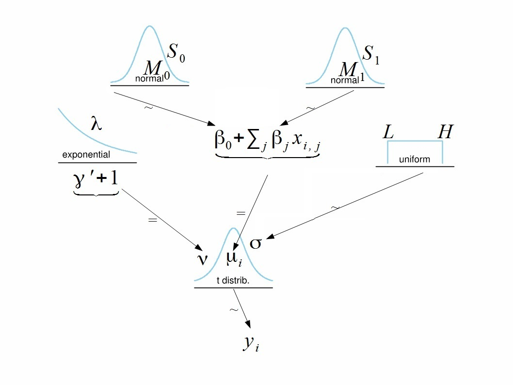
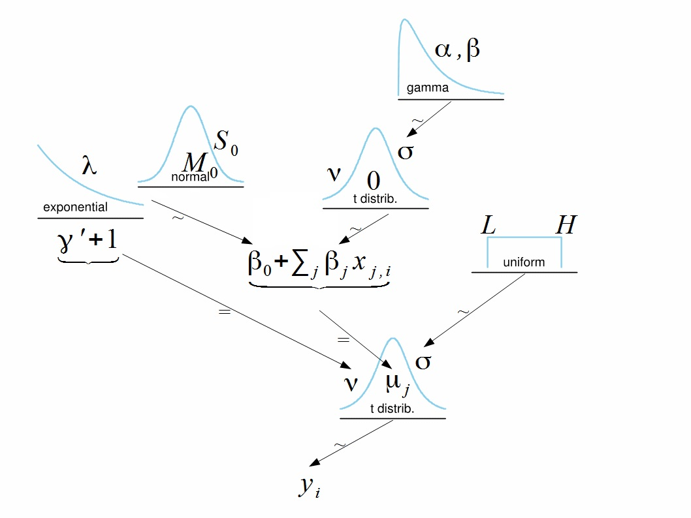

```{r setup, include=FALSE}
library(rstan)
library(shinystan)
options(mc.cores = parallel::detectCores())
rstan_options(auto_write = TRUE)
```

# Review a simple linear regression in Bayes

We can see [a post](https://hai-mn.github.io/posts/2021-04-22-Simple-linear-regression-in-Bayesian-way/) how to fit a simple linear regression in both Frequentist approach and Bayesian methods. Now we move on to the linear multiple regression.

# Multiple Regression

## Example 1: Two significant predictors

Generate data for multiple linear regression with 2 independent significant predictors.  

```{r generate data}
# generate data
set.seed(03182021)
Ntotal <- 500
x <- cbind(rnorm(Ntotal, mean = 20, sd = 4), 
           rnorm(Ntotal, mean=10, sd = 6))
Nx <- ncol(x)
y <- 4 + 1.1*x[,1] + 3*x[,2] + rnorm(Ntotal, mean = 0, sd = 1)
```

Create a data list.

```{r}
dataListRegression <- list(Ntotal = Ntotal, y = y, x = as.matrix(x), Nx = Nx)
```

Here's a model in the Frequentist method:

```{r}
summary(lm(y~x))
```

The diagram of the model shows hierarchical structure with normal priors for intercept $\beta_0$ and slopes $\beta_i$, $i=1,2$.



Description of the model:

\[y_i = \beta_0 + \beta_1 x_{i,1} + \beta_2 x_{i,2} + \epsilon_i \\
y_i \sim t(\mu_i, \sigma, \nu) \\
\\
\text{where mean, scale and degree of freedom, respectively, would be} \\
\mu_i = \beta_0 + \beta_1 x_{i,1} + \beta_2 x_{i,2} \\
\beta_0 \sim N(M_0, S_0) \ ; \ \beta_j \sim N(M_1, S_1) \\
\sigma \sim Unif(L, H) \\
\nu = \gamma^{\prime} + 1, \ \text{where} \ \gamma^{\prime} \sim exp(\lambda)\]


Now, we come back to the problem. Here's we write a model string:

<aside>
__Reminder of Stan:__ (see below, at the end of Example 1)
</aside>

```{r, eval=F}
modelString<-"
data {
    int<lower=1> Ntotal;
    int<lower=1> Nx;
    vector[Ntotal] y;
    matrix[Ntotal, Nx] x;
}
transformed data {
    real meanY;
    real sdY;
    vector[Ntotal] zy; // normalized
    vector[Nx] meanX;
    vector[Nx] sdX;
    matrix[Ntotal, Nx] zx; // normalized
    
    meanY = mean(y);
    sdY = sd(y);
    zy = (y - meanY) / sdY;
    for (j in 1:Nx) {
        meanX[j] = mean(x[,j]);
        sdX[j] = sd(x[,j]);
        for ( i in 1:Ntotal ) {
            zx[i,j] = (x[i,j] - meanX[j]) / sdX[j];
        }
    }
}
parameters {
    real zbeta0;
    vector[Nx] zbeta;
    real<lower=0> nu;
    real<lower=0> zsigma;
}
transformed parameters{
    vector[Ntotal] zy_hat;
    zy_hat = zbeta0 + zx * zbeta;
}
model {
    zbeta0 ~ normal(0, 2);
    zbeta  ~ normal(0, 2);
    nu ~ exponential(1/30.0);
    zsigma ~ uniform(1.0E-5 , 1.0E+1);
    zy ~ student_t(1+nu, zy_hat, zsigma);
}
generated quantities { 
    // Transform to original scale:
    real beta0; 
    vector[Nx] beta;
    real sigma;
    // .* and ./ are element-wise product and divide
    beta0 = zbeta0*sdY  + meanY - sdY * sum( zbeta .* meanX ./ sdX );
    beta = sdY * ( zbeta ./ sdX );
    sigma = zsigma * sdY;
} "
```


```{r, eval=F}
RobustMultipleRegressionDso <- stan_model(model_code=modelString)
```

If saved DSO is used load it, then run the chains.

```{r}
# saveRDS(RobustMultipleRegressionDso, file="data/DSORobustMultRegr.Rds")
RobustMultipleRegressionDso <- readRDS("data/DSORobustMultRegr.Rds")
```

Fit the model.

```{r}
fit1 <- sampling(RobustMultipleRegressionDso,
                 data=dataListRegression,
                 pars=c('beta0', 'beta', 'nu', 'sigma'),
                 iter = 5000, chains = 2, cores = 2)
stan_ac(fit1)
stan_trace(fit1)
```

Look at the results.  

```{r}
summary(fit1)$summary[,c(1,3,4,5,8,9)] #mean, sd, 2.5%, 97.5%, n_eff
pairs(fit1,pars=c("beta0","beta[1]","beta[2]"))
plot(fit1,pars="nu")
plot(fit1,pars="sigma")
plot(fit1,pars="beta0")
plot(fit1,pars="beta[1]")
plot(fit1,pars="beta[2]")
```

Analyze fitted model using `shinystan`  

```{r, eval=FALSE}
launch_shinystan(fit1)
```


__Conclusions:__    

1. $\nu$ (*degree of freedom in t-distribution*) is large enough to consider normal distribution: 2.5% HDI level is 12.6257143, mean value is 49.9778865. Not surprising: we simulated normal model $\Rightarrow$ normality parameter $\nu$   
2. Parameters $\beta_0$ and $\beta_1$ are significantly negatively correlated, as expected.  
3. Parameters $\beta_0$ and $\beta_2$ are also negatively correlated, but correlation is not so strong.   
4. All parameter estimates are close to what we simulated.   

### Reminder of Stan

A `Stan` program has three required "blocks":

1. `data` block: where you declare the data types, their dimensions, any restrictions (i.e. upper = or lower = , which act as checks for `Stan`), and their names. Any names you give to your `Stan` program will also be the names used in other blocks.

2. `parameters` block: This is where you indicate the parameters you want to model, their dimensions, restrictions, and name. For a linear regression, we will want to model the intercept, any slopes, and the standard deviation of the errors around the regression line.

3. `model` block: This is where you include any sampling statements, including the "likelihood" (model) you are using. The model block is where you indicate any prior distributions you want to include for your parameters. If no prior is defined, `Stan` uses default priors with the specifications `uniform(-infinity, +infinity)`. You can restrict priors using upper or lower when declaring the parameters (i.e. `<lower = 0>` to make sure a parameter is positive). You can find more information about prior specification [here](https://github.com/stan-dev/stan/wiki/Prior-Choice-Recommendations).

Sampling is indicated by the `~` symbol, and Stan already includes many common distributions as vectorized functions. You can check out [the manual](https://mc-stan.org/users/documentation/) for a comprehensive list and more information on the optional blocks you could include in your `Stan` model.

There are also four optional blocks:

- `functions`
- `transformed data`: allows for preprocessing of the data  
- `transformed parameters`:  allows for parameter processing before the posterior is computed   

Objects declared in the "transformed parameters" block of a Stan program are:

1. Unknown but are known given the values of the objects in the parameters block   
2. Saved in the output and hence should be of interest to the researcher   
3. Are usually the arguments to the log-likelihood function that is evaluated in the `model` block, although in hierarchical models the line between the prior and the likelihood can be drawn in multiple ways  

(if the third point is not the case, the object should usually be declared in the `generated quantities` block of a Stan program)

The purpose of declaring such things in the `transformed parameters` block rather than the parameters block is often to obtain more efficient sampling from the posterior distribution. If there is a posterior PDF $f(\theta \mid \text{data})$, then for any objective transformation from $\alpha$ to $\theta$, the posterior PDF of $\alpha$ is simply $f($\theta$($\alpha$) \mid data)\text{abs}|J|$, where $|J|$ is the determinant of the Jacobian matrix of the transformation from $\alpha$ to $\theta$. Thus, you can make the same inferences about (functions of) $\theta$ either by drawing from the posterior whose PDF is $f(\theta \mid \text{data})$ where $\theta$ are the parameters or the posterior whose PDF is f(θ(α)|data)abs|J| where α are parameters and θ are transformed parameters. Since the posterior inferences about (functions of) θ are the same, you are free to choose a transformation that enhances the efficiency of the sampling by making α less correlated, unit scaled, more Gaussian, etc. than is θ.


- "generated quantities"

$\Rightarrow$ [Transformation to improve fit]() 
Comments are indicated by `//` in `Stan.` The `write("model code", "file_name")` bit allows us to write the Stan model in our R script and output the file to the working directory (or you can set a different file path)

## Example 2: Insignificant predictor

```{r}
Regression.Data <- as.matrix(read.csv("data/DtSim4RegANOVA.csv", header=TRUE, sep=","))
tail(Regression.Data)
```

Prepare the data for Stan.

```{r}
Ntotal <- nrow(Regression.Data)
x <- Regression.Data[ ,2:3]
tail(x)
Nx <- ncol(x)
y <- Regression.Data[ ,1]
dataListInsig <- list(Ntotal=Ntotal, 
                      y=y, 
                      x=as.matrix(x), 
                      Nx=Nx)
```

Run MCMC using the same DSO. 

```{r}
fit2 <- sampling(RobustMultipleRegressionDso, data=dataListInsig,
                 pars=c('beta0', 'beta', 'nu', 'sigma'),
                 iter=5000, chains = 2, cores = 2)
```

```{r, eval=F}
launch_shinystan(fit2)
```

Analyze the results.

```{r}
summary(fit2)$summary[,c(1,3,4,8,9)] #mean, sd, 2.5%, 97.5%, n_eff
pairs(fit2,pars=c("beta0","beta[1]","beta[2]"))
plot(fit2,pars="nu")
plot(fit2,pars="sigma")
plot(fit2,pars="beta0")
plot(fit2,pars="beta[1]")
plot(fit2,pars="beta[2]")
```

We see that parameter $\beta_2$ is not significant.  
However, there is no strong correlation or redundancy between the predictors.  

Compare with the output of linear model  

```{r}
pairs(Regression.Data)
summary(lm(Output~., data=as.data.frame(Regression.Data)))
```


## Example 3: Correlated predictors  
### Strong correlation  

```{r}
set.seed(03192021)
Ntotal <- 500
x1 <- rnorm(Ntotal, mean = 20, sd = 4)
x2 <- 1 - 1.5*x1 + rnorm(Ntotal, mean=0, sd = .1)
x <- cbind(x1,x2)      

plot(x)

Nx <- ncol(x)
y <- 4 + .2*x[,1] + 3*x[,2]+rnorm(Ntotal, mean = 0, sd = 1)
plot(x[,1],y)

plot(x[,2],y)

fitlm<-lm(y~x[,1]+x[,2])
summary(fitlm)

drop1(fitlm)
```

```{r}
dataListShrink2 <- list(Ntotal=Ntotal, y=y, x=as.matrix(x), Nx=Nx)
```

Note that actual coefficient for `x[,1]` is $+0.2$, but slope on the plot plot(x[,1],y) is negative.  
Also note that __estimated model coefficients are different from actual because of correlation__:

```{r}
cbind(actual=c(4,.2,3),estimated=fitlm$coefficients)
```

Run the chains and analyze the results.

```{r}
tStart<-proc.time()
fit3<-sampling(RobustMultipleRegressionDso,
               data = dataListShrink2,
               pars = c('beta0', 'beta', 'nu', 'sigma'),
               iter = 5000, chains = 2, cores = 2)
tEnd<-proc.time()
tEnd-tStart
```


__How long did it take to run this MCMC? Why so long?__

Monte Carlo methods assume that the samples are independent. This is usually not the case for sequential draws in Markov Chain Monte Carlo (MCMC) sampling, motivating the use of thinning. In thinning, we keep every T sample ($P(x \le t)$) and throw away the other samples. For some types of MCMC (notably, Gibbs sampling), highly correlated variables result in highly correlated samples (i.e., definitely not independent), requiring a large T to compensate. Large values of T mean a large computational cost for each effective sample (i.e., for each sample that is kept).

<aside>
_Note:_ The parameter thin allows the user to specify if and how much the MCMC chains should be thinned out before storing them. By default thin = 1 is used, which corresponds to keeping all values. A value thin = 10 would result in keeping every 10th value and discarding all other values.
</aside>

Check convergence in shiny.

```{r, eval=FALSE}
launch_shinystan(fit3)
```

```{r}
stan_dens(fit3)
stan_ac(fit3, separate_chains = T)
summary(fit3)$summary[,c(1,3,4,8,9)]
pairs(fit3,pars=c("beta0","beta[1]","beta[2]"))
plot(fit3,pars="nu")
plot(fit3,pars="sigma")
plot(fit3,pars="beta0")
plot(fit3,pars="beta[1]")
plot(fit3,pars="beta[2]")
```

> General signs of collinear predictors:   
  - High correlation between slopes (compensating sign)  
  - Wide posterior distributions for slopes  
  - Increased autocorrelation for slopes  

```{r}
pairs(cbind(y,x1,x2))
cbind(actual=c(4,.2,3),estimatedLm=fitlm$coefficients,estimatedBayes=summary(fit3)$summary[1:3,1])
```

Linear model shows the same information as Bayesian.


### Collinearity

In case when predictors have strong collinearity, linear model may stop working.  
Simulate the same model as in the previous section, but make predictors collinear.  

```{r}
set.seed(03192021)
Ntotal <- 500
x1 <- rnorm(Ntotal, mean = 20, sd = 4)
x2<-1-1.5*x1+rnorm(Ntotal, mean=0, sd = .000001) # sd closes to 0
x<-cbind(x1,x2)           
plot(x)

Nx <- ncol(x)
y <- 4 + .2*x[,1] + 3*x[,2]+rnorm(Ntotal, mean = 0, sd = 1)
plot(x[,1],y)

plot(x[,2],y)
```


```{r}
dataListShrink2c <- list(Ntotal=Ntotal, y=y, x=as.matrix(x), Nx=Nx)
(lmFit <- lm(y~x1+x2))
summary(lmFit)
drop1(lmFit)
```

Linear model stops working.

Simulate Markov chains.

```{r}
cbind(actual=c(4,.2,3),estimated=fitlm$coefficients)
```

Run the chains and analyze the results.

```{r}
tStart <- proc.time()
fit3c <- sampling(RobustMultipleRegressionDso,
                data=dataListShrink2c,
                pars=c('beta0', 'beta', 'nu', 'sigma'),
                iter=5000, chains = 1, cores = 2)
tEnd <- proc.time()
tEnd-tStart
```


With collinear predictors model definitely takes much longer time to simulate.


```{r}
stan_dens(fit3c)
stan_ac(fit3c, separate_chains = T)
summary(fit3c)$summary[,c(1,3,4,8,9)]
pairs(fit3c,pars=c("beta0","beta[1]","beta[2]"))
plot(fit3c,pars="nu")
plot(fit3c,pars="sigma")
plot(fit3c,pars="beta0")
plot(fit3c,pars="beta[1]")
plot(fit3c,pars="beta[2]")
```

Markov chains may go over limit on tree depths (yellow dots on pairs graph).   
But Bayesian method still works. It shows that one or both of the slopes are not significantly different from zero.  


# Shrinkage of regression coefficients

When there are many candidate predictors in the model it may be useful to "motivate" them to become closer to zero if they are not very strong.   
One way to do it is to:   

  - Set a prior distribution for slopes as t-Student instead of normal;   
  - Make mean of that distribution equal to zero;   
  - Make normality parameter $\nu$ small and dispersion parameter $\sigma$ also small


  
  Small $\sigma$ forces slopes to shrink towards zero mean. At the same time, small $\nu$ makes the tails fat enough to allow some strong slopes to be outliers.   

  Parameter $\sigma$ of the prior for regression coefficients $\beta_j$ can be either fixed, or given its own prior and estimated.  

  In the former case, all coefficients will be forced to have the same regularizator, if it is random and estimated from the same data then there is mutual influence between $\sigma$ and regression coefficients: if many of them are close to zero then $\sigma$ is going to be smaller, which in turn pushes coefficients even closer to zero.

These approaches reminds us the Ridge/LASSO/Elastic net regression in Machine Learning models.

## Two significant predictors

Use the same data `dataListRegression` as in the above section.  
Describe the model.


\[y_i = \beta_0 + \beta_1 x_{i,1} + \beta_2 x_{i,2} + \epsilon_i \\
y_i \sim t(\mu_i, \sigma, \nu) \\
\\
\text{where mean, scale and degree of freedom, respectively, would be} \\
\mu_i = \beta_0 + \beta_1 x_{i,1} + \beta_2 x_{i,2} \\
\beta_0 \sim N(M_0, S_0) \ ; \ \beta_j \sim t(\mu_j, \nu_j, \sigma_{\beta}) \\
\sigma_{\beta} \sim gamma(shape,rate) \\
\sigma \sim Unif(L, H) \\
\nu = \gamma^{\prime} + 1, \ \text{where} \ \gamma^{\prime} \sim exp(\lambda)\]

```{r, eval=F}
modelString<-"
data {
    int<lower=1> Ntotal;
    int<lower=1> Nx;
    vector[Ntotal] y;
    matrix[Ntotal, Nx] x;
}
transformed data {
    real meanY;
    real sdY;
    vector[Ntotal] zy; // normalized
    vector[Nx] meanX;
    vector[Nx] sdX;
    matrix[Ntotal, Nx] zx; // normalized
    
    meanY = mean(y);
    sdY = sd(y);
    zy = (y - meanY) / sdY;
    for (j in 1:Nx) {
        meanX[j] = mean(x[,j]);
        sdX[j] = sd(x[,j]);
        for (i in 1:Ntotal) {
            zx[i,j] = (x[i,j] - meanX[j]) / sdX[j];
        }
    }
}
parameters {
    real zbeta0;
    real<lower=0> sigmaBeta;
    vector[Nx] zbeta;
    real<lower=0> nu;
    real<lower=0> zsigma;
}
transformed parameters{
    vector[Ntotal] zy_hat;
    zy_hat = zbeta0 + zx * zbeta;
}
model {
    zbeta0 ~ normal(0, 2);
    sigmaBeta ~ gamma(2.3,1.3); // mode=(alpha-1)/beta, var=alpha/beta^2
    zbeta  ~ student_t(1.0/30.0, 0, sigmaBeta);
    nu ~ exponential(1/30.0);
    zsigma ~ uniform(1.0E-5 , 1.0E+1);
    zy ~ student_t(1+nu, zy_hat, zsigma);
}
generated quantities { 
    // Transform to original scale:
    real beta0; 
    vector[Nx] beta;
    real sigma;
    // .* and ./ are element-wise product and divide
    beta0 = zbeta0*sdY  + meanY - sdY * sum( zbeta .* meanX ./ sdX );
    beta = sdY * ( zbeta ./ sdX );
    sigma = zsigma * sdY;
} "
```

Gamma distribution prior for sigmaBeta is selected to have relatively low mode 1.

```{r}
xGamma <- seq(from = .00001, to = 10, by = .001)
plot(xGamma,dgamma(xGamma,shape=2.3,rate=1.3),type="l")
xGamma[which.max(dgamma(xGamma,shape=2.3,rate=1.3))]
```

Create DSO.


```{r, eval=F}
RegressionShrinkDso <- stan_model(model_code = modelString)
```

If saved DSO is used load it, then run the chains.

```{r}
# save(RegressionShrinkDso, file = "data/DSOShrunkMultRegr.Rds")
load("data/DSOShrunkMultRegr.Rds")
```

Generate Markov chains in case of 2 significant predictors.

```{r}
tStart<-proc.time()
# fit model
fit4 <- sampling(RegressionShrinkDso, 
             data=dataListRegression, 
             pars=c('beta0', 'beta', 'nu', 'sigma', 'sigmaBeta'),
             iter=5000, chains = 2, cores = 2
)
tEnd<-proc.time()
tEnd-tStart
```

Analyze fitted model using `shinystan`

```{r, eval=F}
launch_shinystan(fit4)
```

```{r}
stan_dens(fit4)
stan_ac(fit4, separate_chains = T)
summary(fit4)$summary[,c(1,3,4,8,9)]
pairs(fit4,pars=c("beta0","beta[1]","beta[2]"))
plot(fit4,pars="nu")
plot(fit4,pars="sigma")
plot(fit4,pars="beta0")
plot(fit4,pars="beta[1]")
plot(fit4,pars="beta[2]")
```

### Analysis and comparison

Compare posterior mean values and 95% HDI with `fit1` (same model, but with no shrinkage).

```{r}
cbind(summary(fit1)$summary[1:3,c(1,4,8)],
      summary(fit4)$summary[1:3,c(1,4,8)])
```

Mean values of both fits seem very similar.  
Check widths of the HDI for coefficients.  

```{r}
cbind(summary(fit1)$summary[1:3,c(8)]-summary(fit1)$summary[1:3,c(4)],
      summary(fit4)$summary[1:3,c(8)]-summary(fit4)$summary[1:3,c(4)])
```

Shrinkage can be noticed after third digit of all coefficients.  
In this example both slopes are significant and they practically did not shrink.  

For comparison fit linear model, ridge and lasso regressions to the same data.

1- Linear model.

```{r}
lmFit<-lm(dataListRegression$y~dataListRegression$x[,1]+dataListRegression$x[,2])
```


2- Ridge.

```{r}
library(glmnet)
set.seed(15)
cv.outRidge <- cv.glmnet(x = dataListRegression$x, 
                         y = dataListRegression$y, 
                         alpha=0)
plot(cv.outRidge)
(bestlam <-cv.outRidge$lambda.min)
ridgeFit <- glmnet(x = dataListRegression$x, y=dataListRegression$y,
                   alpha = 0, lambda = bestlam, standardize = F)
(ridge.coef <- predict(ridgeFit,type="coefficients", s = bestlam))
```

3- Lasso.


```{r}
set.seed(15)
cv.outLasso <- cv.glmnet(x = dataListRegression$x, 
                         y = dataListRegression$y, 
                         alpha=1)
plot(cv.outLasso)
(bestlam <-cv.outLasso$lambda.min)
lassoFit<-glmnet(x=dataListRegression$x,y=dataListRegression$y,
                 alpha=1,lambda=bestlam,standardize = F)
(lasso.coef<-predict(lassoFit,type="coefficients",s=bestlam))
```

Compare coefficients from all 5 models

```{r}
comparison<-cbind(summary(fit1)$summary[1:3,c(1,4,8)],
      summary(fit4)$summary[1:3,c(1,4,8)],
      Ridge=ridge.coef,
      Lasso=lasso.coef,
      Linear=lmFit$coefficients)
colnames(comparison)<-c(paste("NoShrinkage",c("mean","2.5%","97.5%"),sep="_"),
                        paste("Shrinkage",c("mean","2.5%","97.5%"),sep="_"),
                        "Ridge","Lasso","Linear")
t(comparison)
```

All models show practically no shrinkage relative to linear model.  
Both Ridge and Lasso regression have too high estimates of intercept.  

## Insignificant predictor

Shrink estimates from data `dataListInsig`.

```{r}
tStart<-proc.time()
# fit model
fit5 <- sampling (RegressionShrinkDso, 
             data=dataListInsig, 
             pars=c('beta0', 'beta', 'nu', 'sigma', 'sigmaBeta'),
             iter=5000, chains = 2, cores = 2
)
tEnd<-proc.time()
tEnd-tStart
```

We can analyze fitted model with `shinystan` but

```{r}
stan_dens(fit5)
stan_ac(fit5, separate_chains = T)
summary(fit5)$summary[,c(1,3,4,8,9)]
pairs(fit5,pars=c("beta0","beta[1]","beta[2]"))
plot(fit5,pars="nu")
plot(fit5,pars="sigma")
plot(fit5,pars="beta0")
plot(fit5,pars="beta[1]")
plot(fit5,pars="beta[2]")
```

This time posterior density of $\beta_2$ (beta[2]) is concentrated at zero.  

### Analysis and comparison

Compare mean levels and HDI widths for fits with and without shrinkage.

```{r}
cbind(summary(fit2)$summary[1:3,c(1,4,8)],
      summary(fit5)$summary[1:3,c(1,4,8)])
```

```{r}
cbind(summary(fit2)$summary[1:3,c(8)]-summary(fit2)$summary[1:3,c(4)],
      summary(fit5)$summary[1:3,c(8)]-summary(fit5)$summary[1:3,c(4)])
```

Parameters shrunk a little more this time, second coefficient shrunk to zero.

Again, fit linear model, ridge and lasso regressions to the same data.

1- Linear model. 

```{r}
lmFit<-lm(dataListInsig$y~dataListInsig$x[,1]+dataListInsig$x[,2])
```

2- Ridge.

```{r}
set.seed(15)
cv.outRidge=cv.glmnet(x=dataListInsig$x,y=dataListInsig$y,alpha=0)
plot(cv.outRidge)
(bestlam <-cv.outRidge$lambda.min)
ridgeFit<-glmnet(x=dataListInsig$x,y=dataListInsig$y,
                 alpha=0,lambda=bestlam,standardize = F)
(ridge.coef<-predict(ridgeFit,type="coefficients",s=bestlam))
```

3- Lasso.

```{r}
set.seed(15)
cv.outLasso=cv.glmnet(x=dataListInsig$x,y=dataListInsig$y,alpha=1)
plot(cv.outLasso)
(bestlam <-cv.outLasso$lambda.min)
lassoFit<-glmnet(x=dataListInsig$x,y=dataListInsig$y,
                 alpha=1,lambda=bestlam,standardize = F)
(lasso.coef<-predict(lassoFit,type="coefficients",s=bestlam))
```

Compare coefficients from all 3 models.

```{r}
comparison<-cbind(summary(fit2)$summary[1:3,c(1)],
      summary(fit5)$summary[1:3,c(1)],
      Ridge=ridge.coef,
      Lasso=lasso.coef,
      Linear=lmFit$coefficients)
colnames(comparison)<-c("NoShrinkage","Shrinkage","Ridge","Lasso","Linear")
t(comparison)
```

All models correctly exclude second coefficient.  
Ridge shrunk both slopes more than other models.  
There is again tendency for Ridge and Lasso to overestimate intercept.   

## Correlated predictors

Shrink coefficients estimated from `dataListShrink2`.

```{r}
tStart<-proc.time()
# fit model
fit6 <- sampling (RegressionShrinkDso, 
             data=dataListShrink2, 
             pars=c('beta0', 'beta', 'nu', 'sigma', 'sigmaBeta'),
             iter=5000, chains = 2, cores = 2
)
tEnd<-proc.time()
tEnd-tStart
```

We could analyze model with `shinystan` but let's check densities, pairs and individual plots of parameters.

```{r}
stan_dens(fit6)
stan_ac(fit6, separate_chains = T)
summary(fit6)$summary[,c(1,3,4,8,9)]
pairs(fit6,pars=c("beta0","beta[1]","beta[2]"))
plot(fit6,pars="nu")
plot(fit6,pars="sigma")
plot(fit6,pars="beta0")
plot(fit6,pars="beta[1]")
plot(fit6,pars="beta[2]")
```

### Analysis and comparison

Show mean values and HDI.

```{r}
cbind(summary(fit3)$summary[1:3,c(1,4,8)],
      summary(fit6)$summary[1:3,c(1,4,8)])
cbind(summary(fit3)$summary[1:3,c(8)]-summary(fit3)$summary[1:3,c(4)],
      summary(fit6)$summary[1:3,c(8)]-summary(fit6)$summary[1:3,c(4)])
```

In this example $\beta_1$ shrunk more significantly and is not different from zero.  
At the same time $\beta_2$ has become more different from zero.  
Regularization reinforced one of the two correlated predictors while dumping the other.  

Again, fit linear model, ridge and lasso regressions to the same data.

1- Linear model.

```{r}
lmFit<-lm(dataListShrink2$y~dataListShrink2$x[,1]+dataListShrink2$x[,2])
summary(lmFit)
```

2- Ridge.

```{r}
set.seed(15)
cv.outRidge=cv.glmnet(x=dataListShrink2$x,y=dataListShrink2$y,alpha=0)
plot(cv.outRidge)
(bestlam <-cv.outRidge$lambda.min)
ridgeFit<-glmnet(x=dataListShrink2$x,y=dataListShrink2$y,
                 alpha=0,lambda=bestlam,standardize = F)
(ridge.coef<-predict(ridgeFit,type="coefficients",s=bestlam))
```

3- Lasso.  

```{r}
set.seed(15)
cv.outLasso=cv.glmnet(x=dataListShrink2$x,y=dataListShrink2$y,alpha=1)
plot(cv.outLasso)
(bestlam <-cv.outLasso$lambda.min)
lassoFit<-glmnet(x=dataListShrink2$x,y=dataListShrink2$y,
                 alpha=1,lambda=bestlam,standardize = F)
(lasso.coef<-predict(lassoFit,type="coefficients",s=bestlam))
```

Compare coefficients from all 3 models.

```{r}
comparison<-cbind(summary(fit3)$summary[1:3,c(1)],
      summary(fit6)$summary[1:3,c(1)],
      Ridge=ridge.coef,
      Lasso=lasso.coef,
      Linear=lmFit$coefficients)
colnames(comparison)<-c("NoShrinkage","Shrinkage","Ridge","Lasso","Linear")
t(comparison)
```


All models correctly exclude first slope.  
Lasso does it decisively, making slope $\beta_1$ and exactly equal to $0$.  
Lasso also estimated intercept and $\beta_2$ more accurately than other models: recall that for this data set we simulate $\beta_0=4, \beta_2=3$.

# Is school financing necessary?

Analysis of SAT scores, example from Kruschke, 2015, section 18.3.

These data are analyzed in the [article by Deborah Lynn Guber](chrome-extension://efaidnbmnnnibpcajpcglclefindmkaj/https://www.uvm.edu/~dguber/research/JSE99.pdf).  

The variables observed are:   

- states (State)  
- the mean SAT score by state (SATV, SATM and SATT),   
- amount of money spent by student (Spend),   
- percent of students who take SAT (PrcntTake) and    
- other variables (student to teacher ratio, teacher salary).  

Read the data from file `Guber1999data.csv` available at [Kruschke, 2015](https://sites.google.com/site/doingbayesiandataanalysis/home?authuser=0).

```{r}
myData = read.csv("data/Guber1999data.csv")  # section 18.3 @ Kruschke
head(myData)
pairs(myData[,-c(1,6:7)])
plot(myData$Spend,myData$SATT)
summary(lm(myData$SATT~myData$Spend))$coeff
```

The plots show that mean SAT score is negatively correlated with amount of money states spend per student.
These results were used in hot debates about spending money on education to support argument in favor of reducing public support for schools.

Prepare the data.

Use the 2 predictors from the file, plus add 12 randomly generated nuisance predictors.

```{r}
Ntotal <- nrow(myData)
y <- myData$SATT
x <- cbind(myData$Spend, myData$PrcntTake)
colnames(x) <- c("Spend","PrcntTake");
dataList2Predict <- list(Ntotal=Ntotal,y=y,x=x,Nx=ncol(x))
# generate 12 spurious predictors:
set.seed(47405)
NxRand <- 12
for (xIdx in 1:NxRand) {
    xRand = rnorm(Ntotal)
    x = cbind(x, xRand )
    colnames(x)[ncol(x)] = paste0("xRand", xIdx)
}
dataListExtraPredict <- list(Ntotal=Ntotal,y=y,x=x,Nx=ncol(x))
```

## No-shrinkage

Use the same model as in the example of the first section: `RobustMultipleRegressionDso`.  

First, run the model with 2 predictors.  

```{r}
fit_noshrink2Pred <- sampling (RobustMultipleRegressionDso, 
                          data=dataList2Predict, 
                          pars=c('beta0', 'beta', 'nu', 'sigma'),
                          iter=5000, chains = 2, cores = 2)
summary(fit_noshrink2Pred)$summary[,c(1,4,8)]
```

It is clear that the slope of `Spend` is significantly positive and slope of `PrcntTake` is significantly negative.

This shows that the negative correlation between SAT scores and the money spent as seen from the scatterplot is illusory: fewer students from underfunded schools take SAT, but these are only students who apply for colleges; students who potentially would receive low SAT scores do not apply to college and do not take the test.  
  
Run MCMC for the model with additional nuisance predictors.  

```{r}
fit_noshrinkExtra <- sampling (RobustMultipleRegressionDso, 
                          data=dataListExtraPredict, 
                          pars=c('beta0', 'beta', 'nu', 'sigma'),
                          iter=5000, chains = 2, cores = 2)
```

Analyze the output with `shinystan` .

```{r, eval=F}
launch_shinystan(fit_noshrinkExtra)
```

Here are the results of MCMC.

```{r}
stan_ac(fit_noshrinkExtra, separate_chains = T)
pairs(fit_noshrinkExtra,pars=c("beta0","beta[1]","beta[2]"))
plot(fit_noshrinkExtra,pars=c('beta'))
stan_dens(fit_noshrinkExtra,pars=c("beta0","beta"))
```

All densities look symmetrical: mean values of posterior distributions can be used as point estimates of betas.  

```{r}
summary(fit_noshrinkExtra)$summary[,c(1,4,8)]
```

The variables corresponding to betas are:

```{r}
colnames(x)
```

Note that the coefficient for variable `Spend` is still positive, but the left side of HDI interval is much closer to zero. The coefficient for `PrcntTake` is still significantly negative.  
One of the nuisance predictors happened to be significantly negative: `beta[12]`.  

As a result of adding nuisance predictors the accuracy of inference becomes lower.  

## Shrinkage

Analyze the same data with the model encouraging shrinkage of parameters.

First, fit the model without nuisance parameters.

```{r}
fit_shrink <- sampling (RegressionShrinkDso, 
                        data=dataList2Predict, 
                        pars=c('beta0', 'beta', 'nu', 'sigma', 'sigmaBeta'),
                        iter=5000, chains = 2, cores = 2)
```

Check convergence in `shiny`.

```{r, eval=F}
launch_shinystan(fit_shrink)
```

```{r}
pairs(fit_shrink,pars=c("beta0","beta","nu","sigma","sigmaBeta"))
plot(fit_shrink,pars=c('beta'))
stan_dens(fit_shrink,pars=c('beta'))
stan_ac(fit_shrink, separate_chains = T)
```

Compare with the fit without nuisance parameters and without shrinkage.

```{r}
cbind(summary(fit_noshrink2Pred)$summary[1:4,c(1,4,8)],
      summary(fit_shrink)$summary[1:4,c(1,4,8)])
```

First variable shrunk closer to zero: mean value is smaller and left end of the 95%-HDI is closer to zero.

Now fit the model with additional parameters.

```{r}
fit_shrinkExtra <- sampling (RegressionShrinkDso, 
                        data=dataListExtraPredict, 
                        pars=c('beta0', 'beta', 'nu', 'sigma', 'sigmaBeta'),
                        iter=5000, chains = 2, cores = 2)
stan_ac(fit_shrinkExtra, separate_chains = T)
pairs(fit_shrinkExtra,pars=c("beta0","beta[1]","beta[2]","beta[3]","beta[4]","beta[11]","beta[12]"))
pairs(fit_shrinkExtra,pars=c("nu","sigma","sigmaBeta"))
plot(fit_shrinkExtra,pars=c('beta'))
stan_dens(fit_shrinkExtra,pars=c('beta'))
```

Note characteristic pinched tips of posterior densities for shrunk variables.

```{r}
summary(fit_shrinkExtra)$summary[,c(1:4,8)]
```

Parameter `beta[12]` has shrunk to zero based on 95%-HDI as a result of regularized model.  
This helped removing all nuisance parameters. 
But shrinkage also removed parameter `beta[1]` of variable `Spend`!!!

## Linear model

Compare with linear model.

Without nuisance predictors:

```{r}
lmSAT<-lm(y~x[,1]+x[,2])
summary(lmSAT)
confint(lmSAT)
```

With nuisance predictors:

```{r}
lmSATAll<-lm(y~.,data=as.data.frame(cbind(y,x)))
summary(lmSATAll)
confint(lmSATAll)[2:3,2]-confint(lmSATAll)[2:3,1]
confint(lmSAT)[2:3,2]-confint(lmSAT)[2:3,1]
```

These also show that addition of nuisance parameters widened confidence intervals.

## Ridge and lasso

```{r}
set.seed(15)
cv.outRidge=cv.glmnet(x=dataListExtraPredict$x,y=dataListExtraPredict$y,alpha=0)
plot(cv.outRidge)
(bestlam <-cv.outRidge$lambda.min)
ridgeFit<-glmnet(x=dataListExtraPredict$x,y=dataListExtraPredict$y,
                 alpha=0,lambda=bestlam,standardize = F)
ridge.coef<-predict(ridgeFit,type="coefficients",s=bestlam)
set.seed(15)
cv.outLasso=cv.glmnet(x=dataListExtraPredict$x,y=dataListExtraPredict$y,alpha=1)
plot(cv.outLasso)
(bestlam <-cv.outLasso$lambda.min)
lassoFit<-glmnet(x=dataListExtraPredict$x,y=dataListExtraPredict$y,
                 alpha=1,lambda=bestlam,standardize = F)
lasso.coef<-predict(lassoFit,type="coefficients",s=bestlam)
comparison<-round(cbind(summary(lmSATAll)$coefficients[,c(1,4)],
                        summary(fit_noshrinkExtra)$summary[1:15,c(1,4,8)],
                        summary(fit_shrinkExtra)$summary[1:15,c(1,4,8)],
                        ridge.coef, lasso.coef),3)
comparison<-as.matrix(comparison)
colnames(comparison)<-c("LM","LM-Pv","NoShrink","NoShrink-L","NoShrink-H",
                        "Shrink","Shrink-L","Shrink-H","Ridge","Lasso")
comparison
```

Note that there is no way to extract from ridge and lasso regressions any measure for comparison with zero, like confidence intervals.    

Linear model keeps both `Spend` and `PrcntTake` and removes with 5% level all nuisance coefficients except `xRand10`     
Bayesian model without shrinkage does the same.   
Bayesian model with shrinkage shrinks to zero all artificial predictors, but it also removes Spend.   
Ridge in general is consistent with linear model, but it is not clear if it shrinks any parameters to zero or not.
Lasso fails to shrink to zero several artificial parameters.   

# Further reading 

  - Bayesian Methods, UC's lecture   
  - Gelman, A., Carlin, J., Stern, H., Dunson, D., Vehtari, A., & Rubin, D. (2013). Bayesian Data Analysis, Third Edition, 3rd Edition (3rd edition ed.): CRC Press.     
  - Kruschke, John K. Doing Bayesian Data Analysis: a Tutorial with R, JAGS, and Stan. 2nd ed., Academic Press is an imprint of Elsevier, 2015.  