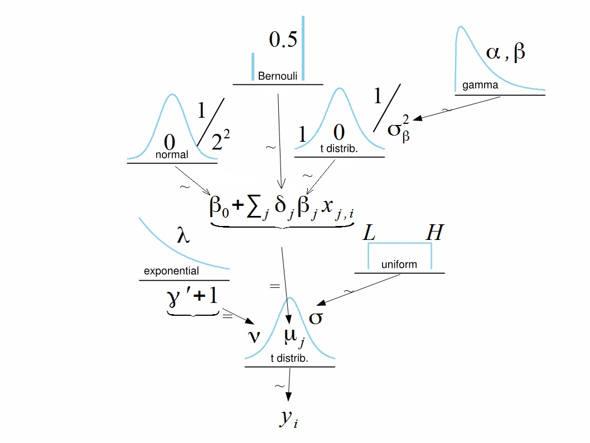

# Introduction  

This example is based on section 18.4 in Kruschke, 2015.

A Bayesian approach variable selection in regression analysis can be done by adding a binary parameter for each slope:  
\[y_i = \beta_0 + \sum_j \delta_j \ \beta_j x_{i,j},\]

with \[\delta_j = 0, \ 1.\]

Every combination of values $\delta_1, \ ..., \delta_k$ gives a submodel. Simple priors for delta-indicators are independent Bernoulli distributions: $\delta \sim \text{dbern}(0.5)$. Then posterior probabilities $P(\delta_j = 1\mid D)$ show importance of the corresponding predictors $x_i$.  

The diagram of such model is an easy generalization of regression model.  


Since parameters $\delta_j$ are discrete, we need to use JAGS: `library(runjags)` instead of Stan

```{r, warning=F}
library(runjags)
```

# Read data  

The [SAT data](https://sites.google.com/site/doingbayesiandataanalysis/software-installation?authuser=0) includes:  

  - `State`: 50 states, 
  - `SATV`: SAT verbal; `SATM`: SAT math; `SATT`: SAT total score   
  - `Spend`: average spending per pupil  
  - `PrcntTake`: percentage of students who took the test  
  - `StuTeaRat`: the average student teacher ratio in each state and   
  - `Salary`: the average salary of the teachers   

These latter four variables are also plausible predictors of SAT score.  

```{r}
dta <- read.csv("data/Guber1999data.csv")
names(dta)
DT::datatable(dta)
```

We now let look at the correlation matrix among 4 predictors.  

```{r, include=FALSE}
library(tidyverse)
```

```{r}
dta %>%
  select(Spend, PrcntTake, StuTeaRat, Salary) %>%
  cor(.) %>%
  round(., 3)
```

That Salary is strongly correlated with Spend, and therefore, a model that
includes both Salary and Spend will show a strong trade-off between those predictors
and consequently will show inflated uncertainty in the regression coefficients for either
one. Should only one or the other be included, or both, or neither?

One more point, response variable is average high school SAT score per state. One of the predictors is amount of money spent by the state on schools. Plotting amount of money spent against SAT scores shows negative slope.

```{r}
plot(dta$Spend,dta$SATT)
```

Thus, should we cut funding for school? Because even with the funding, SAT would be reduced disproportional with the budget spent!!

# Modeling in JAGS 

```{r}
y <- dta[,'SATT']
x <- as.matrix(dta[ , c("Spend","PrcntTake","StuTeaRat","Salary")])

#prepare data in JAGS
dataList <- list(Ntotal = length(y),
                 y = y,
                 x = x,
                 Nx = ncol(x))
```

Description of the model:

\[y_i = \beta_0 + \delta_j \ \beta_j x_{i,j} + \epsilon_i \\
y_i \sim t(\mu_i, \sigma, \nu) \\
\\
\text{where mean, scale and degree of freedom, respectively, would be} \\
\mu_i = \beta_0 + \delta_j \ \beta_j x_{i,j} \\
\beta_0 \sim N(0, \frac{1}{1/2^2}) \ ; \ \beta_j \sim t(0, 1/\sigma_{\beta}^2, \nu = 1) \\
\sigma \sim Unif(L, H) \\
\nu = \gamma^{\prime} + 1, \ \text{where} \ \gamma^{\prime} \sim exp(\lambda) \\
\delta_j \sim Bernoulli(0.5) \ ; \ \sigma_{\beta} \sim \text{Gamma(shape, rate)}\]

```{r}
modelString = "
    # Standardize the data:
    data {
        ym <- mean(y)
        ysd <- sd(y)
        for (i in 1:Ntotal) {
            zy[i] <- (y[i] - ym) / ysd
        }
        for (j in 1:Nx) {
            xm[j]  <- mean(x[,j])
            xsd[j] <-   sd(x[,j])
            for (i in 1:Ntotal) {
                zx[i,j] <- (x[i,j] - xm[j]) / xsd[j]
            }
        }
    }
    # Specify the model for standardized data:
    model {
        for (i in 1:Ntotal) {
            zy[i] ~ dt(zbeta0 + sum(delta[1:Nx] * zbeta[1:Nx] * zx[i,1:Nx] ) ,  1/zsigma^2 , nu)
        }
        # Priors vague on standardized scale:
        zbeta0 ~ dnorm(0, 1/2^2)
        for (j in 1:Nx) {
            zbeta[j] ~ dt(0 , 1/sigmaBeta^2 , 1) 
            delta[j] ~ dbern( 0.5 )
        }
        zsigma ~ dunif(1.0E-5 , 1.0E+1)
        
        # sigmaBeta <- 2.0 ## uncomment one of the following specifications for sigmaBeta
        # sigmaBeta ~ dunif( 1.0E-5 , 1.0E+2 )
        sigmaBeta ~ dgamma(1.1051,0.1051) # mode 1.0, sd 10.0
        # sigmaBeta <- 1/sqrt(tauBeta) ; tauBeta ~ dgamma(0.001,0.001) 
        nu ~ dexp(1/30.0)
        
        # Transform to original scale:
        beta[1:Nx] <- (delta[1:Nx] * zbeta[1:Nx] / xsd[1:Nx])*ysd
        beta0 <- zbeta0*ysd  + ym - sum(delta[1:Nx] * zbeta[1:Nx] * xm[1:Nx] / xsd[1:Nx])*ysd
        sigma <- zsigma*ysd
    }
"
```

```{r}
parameters <- c("beta0",  "beta",  "sigma", "delta", "sigmaBeta", "zbeta0", "zbeta", "zsigma", "nu" )
runjagsMethod <- "parallel"  # change to "rjags" in case of working on 1-core CPU 
# run JAGS
```

```{r, eval=F}
runJagsOut <- run.jags(method = runjagsMethod,
                       model = modelString, 
                       monitor = parameters, 
                       data = dataList,
                       n.chains = 3, #nChains <- 3
                       adapt = 500, #adaptSteps <- 500
                       burnin = 1000, #burnInSteps <- 1000
                       sample = ceiling(15000/3), #numSavedSteps <- 15000;  nChains <- 3
                       thin = 25, #thinSteps <- 25
                       summarise = FALSE,
                       plots = FALSE)
```

```{r, include=FALSE}
# save(runJagsOut, file = "data/runJagsOut.Rdata")
load(file = "data/runJagsOut.Rdata")
```

```{r, eval=FALSE, include=FALSE}
# convert to coda samples
#codaSamples <- as.mcmc.list(runJagsOut)
# concat all chains into one matrix (can be useful in case you want to calculate statistics by yourself):
#mcmcMat <- as.matrix(codaSamples)
```

```{r}
# generate summary info for all parameters
summary(runJagsOut)
```

```{r}
# plot all params
plot(runJagsOut,
     plot.type = c("trace", "ecdf", "histogram", "autocorr"))
```

Find posterior probability of different combinations of predictors by calculating frequencies with which they appeared in MCMC.

```{r}
trajectoriesDelta <- as.matrix(runJagsOut$mcmc[,7:10])
head(trajectoriesDelta)
Nchain <- nrow(trajectoriesDelta)
```

## model $SATT = \beta_0 + \beta_1 \ Spend + \beta_2 \ PrcntTake$

```{r}
(config1 <- sum(apply(trajectoriesDelta, 1, function(z) prod(z==c(1,1,0,0))))/Nchain)
```

## model $SATT = \beta_0 + \beta_1 \ Spend$

```{r}
(config2 <- sum(apply(trajectoriesDelta, 1,function(z) prod(z==c(1,0,0,0))))/Nchain)
```

## model $SATT = \beta_0 + \beta_2 \ PrcntTake$

```{r}
(config3 <- sum(apply(trajectoriesDelta, 1, function(z) prod(z==c(0,1,0,0))))/Nchain)
```

## model $SATT = \beta_0 + \beta_1 \ Spend + \beta_2 \ PrcntTake + \beta_3 \ StuTeaRat + \beta_4 \ Salary$

```{r}
(config4 <- sum(apply(trajectoriesDelta, 1, function(z) prod(z==c(1,1,1,1))))/Nchain)
```


# Inclusion Probabilities

```{r}
(inclSpend<-sum(trajectoriesDelta[,1]==1)/Nchain) #Spend
(inclPrcntTake<-sum(trajectoriesDelta[,2]==1)/Nchain) #PrcntTake
(inclStueTeaRat<-sum(trajectoriesDelta[,3]==1)/Nchain) #StueTeaRat
(inclSalary<-sum(trajectoriesDelta[,4]==1)/Nchain) #Salary
```

# Conclusions

  - Out of 4 analyzed configurations of the model the most observed is configuration 1 (`r config1`).   
  - For configuration 4 with all predictors observation rate is just `r config4`.   
  - Out of 4 variables two are selected with inclusion probabilities above 0.5, those are `Spend` (`r inclSpend`) and `PrcntTake` (`r inclPrcntTake`).  
  - The second variable `PrcntTake` is included with non-stochastic probability of 1, standard deviation of $\delta_2$ is zero.
  
__Warning.__ Posterior probabilities of inclusion may be very sensitive to prior information.  

# References

  - Bayesian Methods, UC's lecture       
  - Kruschke, John K. Doing Bayesian Data Analysis: a Tutorial with R, JAGS, and Stan. 2nd ed., Academic Press is an imprint of Elsevier, 2015.  

