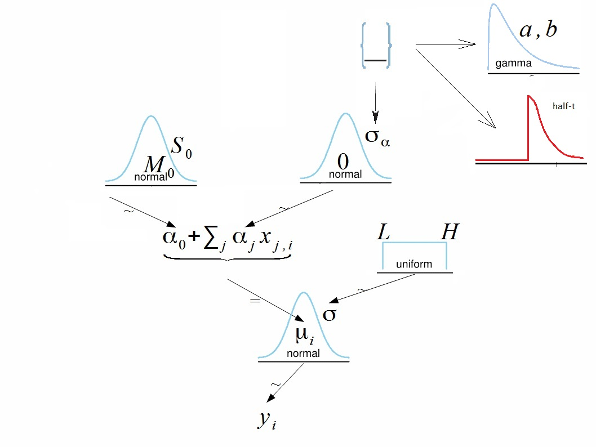
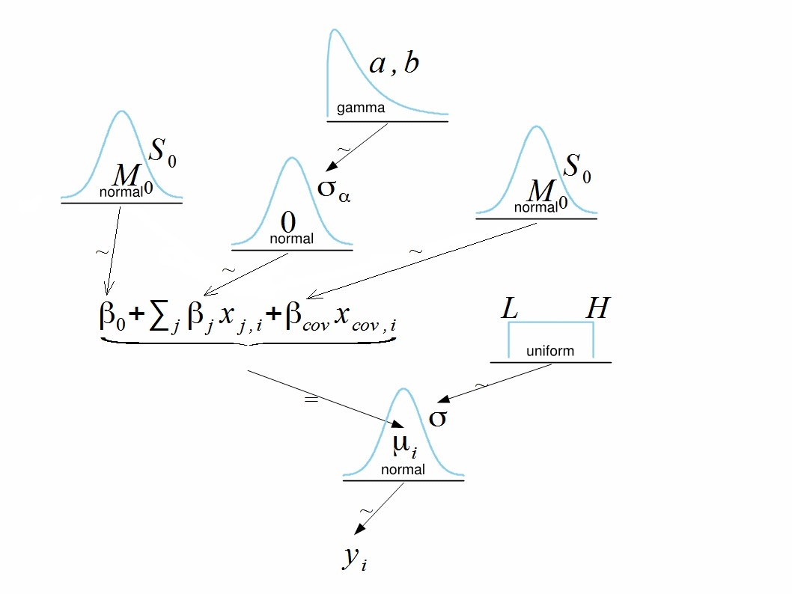

```{r setup, include=F}
source('DBDA2Eprograms/DBDA2E-utilities.R')  #use func gammaShRaFromModeSD()
library(DT)
library(rstan)
library(shinystan)
library(car)
library(HDInterval)
```

If we pay a bit attention to the ANOVA and ANCOVA, we can see the interesting point of views in these cases:  

  - they greatly depend on assumptions (homoscedastic, normally distributed)   
  - "Bayes" perhaps not call the terms ANOVA or ANCOVA. The analysis is based on linear regression's hierarchical modeling with the restriction on some beta coefficient distributions. Thus, "Bayes" would call the metric response with nominal predictor with/without metric predictor.   

# One-way ANOVA

  This type of analysis actually is a model with metric output and one nominal predictor.

<a style='text-decoration: none; color: blue;'>
  
  <div style='width: 980px; text-align: center;'>A diagram for metric output and one nominal predictor shows parameters denoted as $\alpha$ instead of traditional $\beta$.</div>
</a>

  We represent the nominal predictor by a vector $\vec{x}$ = {$x_{1}, ..., x_{J}$}, where $J$ is the number of categories that the predictor has. When an individual falls in group $j$ of the nominal predictor, this is represented by setting $x_{j} = 1$ and $x_{i\neq j} = 0$. The predicted value, denoted $\mu$, is the overall baseline plus the deflection of a group:

\begin{align*}  
\mu &= \beta_0 + \sum_j \beta_{j} x_{j} \\  
    &= \beta_0 + \vec{\beta} \cdot \vec{x}  
\end{align*}  

The overall baseline is constrained so that the deflections sum to $0$ across the categories:  
\[ \sum_j \beta_{[j]} = 0 \]

In order to satisfy this constraint, first, find unconstrained slopes $\alpha_1, ..., \alpha_J$ and then adjust them using formulas:  

\begin{align*}  
\mu &= \alpha_0 + \sum_j \alpha_{j} x_{j} \\  
    &= (\alpha_0 + \bar{\alpha}) + \sum_j (\alpha_{j} - \bar{\alpha}) \cdot x_{j}\\  
    &= \beta_0 + \sum_j \beta_{j} x_{j}
\end{align*}  

where $\bar{\alpha} = \frac{1}{n} \sum_j \alpha_j$  

  On the diagram the within-group standard deviation $\sigma$ is given a broad uniform prior, the intercept is given a broad normal prior centered at $0$ and the group coefficients come from zero-centered normal distribution.   
  
  Interpretation of intercept is the grand mean value.  
  
  The standard deviation of slopes $\sigma_{\beta}$ may be either a constant or may have a prior of its own.  
  
  1. In case when $\sigma_{\beta}$ = const means of all groups are estimated separately, they do not inform each other through estimation of $\sigma_{\beta}$. A large number for $\sigma_{\beta}$ will make the results close or equivalent to ANOVA.   
  2. Giving $\sigma_{\beta}$ a prior affects shrinkage rate. If all group means are close to the grand mean then $\sigma_{\beta}$ is estimated as small number. This makes shrinkage stronger.   
  
  A key assumption behind estimating $\sigma_{\beta}$ from the data is that all groups can be meaningfully described as representatives of shared higher-level distribution.   

  __Example.__ Giving $\sigma_{\beta}$ a prior distribution is not justified if, for example, in medical studies there are several control groups and one treated group. In this case small difference between placebo groups may result in significant shrinkage (bias) of the treated group.

  In this example the treated group is an outlier. Heavy-tailed prior distribution for $\beta_j$ may help to overcome excessive shrinkage.

  __Possible priors for $\sigma_{\alpha}$:__

  - No prior, i.e. parameter is not estimated from the data. Estimated group means do not inform each other through $\sigma_{\alpha}$  
  - Gamma distribution or any other distribution concentrated on positive part of real line with shape allowing large deviations from zero  
  - Distributions on non-negative part of real line allowing large values, but also giving positive probability to zero value: half-Cauchy, folded t-distribution. Should be careful with this option since with small data set it may cause an implosive shrinkage.  

  Another interpretation of imploding shrinkage is: the model has to make choice between assigning more variability to between the groups ($\sigma_{\alpha}$) or shrinking the groups and assigning more variability to within the groups noise ($\sigma_{y}$).  
Whenever it is possible the model will prefer the latter.   
Shrinkage will not be very efficient in case of binary predictor.   


## Sex and Death example of section 19.3 in [@RN721]

The fruit fly, Drosophila melanogaster, is known
for this species that newly inseminated females will not remate (for at least two days),
and males will not actively court pregnant females. There were 25 male fruit flies in each
of the five groups.

`CompanionNumber`: group  

  - `None0`: males with zero companions   
  - `Pregnant1`: males with one pregnant female   
  - `Pregnant8`: males accompanied by eight pregnant females  
  - `Virgin1`: males accompanied by one virgin female   
  - `Virgin8`: males accompanied by eight virgin females      
    
__Research Question:__ estimate the life spans and the magnitude of differences between groups.

```{r setup dta, message=FALSE}
#read the data, the file is available at [K].
dta <- read.csv("data/Fruitfly.csv")
names(dta)
datatable(dta)
```

## Traditional analysis

```{r descriptive, warning=F, message=F}
library(tidyverse)
grMeans<-group_by(dta, CompanionNumber) %>%
  summarise(
    count = n(),
    mean = mean(Longevity, na.rm = TRUE),
    sd = sd(Longevity, na.rm = TRUE)
  )
levels(as.factor(dta$CompanionNumber))
grMeans
```

```{r plot grps}
# Box plots
# ++++++++++++++++++++
# Plot weight by group and color by group
library("ggpubr")
ggboxplot(dta, x = "CompanionNumber", y = "Longevity", 
          color = "CompanionNumber", 
          order = c("None0", "Pregnant1", "Pregnant8", "Virgin1", "Virgin8"),
          ylab = "Longevity", xlab = "Companion Number")
ggline(dta, x = "CompanionNumber", y = "Longevity", 
       add = c("mean_se", "jitter"), 
       order = c("None0", "Pregnant1", "Pregnant8", "Virgin1", "Virgin8"),
       ylab = "Longevity", xlab = "Companion Number")
```

```{r fit anova}
# Compute the analysis of variance
longevity.aov <- aov(Longevity ~ CompanionNumber, data = dta)
# Summary of the analysis
summary(longevity.aov)
```

Interpret the result of one-way ANOVA tests:   

As the p-value is less than the significance level $0.05$, we can conclude that there are significant differences between the groups highlighted with "***" in the model summary.

Tukey multiple pairwise-comparisons

As the ANOVA test is significant, we can compute Tukey HSD (Tukey Honest Significant Differences, R function: TukeyHSD()) for performing multiple pairwise-comparison between the means of groups.

The function TukeyHD() takes the fitted ANOVA as an argument.  

```{r compare btwn grps}
TukeyHSD(longevity.aov)
```

Check ANOVA assumptions: test validity?

```{r aov}
# 1. Homogeneity of variances
plot(longevity.aov, 1)
# 2. Normality
plot(longevity.aov, 2)

# Extract the residuals
aov_residuals <- residuals(object = longevity.aov )
# Run Shapiro-Wilk test
shapiro.test(x = aov_residuals ) #Shapiro-Wilk test on the ANOVA residuals (W = 0.99, p = 0.4) which finds no indication that normality is violated.
```

A Shapiro-Wilk test on the ANOVA residuals (W = 0.99, p = 0.4) which finds no indication that normality is violated.  

## Bayesian approach

```{r dataList}
dataList <- list(Ntotal = nrow(dta),
                 y = dta$Longevity,
                 x = as.integer(as.factor(dta$CompanionNumber)),
                 NxLvl = nlevels(as.factor(dta$CompanionNumber)),
                 agammaShRa=unlist(gammaShRaFromModeSD(mode = sd(dta$Longevity)/2,
                                                       sd = 2*sd(dta$Longevity))))
```

Function `gammaShRaFromModeSD()` from the book calculates shape and rate parameters of gamma distribution from mode and standard deviation.

```{r gamma scales}
#view source code of function gammaShRaFromModeSD()
gammaShRaFromModeSD

(ShRa<-gammaShRaFromModeSD(mode=sd(dta$Longevity)/2,sd=2*sd(dta$Longevity)))
```

With these parameters standard deviation of slopes is concentrated around a relatively small value `r sd(dta$Longevity)/2`, but has fat enough right tail.

```{r}
xAxis <- seq(from=0.001, to=100, by=1 )
plot(xAxis, dgamma(xAxis, shape = ShRa$shape, rate = ShRa$rate), type='l',
     ylab="Gamma Density",xlab="Sigma_Alpha", main="Prior for Sigma_Alpha: mode=8.78")
abline(v=sd(dta$Longevity)/2)
```

Prepare the model description.

```{r modelString, eval=F}
modelString<-"
data {
    int<lower=1> Ntotal;
    real y[Ntotal];
    int<lower=2> NxLvl;
    int<lower=1, upper=NxLvl> x[Ntotal];
    real<lower=0> agammaShRa[2];
}
transformed data {
    real meanY;
    real sdY;
    meanY = mean(y);
    sdY = sd(y);
}
parameters {
    real a0;
    real<lower=0> aSigma;
    vector[NxLvl] a;
    real<lower=0> ySigma;
}
model {
    a0 ~ normal(meanY, 5*sdY);
    aSigma ~ gamma(agammaShRa[1], agammaShRa[2]);
    a ~ normal(0, aSigma);
    ySigma ~ uniform(sdY/100, sdY*10);
    for ( i in 1:Ntotal ) {
        y[i] ~ normal(a0 + a[x[i]], ySigma);
    }
}
generated quantities {
    // Convert a0,a[] to sum-to-zero b0,b[] :
        real b0;
    vector[NxLvl] b;
    b0 = a0 + mean(a);
    b = a - mean(a);
}"
```

Run MCMC.

```{r, eval=F}
stanDso <- stan_model(model_code = modelString)
```

If saved DSO is used load it, then run the chains.

```{r}
# saveRDS(stanDso,file="data/stanDSO.Rds")
stanDso <- readRDS("data/stanDSO.Rds")
```

```{r}
fit <- sampling(stanDso, 
                data = dataList, 
                pars = c('b0', 'b', 'aSigma', 'ySigma'),
                iter = 5000, chains = 2, cores = 4)
```

Analyze the chains using `shinystan()`

```{r, eval=F}
launch_shinystan(fit)
```

```{r}
summary(fit)$summary[,c(1,4,6,8,10)]
cbind(GroupMeans=grMeans,
      EstimatedMeans=summary(fit)$summary[2:6,1]+summary(fit)$summary[1,1])
```

Note differences between estimated group means and also shrinkage.

```{r}
stan_ac(fit, separate_chains = T)
pairs(fit)
plot(fit)
plot(fit,pars=c("b"))
stan_dens(fit)
```


From MCMC we see immediately that not all parameters $\beta_j$ are zeros (omnibus test).   
As usual, the following question in ANOVA is: which group means are not equal.   
To answer this question we use contrasts.   

In FNP approach there is a constraint on how many pairs or subgroups can be checked with contrasts with desired accuracy of inference.   

In Bayesian approach testing of contrasts is straight forward and does not have restrictions: each step of chain returns a combination of group means. Thus we only need to compare frequency of these combinations in the chain.   

Calculate contrasts for `betas`.  

Extract chains for parameters `b`.

```{r}
fit_ext <- rstan::extract(fit)
head(fit_ext$b)
dim(fit_ext$b)
```

  1. Contrast between group 1 (‘None0’) and group 5 (‘Virgin8’)

```{r}
contrast_1_5 <- fit_ext$b[,1] - fit_ext$b[,5]
plot(contrast_1_5)
hist(contrast_1_5)
(hdiContrast_1_5 <- hdi(contrast_1_5))
(sd.contrast_1_5 <- sd(contrast_1_5))
plot(rank(fit_ext$b[,1]), rank(fit_ext$b[,5]))
```

  2. Contrast between average of groups 1-3 (None0, Pregnant1, Pregnant8) and average of groups 4-5 (Virgin1, Virgin8)   
  
```{r}
Comb1<-(fit_ext$b[,1] + fit_ext$b[,2] + fit_ext$b[,3])/3
Comb2<-(fit_ext$b[,4] + fit_ext$b[,5])/2
contrast_123_45 <- Comb1 - Comb2
plot(contrast_123_45)
hist(contrast_123_45)
(hdiContrast_123_45<-hdi(contrast_123_45))
(sd.contrast_123_45<-sd(contrast_123_45))
head(cbind(Comb1,Comb2))
plot(Comb1[1:100],Comb2[1:100])
plot(rank((fit_ext$b[,1] + fit_ext$b[,2] + fit_ext$b[,3])/3),rank((fit_ext$b[,4] + fit_ext$b[,5])/2))
```

# Two-way ANOVA

## Model description

Define the model

```{r, eval=F} 
modelString<-"
data {
    int<lower=1> Ntotal;
    vector[Ntotal] y;
    int<lower=2> Nx1Lvl;
    int<lower=2> Nx2Lvl;
    int<lower=1, upper=Nx1Lvl> x1[Ntotal];
    int<lower=1, upper=Nx2Lvl> x2[Ntotal];
    real<lower=0> agammaShRa[2];
}
transformed data {
    real meanY;
    real sdY;
    vector[Ntotal] zy;
    meanY = mean(y);
    sdY = sd(y);
    zy = (y - mean(y)) / sdY;  // center & normalize
}
parameters {
    real a0;
    real<lower=0> a1Sigma;
    real<lower=0> a2Sigma;
    real<lower=0> a1a2Sigma;
    vector[Nx1Lvl] a1;
    vector[Nx2Lvl] a2;
    matrix[Nx1Lvl,Nx2Lvl] a1a2;
    real<lower=0> zySigma;
}
model {
    a0 ~ normal(0, 1);
    a1Sigma ~ gamma(agammaShRa[1], agammaShRa[2]);
    a1 ~ normal(0, a1Sigma);
    a2Sigma ~ gamma(agammaShRa[1], agammaShRa[2]);
    a2 ~ normal(0, a2Sigma);
    a1a2Sigma ~ gamma(agammaShRa[1], agammaShRa[2]);
    for (j1 in 1:Nx1Lvl) {
        a1a2[j1,] ~ normal(0, a1a2Sigma);
    }
    zySigma ~ uniform(1.0/10, 10);
    for ( i in 1:Ntotal ) {
        zy[i] ~ normal(a0 + a1[x1[i]] + a2[x2[i]]+ a1a2[x1[i],x2[i]], zySigma);
    }
}
generated quantities {
    // Convert a to sum-to-zero b :
    real b0;
    vector[Nx1Lvl] b1;
    vector[Nx2Lvl] b2;
    matrix[Nx1Lvl,Nx2Lvl] b1b2;
    matrix[Nx1Lvl,Nx2Lvl] m;
    real<lower=0> b1Sigma;
    real<lower=0> b2Sigma;
    real<lower=0> b1b2Sigma;
    real<lower=0> ySigma;
    for ( j1 in 1:Nx1Lvl ) { for ( j2 in 1:Nx2Lvl ) {
        m[j1,j2] = a0 + a1[j1] + a2[j2] + a1a2[j1,j2]; // cell means 
    } }
    b0 = mean(m);
    for ( j1 in 1:Nx1Lvl ) { b1[j1] = mean( m[j1,] ) - b0; }
    for ( j2 in 1:Nx2Lvl ) { b2[j2] = mean( m[,j2] ) - b0; }
    for ( j1 in 1:Nx1Lvl ) { for ( j2 in 1:Nx2Lvl ) {
        b1b2[j1,j2] = m[j1,j2] - ( b0 + b1[j1] + b2[j2] );  
    } }
    // transform to original scale:
    b0 = meanY + sdY * b0;
    b1 = sdY * b1;
    b2 = sdY * b2;
    b1b2 = sdY * b1b2;
    b1Sigma = sdY * a1Sigma;
    b2Sigma = sdY * a2Sigma;
    b1b2Sigma = sdY * a1a2Sigma;
    ySigma = sdY * zySigma;
}"
```

```{r, eval=F}
#Create DSO.
stanDsoANOVA2Way <- stan_model(model_code=modelString)
```

```{r}
#If saved DSO is used load it, then run the chains.
# saveRDS(stanDsoANOVA2Way,file="data/stanDso2WayANOVA.Rds")
stanDsoANOVA2Way <- readRDS(file="data/stanDso2WayANOVA.Rds")
```

## Data of section 20.1 in [@RN721]

Read the data.

The data show faculty salaries of a university.

The columns selected as predictors are:

Position (Assistant Professor, Associate Professor, Full Professor, Full Professor with endowment salary and Distinguished Professor) Department (total 60 departments)

```{r}
# 20_1: Metric Predicted Variable with Two Nominal Predictors

# load data from 'Salary.csv' (see Kruschke)
df <- read.csv("data/Salary.csv")
mean(df$Salary)
tail(df)
dim(df)
names(df)
with(df, table(Pos))
with(df, table(Org))
length(table(df$Org))
y <- df$Salary
x1 <- as.factor(df$Pos)
x2 <- as.factor(df$Org)
str(df)
dataListSalary <- list(Ntotal=length(y),
                       y=y,
                       x1=as.integer(x1),
                       x2=as.integer(x2),
                       Nx1Lvl=nlevels(x1),
                       Nx2Lvl=nlevels(x2),
                       agammaShRa=unlist(gammaShRaFromModeSD(mode=1/2, sd=2)))
```

Create names of variables and their interactions

```{r}
(namesPos<-names(table(df$Pos)))
(namesOrg<-names(table(df$Org)))
```

Interactions names:

```{r}
#use outer() to create names for interactions.
as.vector(outer(1:4,1:2,paste,sep="-"))

#apply to our case
(namesInter<-as.vector(outer(namesOrg,namesPos,paste,sep="-")))

#all names:
varNames<-c("Intercept", namesPos, namesOrg, namesInter, rep("Var",5)) #why need to rep Var 5 times
```


## MCMC

```{r, eval=F}
# fit model
fit <- sampling(stanDsoANOVA2Way, 
                data=dataListSalary, 
                pars=c('b0',
                       'b1', 
                       'b2', 
                       'b1b2',
                       'b1Sigma', 
                       'b2Sigma',
                       'b1b2Sigma',
                       'ySigma'),
                iter=5000, chains = 2, cores = 4)
```

```{r}
# save(fit, file = "data/fitinstan1.Rdata")
load("data/fitinstan1.Rdata")
```

```{r, eval=F}
launch_shinystan(fit)
```

Create results including mean value, 2.5%, 50% and 97.5% quantiles.
Add variable names as row names.

```{r}
SalaryResults <- summary(fit)$summary[,c(1,4,6,8)]
varNames[nrow(SalaryResults)-(4:0)] <- rownames(SalaryResults)[nrow(SalaryResults)-(4:0)]
rownames(SalaryResults) <- varNames
head(SalaryResults)
```

Make plots of mean values and HDIs.

```{r}
plot(fit,pars=c("b1"))
plot(fit,pars=c('b2'))
plot(fit,pars=c("b1b2"))
```

Plots show that not all coefficients of the model equal zero.
This answers the question of utility test.

## Working with chains and contrasts

Extract chains for the position variables.

```{r}
fit_ext <- rstan::extract(fit)
names(fit_ext)
fit_ext.b0<-fit_ext$b0
fit_ext.b1<-fit_ext$b1
colnames(fit_ext.b1) <- namesPos
head(fit_ext.b1)
```

Extract chains for the department variables.

```{r}
fit_ext.b2 <- fit_ext$b2
colnames(fit_ext.b2) <- namesOrg
head(fit_ext.b2)
```

Extract chains for interaction variables.

```{r}
fit_ext.b1.b2<-fit_ext$b1b2
dim(fit_ext.b1.b2)
```

Interaction chains make a cube.

```{r}
dimnames(fit_ext.b1.b2)[[2]]<-namesPos
dimnames(fit_ext.b1.b2)[[3]]<-namesOrg
dimnames(fit_ext.b1.b2)
fit_ext.b1.b2[1,,]
```

Rows correspond to iterations of MCMC.   
For each iteration there is interactions table between schools and positions.   

Salary of a school across positions is base level beta, plus school beta: $\beta_0+\beta_{school}$.  
Salary of a position across schools is base level beta, plus position beta: $\beta_0+\beta_{position}$.
Salary of a certain position of a certain school is predicted as base level beta, plus school beta, plus position beta, plus the interaction beta: $\beta_0+\beta_{school}+\beta_{position}+\beta_{school \ \times \ position}$.

__To answer each of the following 4 questions do the following:__

  - Create contrast for comparison   
  - Make histogram of the contrast   
  - Calculate mean of the contrast   
  - Calculate 95%-HDI for the contrast. To find HDI use `hdi()` from library `HDInterval`    

### Contrast for comparison of departments

Use contrasts to compare salaries at Business and Finance ("BFIN") with Physics ("PHYS") and with Chemistry ("CHEM") departments.

To do that select columns of MCMC for departments to "BFIN" and "PHYS" and "BFIN" and "CHEM", take their differences and look at the posterior distribution of the differences

```{r}
contrast.BFIN.PHYS <- fit_ext.b2[,"BFIN"]-fit_ext.b2[,"PHYS"]
hist(contrast.BFIN.PHYS)
mean(contrast.BFIN.PHYS)
hdi(contrast.BFIN.PHYS)
```

__What do we conclude about the differences of salaries?__

Plot histograms of salaries for both departments.
Salaries `BFINComp` of Business and Finance and `PHYSComp` of Physics are calculate as described above.

```{r}
BFINComp <- fit_ext.b2[,"BFIN"]
PHYSComp <- fit_ext.b2[,"PHYS"]
```

```{r}
distrBFIN <- density(BFINComp)
distrPHYS <- density(PHYSComp)

plot(distrPHYS,xlim=c(-20000,200000), lwd=2, main="Salaries Distributions", col="blue")
lines(distrBFIN$x, distrPHYS$y, lwd=2, col="orange")
legend("top", legend = c("PHYS","BFIN"), col = c("blue","orange"), lty=1, lwd=2)
```

Do the same comparison for finance professors and chemistry professors.

```{r}
contrast.BFIN.CHEM<-fit_ext.b2[,"BFIN"]-fit_ext.b2[,"CHEM"]
hist(contrast.BFIN.CHEM)
mean(contrast.BFIN.CHEM)
hdi(contrast.BFIN.CHEM)
```

```{r}
BFINComp <- fit_ext.b2[,"BFIN"]
CHEMComp <- fit_ext.b2[,"CHEM"]
```

```{r}
distrBFIN <- density(BFINComp)
distrPHYS <- density(PHYSComp)

plot(distrPHYS,xlim=c(-20000,200000), lwd=2, main="Salaries Distributions", col="blue")
lines(distrBFIN$x, distrPHYS$y, lwd=2, col="orange")
legend("top", legend = c("PHYS","BFIN"), col = c("blue","orange"), lty=1, lwd=2)
```

### Contrast for comparison of positions

Use contrasts to compare salaries of Endowment Full Professor ("NDW") and Distinguished Full Professor ("DST"). Compare salaries of Full Professor ("FT1") and Endowment Full Professor

```{r}
contrast.NDW.DST <- fit_ext.b1[,"NDW"] - fit_ext.b1[,"DST"]
hist(contrast.NDW.DST)
mean(contrast.NDW.DST)
hdi(contrast.NDW.DST)

DSTComp <- fit_ext.b1[,"NDW"]
NDWComp <- fit_ext.b1[,"DST"]

distrDST<-density(DSTComp)
distrNDW<-density(NDWComp)
plot(distrDST,xlim=c(14000,80000),lwd=2,main="Salaries Distributions",col="blue")
lines(distrNDW$x,distrPHYS$y,lwd=2,col="orange")
legend("top",legend=c("DST","NDW"),col=c("blue","orange"),lty=1,lwd=2)
```

Salary of a Distinguished Full Professor is significantly higher than salary of Endowment Full Professor.

Analyze difference between salaries of Full Professor ("FT1") and Endowment Full Professor

```{r}
contrast.NDW.FT1<-fit_ext.b1[,"NDW"]-fit_ext.b1[,"FT1"]
hist(contrast.NDW.FT1)
mean(contrast.NDW.FT1)
hdi(contrast.NDW.FT1)
```

### Contrast for comparison of spreads

Use contrasts to compare salaries spreads between Full Professor and Assistant Professor at Physics Department and at Chemistry Department.

```{r}
spreadPhys<-fit_ext.b1[,"FT1"]+fit_ext.b1.b2[,"FT1","PHYS"]-
  (fit_ext.b1[,"FT3"]+fit_ext.b1.b2[,"FT3","PHYS"])
spreadChem<-fit_ext.b1[,"FT1"]+fit_ext.b1.b2[,"FT1","CHEM"]-
  (fit_ext.b1[,"FT3"]+fit_ext.b1.b2[,"FT3","CHEM"])
spread<-spreadPhys-spreadChem
hist(spread)
mean(spread)
hdi(spread)
```

Find the highest HDI level for which the spread of differences between "FT1" and "FT3" is significant.

```{r}
hdi(spread,.88)
tryLevels<-seq(from=.8,to=.95,by=.01)
hdis<-sapply(tryLevels,function(z) hdi(spread,z))
maxLevel<-tail(tryLevels[hdis[2,]<0],1)
hdi(spread,maxLevel)
```


## Understanding the effect of scaling and transformations on interactions

Nonlinear transformations may affect interactions very significantly.

Illustrate it on a simple simulated example.

```{r}
mean00<-1
mean10<-3
mean01<-4
mean11<-6
y00<-rnorm(5,mean00,.1)
y10<-rnorm(5,mean10,.1)
y01<-rnorm(5,mean01,.1)
y11<-rnorm(5,mean11,.1)
```

Plot the effects. If the lines are parallel the effects are additive.

```{r}
plot(c(0,1),c(mean(y00),mean(y10)),type="b",ylim=c(1,8),col="darkgreen",lwd=3,ylab="Response",xlab="Predictor 1")
lines(c(0,1),c(mean(y01),mean(y11)),type="b",col="lightblue",lwd=3)
legend("topleft",legend=c("Predictor2 at 0","Predictor2 at 1"),lty=1,lwd=3,col=c("darkgreen","lightblue"))
```


Taking exponent of the same data introduces significant interaction.

```{r}
plot(c(0,1),c(mean(exp(y00)),mean(exp(y10))),type="b",ylim=c(1,400),col="darkgreen",lwd=3,ylab="Response",xlab="Predictor 1")
lines(c(0,1),c(mean(exp(y01)),mean(exp(y11))),type="b",col="lightblue",lwd=3)
legend("topleft",legend=c("Predictor2 at 0","Predictor2 at 1"),lty=1,lwd=3,col=c("darkgreen","lightblue"))
```


# ANCOVA

## Traditional analysis

We cannot use `aov` in ANCOVA because it uses Type I SS, instead we should use Type II SS to get the correct results.

```{r}
longevity.aov2 <- aov(Longevity ~ CompanionNumber + Thorax, data = dta)
# car Anova command on our longevity.aov2 object,
#summary(longevity.aov2) #produces incorrect results
Anova(longevity.aov2, type="II")
```

The covariate, `Thorax`, was significantly related to the fly's longevity, F(1,119)=119.22, p<.001. There was also a significant effect of the Companion Number on the Longevity after controlling for the effect of the Thorax, F(4,119)=21.753, p<.001.


## Bayesian approach

Data show significant variance within groups.

<a style='text-decoration: none; color: blue;'>
  
  <div style='width: 980px; text-align: center;'>An additional metric predictor that can explain part of that variance.</div>
</a>

In this example the subjects of the experiment were in different physical conditions which contributed to large variation of life expectancy.

A metric predictor that is available is the size of the species.

Create data with both predictors.

```{r dataList2}
dataList2<-list(Ntotal=nrow(dta),
                y=dta$Longevity,
                xMet=dta$Thorax,
                xNom=as.integer(as.factor(dta$CompanionNumber)),
                NxLvl=nlevels(as.factor(dta$CompanionNumber)),
                agammaShRa=unlist(gammaShRaFromModeSD(mode=sd(dta$Longevity)/2, 
                                                      sd=2*sd(dta$Longevity))))
```


```{r modelString2, eval=FALSE}
modelString<-"
data {
    int<lower=1> Ntotal;
    real y[Ntotal];
    int<lower=2> NxLvl;
    int<lower=1, upper=NxLvl> xNom[Ntotal];
    real xMet[Ntotal];
    real<lower=0> agammaShRa[2];
}
transformed data {
    real meanY;
    real sdY;
    real xMetMean;
    real xMetSD;
    meanY = mean(y);
    sdY = sd(y);
    xMetMean = mean(xMet);
    xMetSD = sd(xMet);
}
parameters {
    real a0;
    real<lower=0> aSigma;
    vector[NxLvl] a;
    real aMet;
    real<lower=0> ySigma;
}
model {
    a0 ~ normal(meanY, 5*sdY);
    aSigma ~ gamma(agammaShRa[1], agammaShRa[2]);
    a ~ normal(0, aSigma);
    aMet ~ normal(0, 2*sdY/xMetSD);
    ySigma ~ uniform(sdY/100, sdY*10);
    for ( i in 1:Ntotal ) {
        y[i] ~ normal(a0 + a[xNom[i]] + aMet*(xMet[i] - xMetMean), ySigma);
    }
}
generated quantities {
    // Convert a0,a[] to sum-to-zero b0,b[] :
        real b0;
    vector[NxLvl] b;
    b0 = a0 + mean(a) - aMet * xMetMean;
    b = a - mean(a);
}
"
```

```{r, eval=FALSE}
model2 <- stan_model(model_code=modelString)
```

If saved DSO is used load it, then run the chains.

```{r}
# saveRDS(model2, file="data/stanDSO2.Rds")
model2 <- readRDS("data/stanDSO2.Rds")
```

Run MCMC.
```{r}
fit2 <- sampling(model2, 
                data=dataList2, 
                pars=c('b0', 'b', 'aMet', 'aSigma', 'ySigma'),
                iter=5000, chains = 2, cores = 4)
```

```{r, eval=FALSE}
launch_shinystan(fit2)
```

Calculate same contrasts for betas:

  1. Contrasts between group 1 (‘None0’) and 5 (‘Virgin8’).
  
```{r}
fit_ext2 <- rstan::extract(fit2)
head(fit_ext2$b)
contrast2_1_5 <- fit_ext2$b[,1] - fit_ext2$b[,5]
plot(contrast2_1_5)
hist(contrast2_1_5)
(hdiContrast2_1_5<-hdi(contrast2_1_5))
(sd.contrast2_1_5<-sd(contrast2_1_5))
plot(rank(fit_ext2$b[,1]),rank(fit_ext2$b[,5]))
```

  2. Contrast between average of groups 1-3 and average of groups 4-5 
  
```{r}
Comb1<-(fit_ext2$b[,1] + fit_ext2$b[,2] + fit_ext2$b[,3])/3
Comb2<-(fit_ext2$b[,4] + fit_ext2$b[,5])/2
contrast2_123_45 <-Comb1-Comb2
plot(contrast2_123_45)
hist(contrast2_123_45)
(hdiContrast2_123_45<-hdi(contrast2_123_45))
(sd.contrast2_123_45<-sd(contrast2_123_45))
plot(rank(Comb1),rank(Comb2))
```
  
Compare the models.

Using standard deviation:

```{r}
rbind(WithoutMetricPred=c(sd.contrast_1_5,sd.contrast_123_45),WithMetricPred=c(sd.contrast2_1_5,sd.contrast2_123_45))
```

Using HDI:
```{r}
rbind(WithoutMetricPred=c(hdiContrast_1_5,hdiContrast_123_45),WithMetricPred=c(hdiContrast2_1_5,hdiContrast2_123_45))
```

Using HDI width:

```{r}
rbind(WithoutMetricPred=c(Contrast_1_5=unname(diff(hdiContrast_1_5)),
                          Contrast_123_45=unname(diff(hdiContrast_123_45))),
      WithMetricPred=c(Contrast_1_5=diff(hdiContrast2_1_5),
                       Contrast_123_45=diff(hdiContrast2_123_45)))
```

Obviously, the width was shrinkage so with the metric predictor in the model, we can explain more the variability of Longevity due to the difference among groups and Thorax. 

# Heterogeneous variances  

The most restrictive assumption of ANOVA is equivalence of variances in all groups.

Look how Bayesian approach can remove this assumption.

On the following model diagram there is an implementation of model with heterogeneous variances.

The model uses t-distributed noise and allows each group to have its own standard deviation.

Data set `InsectSprays` from `datasets` shows test of 6 different insect sprays. Column count contains numbers of insects found in the field after each spraying. Column spray identifies the type of spray.

Prepare the data.

```{r}
df <- InsectSprays
head(df)
levels(df$spray)
dataListSprays <- list(Ntotal = nrow(df),
                       y = df$count,
                       x = as.integer(df$spray),
                       NxLvl = nlevels(df$spray),
                       aGammaShRa = unlist(gammaShRaFromModeSD(mode=sd(df$count)/2, 
                                                               sd=2*sd(df$count))))
```

Plot the data.

```{r}
plot(df$count ~ df$spray)
```
Note that variances within the groups are very different. If estimated overall the variance for groups "C", "D" and "E" is overestimated and for "A" "B" and "F" - underestimated.

## Apply traditional ANOVA method.

```{r}
m1 <- lm(count~spray, df)
summary(m1)
anova(m1)
#m.aov <- aov(count~spray, df)
#summary(m.aov)
```

The categorical factor is significant, i.e. utility test fails.

Create contrasts to identify differences between combinations of sprays.

```{r contrasts}
A <- factor(df$spray)
contrasts(A)
contrasts(A)<-cbind("GA vs GB"=c(1,-1,0,0,0,0),
                    "GAB vs GF"=c(1,1,0,0,0,-2),
                    "GC vs GD"=c(0,0,1,-1,0,0),
                    "GC vs GE"=c(0,0,1,0,-1,0),
                    "GABF vs GCDE"=c(1,1,-1,-1,-1,1))
A
aov(df$count ~ A)
summary.lm(aov(df$count ~ A))
```


Summary shows that sprays A and B, C and D, C and E are indistinguishable as well as combined observations of sprays A and B vs. F, but combined observations for sprays A, B, F are significantly different from C, D and E.

However, separate t-test of C vs. D shows significant difference and equivalence of C and E is almost rejected by t-test.

```{r}
t.test(df$count[df$spray=="C"], df$count[df$spray=="D"])
t.test(df$count[df$spray=="C"], df$count[df$spray=="E"])
```

These contradicting results are caused by the fact that for comparison of C with D and E the assumption of homoscedasticity leads to overestimation of noise in general framework of ANOVA, but pairwise t-test is only accounting for variances of the compared pairs.

## Bayes' 

Run MCMC.

```{r, eval=F}
modelString<-"
data {
    int<lower=1> Ntotal;
    real y[Ntotal];
    int<lower=2> NxLvl;
    int<lower=1, upper=NxLvl> x[Ntotal];
    real<lower=0> aGammaShRa[2];
}
transformed data {
    real meanY;
    real sdY;
    meanY = mean(y);
    sdY = sd(y);
}
parameters {
    real<lower=0> nu;
    real a0;
    real<lower=0> aSigma;
    vector[NxLvl] a;
    real<lower=0> ySigma[NxLvl];
    real<lower=0> ySigmaMode;
    real<lower=0> ySigmaSD;
}
transformed parameters{
    real<lower=0> ySigmaSh;
    real<lower=0> ySigmaRa;
    ySigmaRa = ( ( ySigmaMode + sqrt( ySigmaMode^2 + 4*ySigmaSD^2 ) ) / ( 2*ySigmaSD^2 ) );
    ySigmaSh = 1 + ySigmaMode * ySigmaRa;
}
model {
    nu ~ exponential(1/30.0);
    a0 ~ normal(meanY, 10*sdY);
    aSigma ~ gamma(aGammaShRa[1], aGammaShRa[2]);
    a ~ normal(0, aSigma);
    ySigma ~ gamma(ySigmaSh, ySigmaRa);
    ySigmaMode ~ gamma(aGammaShRa[1], aGammaShRa[2]);
    ySigmaSD ~ gamma(aGammaShRa[1], aGammaShRa[2]);
    for ( i in 1:Ntotal ) {
        y[i] ~ student_t(nu, a0 + a[x[i]], ySigma[x[i]]);
    }
}
generated quantities {
    // Convert a0,a[] to sum-to-zero b0,b[] :
        real b0;
    vector[NxLvl] b;
    b0 = a0 + mean(a);
    b = a - mean(a);
}
"
```

```{r, eval=FALSE}
model3 <- stan_model(model_code = modelString)
```

```{r}
# saveRDS(model3,file = "data/stanDSO3.Rds")
model3 <- readRDS(file = "data/stanDSO3.Rds")
```

Run chains.

```{r}
fit.sprays <- sampling(model3, 
                data=dataListSprays, 
                pars=c('b0', 'b', 'aSigma', 'ySigma', 'nu', 'ySigmaMode', 'ySigmaSD'),
                iter=5000, chains = 2, cores = 4)
```

```{r, eval=F}
launch_shinystan(fit)
```

Analyze estimates.

```{r}
plot(fit.sprays,pars=c("b0","aSigma"))
plot(fit.sprays,pars=c("b"))
plot(fit.sprays,pars=c("ySigma"))
```

Extract chains.

```{r}
chains_sprays <- rstan::extract(fit.sprays)
head(chains_sprays$b)
```

Look at the same contrasts.

1. A vs. B 

```{r}
contrast1_2 <- chains_sprays$b[,1] - chains_sprays$b[,2]
plot(contrast1_2)
hist(contrast1_2)
(hdiContrast1_2<-hdi(contrast1_2))
(sd.contrast1_2<-sd(contrast1_2))
plot(rank(chains_sprays$b[,1]),rank(chains_sprays$b[,5]))
```

The contrast is not different from zero.

2. A, B vs. F 
  
```{r}
Comb1<-chains_sprays$b[,1] + chains_sprays$b[,2]
Comb2<-2*chains_sprays$b[,6]
contrast12_6 <-Comb1  - Comb2
plot(contrast12_6)
hist(contrast12_6)
(hdiContrast12_6<-hdi(contrast12_6))
(sd.contrast12_6<-sd(contrast12_6))
plot(rank(Comb1),rank(Comb2))
```

The contrast is not different from zero.

3. C vs. D 

```{r}
contrast3_4 <- chains_sprays$b[,3] - chains_sprays$b[,4]
plot(contrast3_4)
hist(contrast3_4)
(hdiContrast3_4<-hdi(contrast3_4))
(sd.contrast3_4<-sd(contrast3_4))
plot(rank(chains_sprays$b[,3]),rank(chains_sprays$b[,4]))
```


This contrast is different from zero. ANOVA could not detect that.

4. C vs. E
  
```{r}
contrast3_5 <- chains_sprays$b[,3] - chains_sprays$b[,5]
plot(contrast3_5)
hist(contrast3_5)
(hdiContrast3_5<-hdi(contrast3_5))
(sd.contrast3_5<-sd(contrast3_5))
plot(rank(chains_sprays$b[,3]),rank(chains_sprays$b[,5]))
```
  
The contrast is not different from zero.

5. Combined observations A, B and F vs. C, D, E 
  
```{r}
Comb1<-chains_sprays$b[,1] + chains_sprays$b[,2] + chains_sprays$b[,6]
Comb2<-chains_sprays$b[,3] + chains_sprays$b[,4] + chains_sprays$b[,5]
contrast126_345 <-Comb1  - Comb2
plot(contrast126_345)
hist(contrast126_345)
(hdiContrast126_345<-hdi(contrast126_345))
(sd.contrast126_345<-sd(contrast126_345))
plot(rank(Comb1),rank(Comb2))
```
  
The contrast is significantly different from zero.

# Further Readings

Adapted from UC's coursework   


  
  