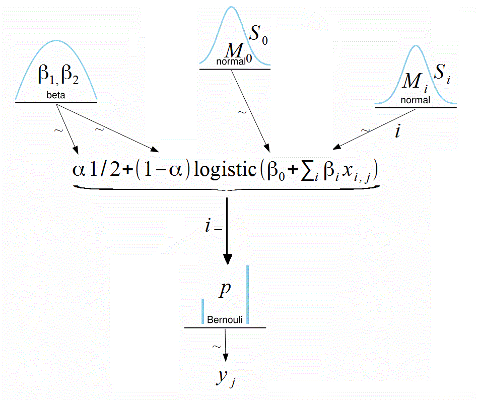
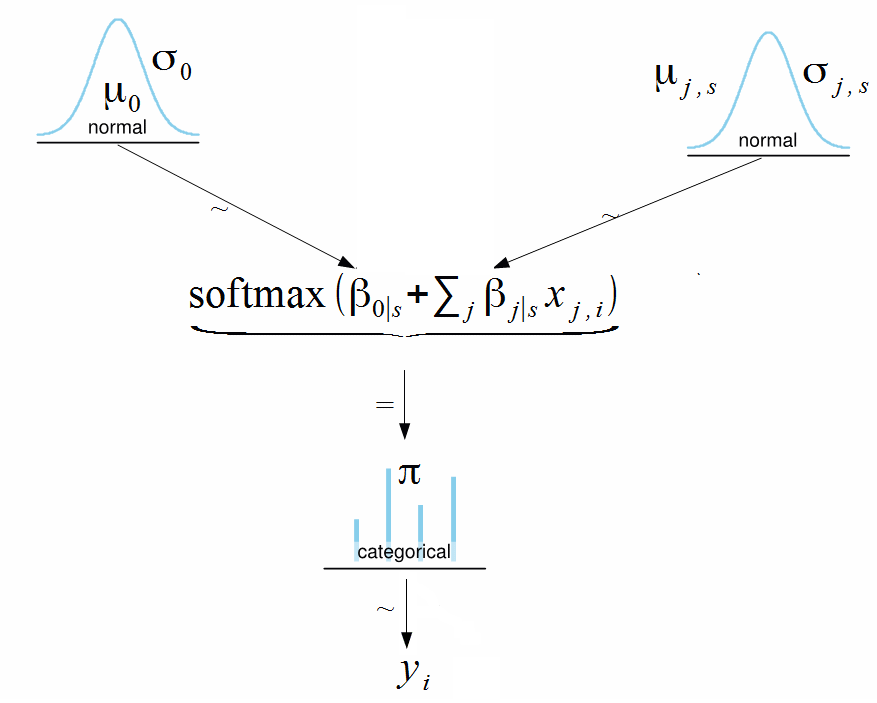

```{r setup, include=FALSE}
knitr::opts_chunk$set(echo = TRUE)
library(rstan)
library(shinystan)
```

# Logistic regression

- Dichotomous $y$ with multiple metric predictors.  
- Logistic regression model would be constructed based on  diagram.  
- We use Height-Weight Data   

## Prediction of gender by hight and weight. Probability close to 0.5 (balanced data)

```{r}
mydf <- read.csv(file = 'data/HtWtData300.csv')
head(mydf)
```

Probability close to 0.5

```{r}
table(mydf$male)
prop.table(table(mydf$male))
```

Firstly, we try to fit with `glm`

```{r glm1}
fmod1 <- glm(male ~ height + weight, 
             family = "binomial", data = mydf)
summary(fmod1)
```

$\Rightarrow$ We will see the estimates as same as the Bayesian method.

```{r}
plot(mydf$height, 
     mydf$weight,pch=16, col="blue")
points(mydf$height[mydf$male==1], 
       mydf$weight[mydf$male==1], 
       col="orange", pch=16)
legend("topleft", legend=c("Female","Male"), 
       col=c("blue","orange"), pch=16)
```

Model for Dichotomous y with multiple metric predictors set up in `Stan`

But firstly, we look at the simplified `modelString` of Stan:

```{r, eval=FALSE}
# Not eval
modelString <- "
  data{
    int<lower=0> N;
    real xc[N];
    int xb[N];
    int<lower=0,upper=1> y[N]; //Binary outcome
  }
  parameters{
    real b0;
    real b1;
    real b2;
  }
  model{
    b0 ~ normal(0,1);
    b1 ~ normal(0,1);
    b2 ~ normal(0,1);
    y  ~ bernoulli_logit(b0 + b1*xc + b2*xb);
  }
"
```

Then move on the destination one:

```{r, eval=FALSE}
modelString <- "
  data {
    int<lower=1> Ntotal; // num of observations
    int<lower=1> Nx;     // num of predictors
    int<lower=0, upper=1> y[Ntotal];
    matrix[Ntotal, Nx] x;
  }
  
  transformed data {
    vector[Nx] meanX;
    vector[Nx] sdX;
    matrix[Ntotal, Nx] zx; // normalized

    for ( j in 1:Nx ) {
      meanX[j] = mean(x[,j]);
      sdX[j] = sd(x[,j]);
        for (i in 1:Ntotal) {
          zx[i,j] = (x[i,j] - meanX[j]) / sdX[j];
        }
      }
  }
    
  parameters {
    real zbeta0;
    vector[Nx] zbeta;
  }

  transformed parameters{
    vector[Ntotal] mu;
    mu = zbeta0 + zx * zbeta;  // matrix product
  }

  model {
    zbeta0 ~ normal(0, 2);
    zbeta  ~ normal(0, 2);
    y ~ bernoulli_logit(mu);
  }

  generated quantities { 
    // Transform to original scale:
    real beta0; 
    vector[Nx] beta;
    // .* and ./ are element-wise product and division
    beta0 = zbeta0 - sum(zbeta .* meanX ./ sdX);
    beta = zbeta ./ sdX;
  } 
"
```

```{r, eval=FALSE}
stanDsoLogistic <- stan_model(model_code=modelString)
# save(stanDsoLogistic, file = "data/stanLogisticDso.Rdata")
```

```{r}
load(file = "data/stanLogisticDso.Rdata")
```

Fit model

```{r}
heightWeightDataList <- list(Ntotal = nrow(mydf),
                             y = mydf$male,
                             x = cbind(mydf$height, mydf$weight),
                             Nx = 2)
```

```{r}
fit <- sampling(stanDsoLogistic,
                data = heightWeightDataList, 
                pars = c('beta0', 'beta'),
                iter = 5000, chains = 2, cores = 2
)
```

Analyze fitted model using shinystan

```{r, eval=FALSE}
launch_shinystan(fit)
```

Analyze parameters.

```{r}
stan_ac(fit, separate_chains = T)
pairs(fit)
plot(fit)
plot(fit,pars=c("beta"))
plot(fit,pars=c("beta[2]"))
summary(fit)$summary[,c(1,4,8)]
```

Parameter $\beta_2$  is not significant with 95% HDI.  

```{r}
stan_dens(fit)
```

```{r}
estimBetas<-summary(fit)$summary[1:3,1]
```

Plot the data with separating hyperplane.

```{r}
plot(mydf$height, mydf$weight, pch=16, col="blue")
points(mydf$height[mydf$male==1], mydf$weight[mydf$male==1], col = "orange", pch = 16)
lines(mydf$height, -(estimBetas[1]+estimBetas[2]*mydf$height)/estimBetas[3])
legend("topleft", legend = c("Female","Male"), col = c("blue","orange"), pch=16)
```


## Prediction of gender by hight and weight. Probability close to extreme (imbalanced sample)

Now try to remove almost all males from the sample to see what may happen when there are few 1’s observed.

In the original sample the proportion of males is:

```{r}
mean(mydf$male)
```

Sample with females is

```{r}
females <- mydf[mydf$male == 0,]
```

Select first 15 males.

```{r}
males <- mydf[mydf$male == 1,][1:15,] # just 15 males (originally was ~150)
mydf_sparse <- rbind(males,females)
rownames(mydf_sparse) <- NULL
head(mydf_sparse, 20)
```

Fit sparse model

```{r}
fmod2 <- glm(male ~ height + weight, family = "binomial", data = mydf_sparse)
summary(fmod2)
```


```{r}
heightWeightSparseDataList<-list(Ntotal=nrow(mydf_sparse),
                                 y=mydf_sparse$male,
                                 x=cbind(mydf_sparse$height, mydf_sparse$weight),
                                 Nx=2)
```

```{r}
fit_sparse <- sampling(stanDsoLogistic,
                       data=heightWeightSparseDataList, 
                       pars=c('beta0', 'beta'),
                       iter=5000, chains = 2, cores = 2
)
```

```{r}
stan_ac(fit_sparse, separate_chains = T)
pairs(fit_sparse)
plot(fit_sparse)
plot(fit_sparse,pars=c("beta"))
plot(fit_sparse,pars=c("beta[2]"))
```

Compare summary of the two studies

```{r}
rbind(beta0reg=summary(fit)$summary[1,c(1,3)],
      beta0glm=c(summary(fmod1)$coefficients[1,1],summary(fmod1)$coefficients[1,2]*sqrt(dim(mydf)[1])),
      beta0sparce=summary(fit_sparse)$summary[1,c(1,3)],
      beta0sparceglm=c(summary(fmod2)$coefficients[1,1],summary(fmod2)$coefficients[1,2]*sqrt(dim(mydf_sparse)[1])))
rbind(beta1reg=summary(fit)$summary[2,c(1,3)],
      beta1glm=c(summary(fmod1)$coefficients[2,1],summary(fmod1)$coefficients[2,2]*sqrt(dim(mydf)[1])),
      beta1sparce=summary(fit_sparse)$summary[2,c(1,3)],
      beta1sparceglm=c(summary(fmod2)$coefficients[2,1],summary(fmod2)$coefficients[2,2]*sqrt(dim(mydf_sparse)[1])))
rbind(beta2reg=summary(fit)$summary[3,c(1,3)],
      beta2glm=c(summary(fmod1)$coefficients[3,1],summary(fmod1)$coefficients[3,2]*sqrt(dim(mydf)[1])),
      beta2sparce=summary(fit_sparse)$summary[3,c(1,3)],
      beta2sparceglm=c(summary(fmod2)$coefficients[3,1],summary(fmod2)$coefficients[3,2]*sqrt(dim(mydf_sparse)[1])))
```

```{r}
rbind(beta0reg=summary(fit)$summary[1,c(4,8)],
      beta0sparce=summary(fit_sparse)$summary[1,c(4,8)])
rbind(beta1reg=summary(fit)$summary[2,c(4,8)],
      beta1sparce=summary(fit_sparse)$summary[2,c(4,8)])
rbind(beta2reg=summary(fit)$summary[3,c(4,8)],
      beta2sparce=summary(fit_sparse)$summary[3,c(4,8)])
```

__HDI of both slopes widened significantly in the sample with more extreme disproportion.__   
__Standard deviations of betas also increase dramatically, especially fit with `glm`.__


# Robust logistic regression

## Prediction of gender by height and weight. Robust model

Observe the data of the previous section.  
Plot male (1) and female (0) groups with respect to weight.  

```{r}
plot(mydf$weight,mydf$male)
```

In the lower right corner there are some outliers representing heavy females.  
Such observations cause bias of model parameters.  

```{r}
plot(mydf$height,mydf$male)
```

On the plot relative to height outliers are short males.

What does a model robust to such outliers look like?

Robust logistic regression is a mix of "guessing model" and logistic model

\[\mu = \alpha \frac{1}{2} + (1 - \alpha) \ \text{logistic}\Big(\beta_0 + \sum_j \beta_j x_j\Big)\]

- When $\alpha = 0$ all observations fit within logistic regression pattern, i.e. the classes are separated well enough to be explained by logistic sigmoid function. In this case the model becomes pure logistic regression.   

- When $\alpha = 1$ the classes overlap completely and the model can only guess with probability 0.5 to which class the observation belongs.  

Typically $\alpha$  is small (few outliers showing that predictor points to wrong class).   
Select beta distribution as a prior to $\alpha$ with high concentration near zero: dbeta(1,9).

```{r}
Argument <- seq(from=0,to=1,by=.01)
plot(Argument, dbeta(Argument, 1, 9), type="l")
```

The modified model is on the .

```{r, eval=F}
modelString= 
"data {                   // ROBUST LOGISTIC REGRESSION
    int<lower=1> Ntotal;  // num of observations
    int<lower=1> Nx;      // num of predictors
    int<lower=0, upper=1> y[Ntotal];
    matrix[Ntotal, Nx] x;
}
transformed data {
    vector[Nx] meanX;
    vector[Nx] sdX;
    matrix[Ntotal, Nx] zx;  // normalized
    
    for ( j in 1:Nx ) {
        meanX[j] = mean(x[,j]);
        sdX[j] = sd(x[,j]);
        for ( i in 1:Ntotal ) {
            zx[i,j] = ( x[i,j] - meanX[j] ) / sdX[j];
        }
    }
}
parameters {
    real zbeta0;
    vector[Nx] zbeta;
    real<lower=0,upper=1> guess;  // mixture param
}
transformed parameters{
    vector[Ntotal] mu;
    for ( i in 1:Ntotal ) {
        mu[i] = guess * (1/2.0) + (1-guess) * inv_logit(zbeta0 + zx[i,] * zbeta);
    }
}
model {
    zbeta0 ~ normal(0, 2);
    zbeta  ~ normal(0, 2);
    guess ~ beta(1, 9);
    y ~ bernoulli(mu);
}
generated quantities { 
    // Transform to original scale:
    real beta0; 
    vector[Nx] beta;
    // .* and ./ are element-wise product and division
    beta0 =  zbeta0 - sum( zbeta .* meanX ./ sdX );
    beta =  zbeta ./ sdX;
}
"
```

```{r, eval=F}
stanDsoRobustLogistic <- stan_model(model_code=modelString)
```

```{r}
# save(stanDsoRobustLogistic, file = "data/stanRobustLogisticDso.Rds")
load("data/stanRobustLogisticDso.Rds")
```

Run robust MCMC with the hight/weight data.

```{r}
fitRobust <- sampling(stanDsoRobustLogistic,
                data=heightWeightDataList, 
                pars=c('beta0', 'beta', 'guess'),
                iter=5000, chains = 2, cores = 2)
```

Analyze results.

```{r}
stan_ac(fitRobust, separate_chains = T)
pairs(fitRobust)
plot(fitRobust)
plot(fitRobust,pars=c("beta[1]"))
plot(fitRobust,pars=c("beta[2]"))
plot(fitRobust,pars=c("guess"))
rbind(summary(fitRobust)$summary[,c(1,4,7)],
      summary(fit)$summary[,c(1,4,8)]
)
```

Note positive correlation between guess and the slope $\beta_1$.
The more outliers the higher is the slope.

Since $\beta_2$  does not seem significant. Now, we fit both models with height as only predictor.

```{r}
heightWeightDataList<-list(Ntotal=nrow(mydf),
                          y=mydf$male,
                          x=cbind(mydf$height),
                          Nx=1)


fit <- sampling(stanDsoLogistic,
                data=heightWeightDataList, 
                pars=c('beta0', 'beta'),
                iter=5000, chains = 2, cores = 2
)
fitRobust <- sampling(stanDsoRobustLogistic,
                data=heightWeightDataList, 
                pars=c('beta0', 'beta', 'guess'),
                iter=5000, chains = 2, cores = 2
)
pairs(fit)
pairs(fitRobust)
plot(fit)
plot(fit,pars=c("beta"))
plot(fitRobust)
plot(fitRobust,pars=c("beta[1]","guess"))
plot(fitRobust,pars=c("guess"))
rbind(summary(fitRobust)$summary[,c(1,4,7)],
      summary(fit)$summary[,c(1,4,8)]
)
```

Compare probabilities predicted by logistic regression and robust logistic regression.

```{r}
# Coefficients
meanBeta0Robust<-summary(fitRobust)$summary[1,1]
meanBeta1Robust<-summary(fitRobust)$summary[2,1]
guess<-summary(fitRobust)$summary[3,1]
meanBeta0<-summary(fit)$summary[1,1]
meanBeta1<-summary(fit)$summary[2,1]

#Linear predictors and probabilities
linPredRobust_Male.Height<-meanBeta0Robust+meanBeta1Robust*mydf$height
pRobustMail_height<-guess/2+(1-guess)*exp(linPredRobust_Male.Height)/(1+exp(linPredRobust_Male.Height))
linPred_Male.Height<-meanBeta0+meanBeta1*mydf$height
pMail_height<-exp(linPred_Male.Height)/(1+exp(linPred_Male.Height))

# Plot
plot(mydf$height,mydf$male,pch=16)
points(mydf$height,pRobustMail_height,col="orange",pch=16)
points(mydf$height,pMail_height,col="cyan",pch=16)
legend("topleft",
       legend=c("Actual","Prob Logistic","Prob. Robust"),
       col=c("black","cyan","orange"), pch=16)
```

Logistic probability is more extreme: higher in the area of low-height male observations because it is biased by an outlier of short male below the average female height. But the far tails are closer to 0.   
Robust logistic regression did not react to this observation as much!!  
Robust model does not produce probabilities too close to 0 and 1.  


## Prediction of gender by height and weight with sparse data. Robust model

Repeat the same comparison with the sparse data.

Create data list with one predictor.  

```{r}
heightWeightSparseDataList <- list(Ntotal = nrow(mydf_sparse),
                                   y = mydf_sparse$male,
                                   x = cbind(mydf_sparse$height),
                                   Nx = 1)
```

Fit both models with only one predictor `height`

```{r}
fitSparse <- sampling(stanDsoLogistic,
                       data=heightWeightSparseDataList, 
                       pars=c('beta0', 'beta'),
                       iter=5000, chains = 2, cores = 2)

fitSparseRobust <- sampling(stanDsoRobustLogistic,
                data=heightWeightSparseDataList, 
                pars=c('beta0', 'beta', 'guess'),
                iter=5000, chains = 2, cores = 2)
```


Analyze the models.

```{r}
pairs(fitSparse)
pairs(fitSparseRobust)
plot(fitSparse)
plot(fitSparse,pars=c("beta"))
plot(fitSparseRobust)
plot(fitSparseRobust,pars=c("beta[1]","guess"))
plot(fitSparseRobust,pars=c("guess"))
rbind(summary(fitSparseRobust)$summary[,c(1,4,7)],
      summary(fitSparse)$summary[,c(1,4,8)]
)
```

Make plot of probabilities.

```{r}
# Coefficients
meanBeta0Robust<-summary(fitSparseRobust)$summary[1,1]
meanBeta1Robust<-summary(fitSparseRobust)$summary[2,1]
guess<-summary(fitSparseRobust)$summary[3,1]
meanBeta0<-summary(fitSparse)$summary[1,1]
meanBeta1<-summary(fitSparse)$summary[2,1]

#Linear predictors and probabilities
linPredRobust_Male.Height<-meanBeta0Robust+meanBeta1Robust*mydf_sparse$height
pRobustMail_height<-guess/2+(1-guess)*exp(linPredRobust_Male.Height)/(1+exp(linPredRobust_Male.Height))
linPred_Male.Height<-meanBeta0+meanBeta1*mydf_sparse$height
pMail_height<-exp(linPred_Male.Height)/(1+exp(linPred_Male.Height))

# Plot
plot(mydf_sparse$height,mydf_sparse$male,pch=16)
points(mydf_sparse$height,pRobustMail_height,col="orange",pch=16)
points(mydf_sparse$height,pMail_height,col="cyan",pch=16)
legend("topleft",
       legend=c("Actual","Prob Logistic","Prob. Robust"),
       col=c("black","cyan","orange"),pch=16)
```


## Anesthesia example

This data example is from library `DAAG.`  
Thirty patients were given an anesthetic agent maintained at a predetermined concentration level (`conc`) for 15 minutes before making an incision. It was then noted whether the patient moved (1), i.e. jerked or twisted.  

### Data

```{r}
library(DAAG)
head(anesthetic)
```

Use column `move` as response and column `logconc` as predictor.

Prepare the data.

```{r}
dataListAnesthetic <- list(Ntotal=nrow(anesthetic),
                           y=anesthetic$move,
                           x=cbind(anesthetic$logconc),
                           Nx=1)
```

### Logistic model by `glm()`

```{r}
logRegr <- glm(move ~ logconc, 
               data=anesthetic,
               family="binomial")
summary(logRegr)
predLogRegr <- predict(logRegr, type="response")
```

### Running chains 

Run MCMC using logistic and robust logistic models.

```{r}
fitAnesth <- sampling(stanDsoLogistic,
                data=dataListAnesthetic, 
                pars=c('beta0', 'beta'),
                iter=5000, chains = 2, cores = 2
)

fitRobustAnesth <- sampling(stanDsoRobustLogistic,
                             data=dataListAnesthetic, 
                              pars=c('beta0', 'beta', 'guess'),
                              iter=5000, chains = 2, cores = 2)
```

### Analysis of logistic model

Extract diagnostics

```{r}
summary(fitAnesth)$summary[,c(1,4,8:10)]
stan_ac(fitAnesth, separate_chains = T)
stan_trace(fitAnesth)
pairs(fitAnesth,pars=c("beta0","beta"))
plot(fitAnesth)
```


### Analysis of robust logistic model

```{r}
summary(fitRobustAnesth)$summary[,c(1,4,8:10)]
stan_ac(fitRobustAnesth, separate_chains = T)
stan_trace(fitRobustAnesth)
pairs(fitRobustAnesth,pars=c("beta0","beta","guess"))
plot(fitRobustAnesth)
plot(fitRobustAnesth,pars=c("guess"))
```

Parameter guess is almost $10%$. This means that there should be a significant difference between the two models.  
However, 95% HDI almost covers $0$.  

### Comparison of logistic and robust logistic models

Compare intercepts.

```{r}
rbind(Logistic=summary(fitAnesth)$summary[1,c(1,4,8)],
      Robust=summary(fitRobustAnesth)$summary[1,c(1,4,8)])
```

Compare slopes.

```{r}
rbind(Logistic=summary(fitAnesth)$summary[2,c(1,4,8)],
      Robust=summary(fitRobustAnesth)$summary[2,c(1,4,8)])
```

Compare probabilities.

```{r}
# Coefficients
meanBeta0Robust<-summary(fitRobustAnesth)$summary[1,1]
meanBeta1Robust<-summary(fitRobustAnesth)$summary[2,1]
guess<-summary(fitRobustAnesth)$summary[3,1]
meanBeta0<-summary(fitAnesth)$summary[1,1]
meanBeta1<-summary(fitAnesth)$summary[2,1]

#Linear predictors and probabilities
linPredRobust_Move<-meanBeta0Robust+meanBeta1Robust*anesthetic$logconc
pRobustMove<-guess/2+(1-guess)*exp(linPredRobust_Move)/(1+exp(linPredRobust_Move))
linPred_Move<-meanBeta0+meanBeta1*anesthetic$logconc
pMove<-exp(linPred_Move)/(1+exp(linPred_Move))

# Plot
plot(anesthetic$logconc,anesthetic$move,pch=16)
points(anesthetic$logconc,pRobustMove,col="orange",pch=15)
points(anesthetic$logconc,pMove,col="cyan",pch=17)
points(anesthetic$logconc,predLogRegr,col="purple",pch=25)
legend("topright",
       legend=c("Actual","Prob Logistic","Prob. Robust","Glm"),
       col=c("black","cyan","orange","purple"),pch=c(16,17,15,25))
```

Again, robust method does not return extreme probabilities.

# Softmax regression

Softmax (or multinomial logistic regression) is a generalization of logistic regression to the case where we want to handle multiple classes. In logistic regression, the response was binary: $y^{(i)} \in \{0,1\}$, meanwhile softmax handles $y^{(i)} \in \{1, ..., K\}$  

It is based on modification of odds ratio from  
\[\frac{p}{1-p}\]
to
\[\frac{p_s}{p_r},\]  
where $p_r$
 is probability of one of several classes selected as reference (for example, control group).

The model changes very little from logistic regression and is shown on this diagram.  


Because adding constants to coefficients does not change softmax the reference class coefficients are assumed equal to zero.


## Simulated data from the book

The data `SoftmaxRegData1.csv` are from Kruschke, 2015 chapter 22.

```{r}
myData <- read.csv(file="data/SoftmaxRegData2.csv" )
head(myData)
table(myData$Y, useNA = "always")
idx2<-myData$Y==2
idx3<-myData$Y==3
idx4<-myData$Y==4

plot(myData$X1,myData$X2,pch=16)
points(myData$X1[idx2],myData$X2[idx2],pch=16,col="orange")
points(myData$X1[idx3],myData$X2[idx3],pch=16,col="cyan")
points(myData$X1[idx4],myData$X2[idx4],pch=16,col="magenta")
```

Prepare data list

```{r}
dataListSoftmax<-list(N=nrow(myData),  # num of observations
                          K=max(myData$Y), # num of groups
                          y=myData$Y,
                          x=cbind(x1 = myData$X1, x2 = myData$X2),
                          D=2)  # num of predictiors
```

## Softmax model

Describe the model.

```{r, eval=F}
modelString="
data {
    int<lower=2> K;  // num of groups
    int<lower=0> N;  // num of observations
    int<lower=1> D;  // num of predictors 
    int<lower=1,upper=K> y[N];
    matrix[N, D] x;
}
transformed data {
    row_vector[D] zeros;
    row_vector[D] x_m;  // x means
    row_vector[D] x_sd; // x standard deviations
    matrix[N, D] zx;    // normalized x
    zeros = rep_row_vector(0, D); // coefficients are zeros for the baseline class
    for (j in 1:D) {
        x_m[j] = mean(x[,j]);
        x_sd[j] = sd(x[,j]);
        zx[,j] = (x[,j] - x_m[j]) / x_sd[j];
    }
}
parameters {
    matrix[K-1,D] zbeta_raw;  // K-1 makes model identifiable
    vector[K-1] zbeta0_raw;
}
transformed parameters {
    vector[K] zbeta0;   // intersection coeffs
    matrix[K, D] zbeta; // predictor coeffs
    zbeta0 = append_row(0, zbeta0_raw);
    zbeta = append_row(zeros, zbeta_raw); // add zeros for coefficients of the baseclass
}
model {
    zbeta0_raw ~ normal(0, 5);
    for (k in 1:(K-1))
        zbeta_raw[k,] ~ normal(0, 5);
    for (n in 1:N)
        y[n] ~ categorical(softmax(zbeta0 + zbeta * to_vector(zx[n,]) ));
}
generated quantities {
    vector[K] beta0;
    matrix[K, D] beta;
    // transform zbetas to original betas:
    for (k in 1:K) {
        beta0[k] = zbeta0[k];
        for (j in 1:D) {
            beta0[k] = beta0[k] - zbeta[k,j] * x_m[j] / x_sd[j];
            beta[k,j] = zbeta[k,j] / x_sd[j];
        }
     }
}
"
```

Create DSO.

```{r, eval=F}
modelSoftmax <- stan_model(model_code=modelString)
save(modelSoftmax, file = "data/stanSoftmaxDso.Rds")
```

```{r}
load("data/stanSoftmaxDso.Rds")
```

```{r, eval=F}
fit <- sampling(modelSoftmax,
                data=dataListSoftmax,
                pars=c('beta0', 'beta'),
                iter=5000, chains = 2, cores = 2)
```

```{r, include=F}
# save(fit, file = "data/fitinmodelsoftmax.Rds")
load("data/fitinmodelsoftmax.Rds")
```

## Analysis

Analyze fitted model using `shinystan`, but check directly for purposely demonstration.

```{r}
summary(fit)$summary[,c(1,4,8:10)]
```


The model has 4 classes and 2 predictors. The returned coefficients form a matrix
\[\lambda_{i,1} = \beta_{0,1} + \beta{1,1} x_{i,1} + \beta_{2,1} x_{i,2} \\
\lambda_{i,2} = \beta_{0,2} + \beta{1,2} x_{i,1} + \beta_{2,2} x_{i,2} \\
\lambda_{i,3} = \beta_{0,3} + \beta{1,3} x_{i,1} + \beta_{2,31} x_{i,2} \\
\lambda_{i,4} = \beta_{0,4} + \beta{1,4} x_{i,1} + \beta_{2,4} x_{i,2}\]

In this system first class is selected as reference, so $\beta_{0,1} = \beta_{1,1} = \beta_{2,1} = 0$.

```{r}
stan_ac(fit, separate_chains = T)
stan_trace(fit)
pairs(fit,pars=c("beta0"))
pairs(fit,pars=c("beta"))
plot(fit)
```

## Classification

To predict classes use formula for probability of class $k$
\[p_k = \frac{e^{\lambda_k}}{\sum_s e^{\lambda_s}}.\]

Create matrix of coefficients.

```{r}
SoftmaxCoeff<-summary(fit)$summary[1:12,c(1)]
SoftmaxCoeff<-cbind(SoftmaxCoeff[1:4],matrix(SoftmaxCoeff[-(1:4)],ncol=2,byrow=T))
rownames(SoftmaxCoeff)<-paste0("Class",1:4)
SoftmaxCoeff
```

Create linear predictors.

```{r}
head(myData)
linPredictors<-apply(SoftmaxCoeff[,-1],1,function(z) z%*%t(myData[,1:2]))
dim(linPredictors)
head(linPredictors)
linPredictors<-t(apply(linPredictors,1,function(z) z+SoftmaxCoeff[,1]))
dim(linPredictors)
head(linPredictors)
```

Check calculation for the first row of the data and second class.

```{r}
row1<-myData[1,]
Class2<-SoftmaxCoeff[2,1]+SoftmaxCoeff[2,2]*row1[1]+SoftmaxCoeff[2,3]*row1[2]
c(Class2,linPredictors[1,2])
```

Create probabilities

```{r}
softmaxProb<-exp(linPredictors)/apply(exp(linPredictors),1,sum)
apply(head(softmaxProb),1,sum)
```

Predict classes.

```{r}
predClass<-apply(softmaxProb,1,which.max)
head(predClass)
```

Plot predicted classes and compare them with the data.

```{r}
idx2Pred<-predClass==2
idx3Pred<-predClass==3
idx4Pred<-predClass==4

par(mfrow=c(1,2))
plot(myData$X1,myData$X2,pch=16)
points(myData$X1[idx2],myData$X2[idx2],pch=16,col="orange")
points(myData$X1[idx3],myData$X2[idx3],pch=16,col="cyan")
points(myData$X1[idx4],myData$X2[idx4],pch=16,col="magenta")

plot(myData$X1,myData$X2,pch=16)
points(myData$X1[idx2Pred],myData$X2[idx2Pred],pch=16,col="orange")
points(myData$X1[idx3Pred],myData$X2[idx3Pred],pch=16,col="cyan")
points(myData$X1[idx4Pred],myData$X2[idx4Pred],pch=16,col="magenta")
par(mfrow=c(1,1))
```

See how different classes are separated by hyperplanes.

Add hyperplane between class 1 and class 2:

```{r}
plot(myData$X1,myData$X2,pch=16)
points(myData$X1[idx2Pred],myData$X2[idx2Pred],pch=16,col="orange")
points(myData$X1[idx3Pred],myData$X2[idx3Pred],pch=16,col="cyan")
points(myData$X1[idx4Pred],myData$X2[idx4Pred],pch=16,col="magenta")
lines(myData$X1,-(SoftmaxCoeff[2,1]+SoftmaxCoeff[2,2]*myData$X1)/SoftmaxCoeff[2,3],col="grey")
```

Add hyperplane between class 1 and class 3.

```{r}
plot(myData$X1,myData$X2,pch=16)
points(myData$X1[idx2Pred],myData$X2[idx2Pred],pch=16,col="orange")
points(myData$X1[idx3Pred],myData$X2[idx3Pred],pch=16,col="cyan")
points(myData$X1[idx4Pred],myData$X2[idx4Pred],pch=16,col="magenta")
lines(myData$X1,-(SoftmaxCoeff[2,1]+SoftmaxCoeff[2,2]*myData$X1)/SoftmaxCoeff[2,3],col="grey")
lines(myData$X1,-(SoftmaxCoeff[3,1]+SoftmaxCoeff[3,2]*myData$X1)/SoftmaxCoeff[3,3],col="grey")
```

Add hyperplane between class 1 and class 4.

```{r}
plot(myData$X1,myData$X2,pch=16)
points(myData$X1[idx2Pred],myData$X2[idx2Pred],pch=16,col="orange")
points(myData$X1[idx3Pred],myData$X2[idx3Pred],pch=16,col="cyan")
points(myData$X1[idx4Pred],myData$X2[idx4Pred],pch=16,col="magenta")
lines(myData$X1,-(SoftmaxCoeff[2,1]+SoftmaxCoeff[2,2]*myData$X1)/SoftmaxCoeff[2,3],col="grey")
lines(myData$X1,-(SoftmaxCoeff[3,1]+SoftmaxCoeff[3,2]*myData$X1)/SoftmaxCoeff[3,3],col="grey")
lines(myData$X1,-(SoftmaxCoeff[4,1]+SoftmaxCoeff[4,2]*myData$X1)/SoftmaxCoeff[4,3],col="grey")
```

# Further reading

  - Bayesian Methods, UC's lecture       
  - Kruschke, John K. Doing Bayesian Data Analysis: a Tutorial with R, JAGS, and Stan. 2nd ed., Academic Press is an imprint of Elsevier, 2015.  