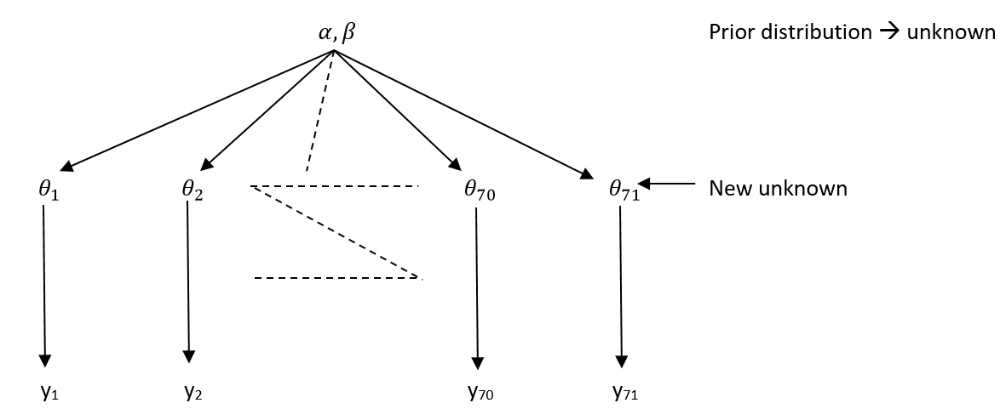
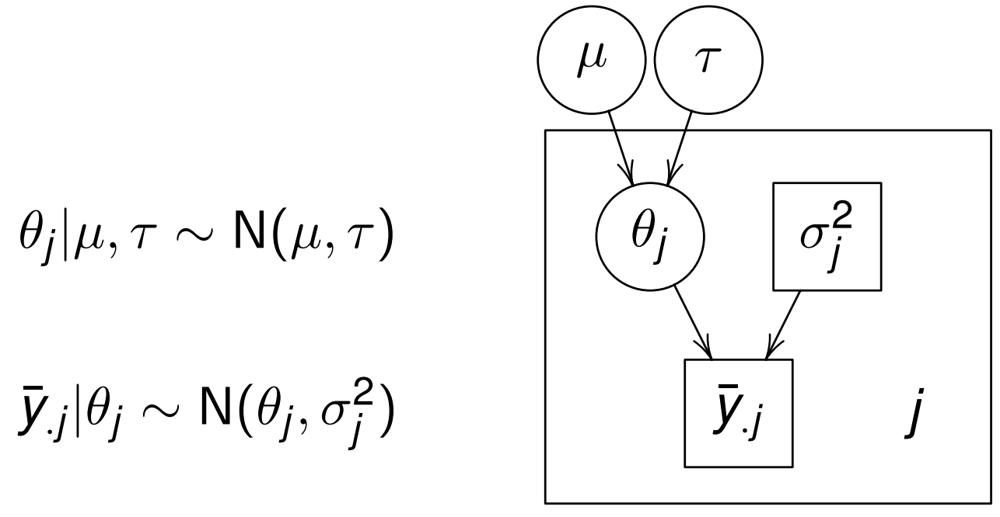
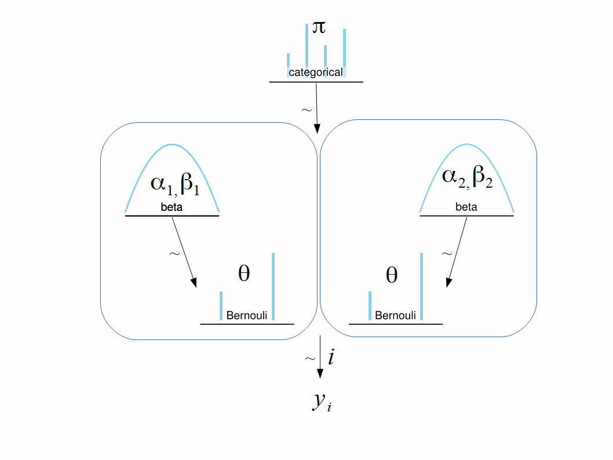

```{r setup, include=FALSE}
knitr::opts_chunk$set(echo = TRUE)
library(tidyverse)
library(rjags)
library(rstan)
library(shinystan)
library(parallel) # For using multiple chains
```

## Hierarchical Models \# Multilevel Models: an example

Binomial-Beta Hierarchical Models, $\phi$ = $(\alpha, \beta)$

```{r echo=FALSE, out.width = "80%", fig.align = "center"}

```

$y_i \mid \theta_i, \alpha, \beta$ $\overset{\text{ind}}{\sim}$   Binomial$(n_i, \theta_i)$

$\theta_i$ $\overset{\alpha, \beta}{\sim}$ $\text{Beta}(\alpha, \beta)$

$\phi = (\alpha, \beta)$ $\sim$ p$(\alpha, \beta)$

Finally, $p(y,\theta,\phi) = \Big\{\int_{i=1}^{71} p(y_i \mid \theta_i, \phi) \int_{i=1}^{71} p(\theta_i \mid \phi) \Big\} p(\phi)$


## Motivation for Hierarchical Models

- Realization of [Stein paradox](https://joe-antognini.github.io/machine-learning/steins-paradox) creates an argument in favor of a hierarchical model instead of ANOVA framework   

- When Hierarchical Bayesian model may be more useful?   
   * When you expect that there is some common information in multiple groups, but group means are not fixed, but distributed around some common center: general effectiveness of drug that may vary depending on conditions of treatments in different hospitals, individual responses of patients, etc.  
   * It is natural to model such a problem hierarchically, with observable outcomes modeled conditionally on certain parameters, which themselves are given a probabilistic specification in terms of further parameters, known as *hyperparameters*. Such hierarchical thinking helps in understanding multiparameter problems and also plays an important role in developing computational strategies   

- How do you continue Bayesian analysis with new data after group means with common prior have different posteriors?  

- All parameters of a hierarchical model exist in the same probability space and have joint distribution. Bayes rule applies to the joint parameter distribution:   
    \[ 
    p(\phi, \theta\mid y) \propto p(\phi, \theta) \ p(y\mid \phi, \theta) = p(\phi, \theta) \ p(y\mid \theta)
    \]  
    
- Advantages of hierarchical parameterization:  
   * Dependencies are often meaningful for given application  
   * Model can be efficiently coded and run by using MCMC sampling  
        
## Eight Schools Example Analysis

Eight Schools is a study of coaching effects from eight schools

> The Scholastic Aptitude Test (SAT) measures the aptitude of high-schoolers in order to help colleges to make admissions decisions. It is divided into two parts, verbal (SAT-V) and mathematical (SAT-M). Our data comes from the SAT-V (Scholastic Aptitude Test-Verbal) on eight different high schools, from an experiment conducted in the late 1970s. SAT-V is a standard multiple choice test administered by the Educational Testing Service. This Service was interested in the effects of coaching programs for each of the selected schools. The study included coached and uncoached pupils, about sixty in each of the eight different schools; see Rubin (1981). All of them had already taken the PSAT (Preliminary SAT) which results were used as covariates. For each school, the estimated treatment effect and the standard error of the effect estimate are given. These are calculated by an analysis of covariance adjustment appropriate for a completely randomized experiment (Rubin 1981). This example was analysed using a hierarchical normal model in Rubin (1981) and Gelman, Carlin, Stern, and Rubin (2003, Section 5.5).

__Research Question:__


### Data

```{r}
Schools <- data.frame(N = letters[1:8],
                      effect = c(28.39, 7.94, -2.75, 6.82, -.64, .63, 18.01, 12.16),
                      stderr = c(14.9, 10.2, 16.3, 11.0, 9.4, 11.4, 10.4, 17.6)) %>% 
   mutate(effect_p_stderr = effect + 1.96*stderr,
          effect_m_stderr = effect - 1.96*stderr)
```

### Separate estimates

```{r}
Schools[,1:3]
```

For each the eight schools, we have the estimated treatment effect (`effect`) plus standard error (`stderr`). We show the estimated treatment effects +/- standard error per school

```{r}
ggplot(Schools, aes(x = N, y = effect)) +
  geom_bar(stat = "identity", fill = "red", alpha = 0.5) +
  geom_errorbar(aes(ymin = effect_m_stderr, ymax = effect_p_stderr), width = 0.3) +
  labs(x = "school", y = "treatment effect",
       title = "Barplot of treatment effects for eight schools",
       subtitle = "Error bars represent standard error")
```

or

### A pooled estimates

Lets start by calculating a weighted average effect. I’ll weight each case by the precision (one over the square of the see).

```{r}
Schools$w <- 1/Schools$stderr^2
(Schools.mean <- sum(Schools$w*Schools$effect)/sum(Schools$w))
(Schools.lowCI <- Schools.mean - 1.96*sqrt(1/sum(Schools$w)))
(Schools.upCI <- Schools.mean + 1.96*sqrt(1/sum(Schools$w)))
```

```{r}
ord <- order(Schools$effect)
plot(Schools$effect[ord[c(1,8)]] + c(-2,2)*Schools$stderr[ord[c(1,8)]],
     c(nrow(Schools),1), main = "8 Schools data",type = "n", yaxt = "n",
     xlab = "Effect Size", ylab = "School")
points(Schools$effect[ord], nrow(Schools):1, pch = rownames(Schools)[ord])

segments(Schools$effect[ord] - 2*Schools$stderr[ord], nrow(Schools):1,
         Schools$effect[ord] + 2*Schools$stderr[ord], nrow(Schools):1)
abline(v=Schools.mean,col="red")
```

### Applied the hierarchical model



#### Prepare data

```{r}
school8.dat <- list(
   J = nrow(Schools),
   y = Schools$effect,
   sigma=Schools$stderr)
```

#### Run Stan

```{r}
modelString = "
   data {
     int<lower=0> J; // number of schools
     real y[J]; // estimated treatement effects
     real<lower=0> sigma[J]; //s.e. of effects.
   }
   parameters {
     real mu;
     real<lower=0> tau;
     vector[J] theta;
   } 
   model {
     theta ~ normal(mu,tau);
     //target += normal_lpdf(theta|mu,tau);
     y ~ normal(theta,sigma);
     //target += normal_lpdf(effect|theta,see);
   }
"
```


## Another view

### Alternative models describing same data in terms of hierarchical model  

- Description of a single model: 
\[y_i \sim p(y\mid \theta), \ \theta \sim p(\theta)\]

- If there are alternative models for the same data then 
\[y_i \sim p_m (y\mid \theta_m), \\
\theta_m \sim p_m(\theta), \ m = 1, ..., M\]

- Index of the models can be considered as another parameter:  
\[y_i \sim p_m (y\mid \theta_m), \\
\theta_m \sim p_m(\theta_m\mid m), \ m = 1, ..., M\]  

- Then we obtain a hierarchical model  
\[y_i \sim p_m (y\mid \theta_m), \\
\theta_m \sim p_m(\theta_m\mid m), \ m = 1, ..., M\]
where $p(m)$ is a multinomial prior distribution for model index

### Joint posterior distribution of parameters, including index of models  
### Conditional distribution of data, given the model index  
### Bayes factor and its interpretation  
### Problem of dependence on prior distribution  
### Prediction by averaging models  
### Analysis of nested models  
### Measures for predictive accuracy: AIC, DIC, WAIC  
### Bayesian cross-validation  

## Model Comparison: An example

### Hierarchical model

Define the model.  

```{r}
modelString=" 
model {
  for (i in 1:Ntotal) {
    y[i] ~ dbern(theta)
  }
  theta ~ dbeta(omega[m]*(kappa-2)+1,(1-omega[m])*(kappa-2)+1)
  omega[1] <- .25
  omega[2] <- .75
  kappa <- 12
  m ~ dcat(mPriorProb[])
  mPriorProb[1] <- .5
  mPriorProb[2] <- .5
}
"
```

```{r}
writeLines(modelString,con="Tempmodel.txt")
```



For $m=1$ the prior is concentrated around $\omega_1=0.25$.  
And for $m=2$ the prior is concentrated around $\omega_2=0.75$.  
Concentration levels are the same $\kappa=12$.  
Correspondingly, the resulting parameters of beta distribution are: $(\alpha_1=3.5, \beta_1=8.5)$ and $(\alpha_2=8.5, \beta_2=3.5)$.

Create list of data corresponding to 6 successes out of 9 trials.  
```{r}
y <- c(rep(0,3), rep(1,6))   
(Ntotal <- length(y))
(dataList <- list(y=y, Ntotal=Ntotal))
```

Send model to JAGS.

```{r}
jagsModel <- jags.model(file="TempModel.txt",
                        data=dataList,
                        n.chains=4,
                        n.adapt=500)
names(jagsModel)
```

Burn in.

```{r}
update(jagsModel,
       n.iter=600)
```

Generate MCMC trajectories.

```{r}
codaSamples <- coda.samples(jagsModel,
                            variable.names=c("m"),
                            thin=1,
                            n.iter=5000)
list.samplers(jagsModel)
head(codaSamples)
```

Analyze convergence.

```{r}
summary(codaSamples)
plot(codaSamples)
```

Plot of the samples is not very informative because each sample is a trajectory switching between 1 and 2.  

```{r}
autocorr.plot(codaSamples,ask=F)
effectiveSize(codaSamples)
```

We see that autocorrelation converges to zero only in about 5 lags or so.  
This is confirmed by ESS.  

Rerun the chains with thinning parameter equal to 5.  

```{r}
codaSamples<-coda.samples(jagsModel,variable.names=c("m"),thin=5,n.iter=5000)
plot(codaSamples)
autocorr.plot(codaSamples,ask=F)
effectiveSize(codaSamples)
lapply(codaSamples,length)
```

Now autocorrelation function is not significant.  
Effective size is 3620.0240921, but this is out of total 4,000 of observations instead of 20,000. Thinning reduces sample. When we apply thinning we need to make sample longer.  

Potential scale reduction factor or shrink factor showed convergence.  

```{r}
gelman.diag(codaSamples)
gelman.plot(codaSamples)
```

### Selecting and ensembling models

Now analyze the results.  

Look at the chain means.  

```{r}
(means<-lapply(codaSamples,mean))
```

Means are calculated as  
\[\text{Mean}=1P(m=1)+2P(m=2)=1(1−P(m=2))+2P(m=2)=1−P(m=2)\].
From this $P(m=2)=\text{Mean}−1$

Find posterior probabilities of $m=2$ for each of the 4 chains and their average.

```{r}
(prob.2<-lapply(means,function(z) z-1))
mean(unlist(prob.2))
```

This means that posterior probability of $m=1$ is 0.17525.
Obviously, observing 6 successes out of 9 is more consistent with the model concentrating around level of 0.75.

Find how much time each chain spent in each of the state for $m$.

```{r}
lapply(codaSamples,function(z) sum(z==2)/length(z))
```

This is a caveat of using hierarchical model for model comparison: if one of the models is a strong leader the sample for the underdog becomes too short which leads to more unstable results.  
One obvious way to overcome this is to sacrifice efficiency and run chains longer.  
Also, it may be a good idea to try avoiding significant difference in prior probabilities of competing models.  