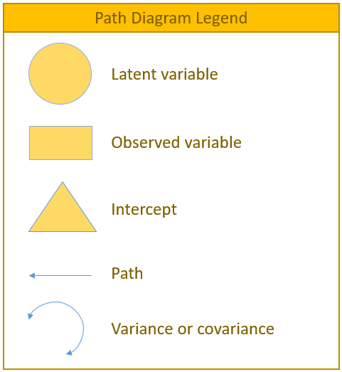

- Specification (estimating in our models)  $\Rightarrow$ Measurement model specification (relationships among observed and latent variables, including variances and covariance) $\Rightarrow$ Structural model specification (classic regression relationships among (latent) variables of substantive interest)  

- SEM = measurement model + structural model  
  * Specify # of factors and factor loadings with __"BY" or =~__  
  * Specify regression/covariance with __"ON" or ~ __ and __"WITH" or ~~__  

- SEM solves two regression problems:  
  * Simple structural models (path analysis)  
  * Variables measured with error (CFA)  

## First build

<aside>
*Quick reference of `lavaan` syntax* (@RN821)
</aside>

<span style="color:blue">__*Quick reference of `lavaan` syntax*__</span>  

Introduce some of the most frequently used syntax in __lavaan__  

- **~ predict**, used for regression of observed outcome to observed predictors (e.g., y ~ x)  
- **=~ indicator**, used for latent variable to observed indicator in factor analysis measurement models (e.g., f =~ q + r + s)  
- **~~ covariance** (e.g., x ~~ x)  
- **~1** intercept or mean (e.g., x ~ 1 estimates the mean of variable x)  
- __1\*__ fixes parameter or loading to one (e.g., f =~ 1*q)  
- __NA\*__ frees parameter or loading (useful to override default marker method, (e.g., f =~ NA*q)  
- __a\*__ labels the parameter ‘a’, used for model constraints (e.g., f =~ a*q)  


### Demonstation 1

- __Model in Mplus:__  
  f1 BY y1-y3;  
  f2 BY y4-y6;   
  f2 ON f1;  

- __Model in lavaan (R):__  
  f1 =~ y1+y2+y3  
  f2 =~ y4+y5+y6   
  f2 ~ f1  
  
### Demonstation 2

  

- __Model in Mplus:__  

<span style="color:green">! Required code to estimate regression paths</span>  
D ON A B;  
E ON D C;  
F ON E;  
<span style="color:green">! Outcome intercepts and residual variances estimated by default</span>  
[D E F]; D E  
<span style="color:green">! To bring A, B, and C predictors into the likelihood,</span>  
<span style="color:green">! Request their covariances</span>  
A B C WITH A B C;  
<span style="color:green">! Predictor means and variances then estimated by default</span>  
[A B C]; A B C;  

- __Model in lavaan (R):__

D ~ A+B   
E ~ D+C    
F ~ E     

D ~ 1; D ~~ D  

A B C ~~ A B C  

A ~ 1; A~~A  

## Be aware of 2 types of path models

- Unstandardized $\rightarrow$ predicts scale sensitive original variables:  
  * Useful for comparing across groups (whenever absolute values matter)   
  * Parameters predict the variables’ means, variance s, and covariances  
- Standardized $\rightarrow$ predicts 𝑧 scored versions of variables  
  * Useful when comparing effects within a solution (are then on same scale)   
  * Model parameters predict the variables’ correlations   

Refer more in @RN820

## Confusing terminolgy

- _Predictors_ are known as **exogenous** variables   
- _Outcomes_ are known as **endogenous** variables  
- Variables that are _both_ at once are called **endogenous** variables  

   
  

<span style="color:orange">__*How set up in Mplus to run FIML:*__</span>     

<aside>
Trick in Mplus  
</aside>

- By default __in Mplus__ , *truly* exogenous predictor variables cannot
have missing data, the same as in any general(ized) linear model  
  * Cases with missing predictors are __listwise deleted__ (incomplete data then are assumed missing completely at random ), no matter which  
  * Because *truly* exogenous predictors are not part of likelihood function      + Log likelihood (LL) contains $\hat{y}_i$ for each person and $\sigma^2_e$ for each outcome  
    + So LL can’t be calculated without the predictors that create each $\hat{y}_i$   
- But truly exogenous predictors also do not have assumed distributions   
  * Good when you have non normally distributed predictors (e.g., ANOVA)!  
- We thought full information ML allows missing data???  
  * NO: only endogenous outcomes can be incomplete (then assumed missing at random, which means random only after conditioning on model variables   
  * BTW, we can add other variables into the likelihood but not the model to help (untestable) missing at random assumption using AUXILIARY option  
    + Is a "saturated correlates" approach (they just covary with all outcomes)   
- Mplus allows a work around: you __*can* bring exogenous
predictors into the likelihood__ by listing their means, variances, or
covariances as parameters $\rightarrow$ __predictors then become "outcomes"__  
  * Even if nothing predicts the predictor (i.e., it’s not really an outcome)  
  * Incomplete "endogenous predictors" can be included assuming missing
at random (MAR), but they also then have distributional assumptions (MNV)  
    + Historically Mplus has not let endogenous predictors have other distributions, so you may have to make non normal predictors an outcome of something else   
    + But there may be ways to trick it in doing this that I haven’t found yet  
    
## Steps in Model Building

### Practical Steps: 2 Step

2-step (@RN815)  

- CFA with "fully-saturated" covariance structure  
  * Allow all latent variables to freely covary (i.e., only WITH, no ON)  
  * Removes structural model from estimation of fit  
  * Misfit can only be due to measurement model problems  
- Obtain fit to evaluate measurement model  
- Estimate structural model with regression  
- Obtain fit & contrast with previous model  
  * Changes in fit due to structural model misfit

### Practical Steps: 4 Step

4-step (@RN816, @RN817, and @RN818)  

- Exploratory search for # of factors  
- CFA with fully-saturated covariance structure  
- Estimate structural model with regression  
- Test nested/alternative models  

## An example

@RN814 article about *"Further evidence for the discriminant validity of measures of organizational commitment, job involvement, and job satisfaction"*  

- Measured organizational commitment, performance, job involvement, and job satisfaction and other variables  
- Show discriminant validity with good-fitting CFA that specifies each as a distinct latent variable
- Then show non-huge inter-correlations among factors  
- Data (Means -- Stdeviations -- Correlation) from engineers is used, in Appendix A

```{r}
print("Mathieu & Farr 1991.txt")
writeLines(readLines("Mathieu & Farr 1991.txt"))
```


### Set up Mplus in Rmarkdown

```{r engine path setup}
knitr::opts_chunk$set(engine.path = list(
  mplus = "C:/Program Files/Mplus/Mplus"
))
```

```{r}
knitr::knit_engines$set(mplus = function(options) {
    code <- paste(options$code, collapse = "\n")
    fileConn<-file("formplus.inp")
    writeLines(code, fileConn)
    close(fileConn)
    out  <- system2("C:/Program Files/Mplus/Mplus", "formplus.inp")
    fileConnOutput <- file("formplus.out")
    mplusOutput <- readLines(fileConnOutput)
    knitr::engine_output(options, code, mplusOutput)
})
```

### Run Mplus in Rmarkdown

```{mplus}
Title: CFA Example

Data: File is Mathieu & Farr 1991.txt;

Type is Means Stdeviations Correlation;

Nobservations = 483;

Variable:
Names are 
OC1 OC2 OC3 ! Organizational commitment
JI1 JI2 JI3 ! Job involvement
SAT1 SAT2 SAT3 ! Job satisfaction
JS1 JS2 JS3 ! Job scope
SELF1 SELF2 SELF3 ! Self ratings of performance
SUPR1 SUPR2 SUPR3 ! Supervisor ratings of performance
Education
PostTen ! Position tenure
OrgTen ! Organizational tenure
Age;

UseVariables are OC1-OC3 SAT1-SAT3 
JS1-JS3 SUPR1-SUPR3 Education;

Analysis:

Model:
OC by OC1 OC2 OC3;
SAT by SAT1 SAT2 SAT3;
JS by JS1 JS2 JS3;
PERF by SUPR1 SUPR2 SUPR3;

PERF on OC SAT JS Education;
OC on SAT; 
SAT on JS;

Output: Tech1 Tech8 standardized sampstat;
```

### Run lavaan (R)

We have no full dataset, but do have a sample mean, standard deviation and correlation matrix. Due to [`lavaan` supports covariance matrix as input but not correlation matrix](https://stackoverflow.com/questions/61148096/correlation-matrix-as-input-for-lavaan), we need to convert correlation matrix to covariance matrix to fit your model.

#### Convert correlation to covariance matrix 

First, I run [SAS (proc iml)](https://blogs.sas.com/content/iml/2010/12/10/converting-between-correlation-and-covariance-matrices.html) for easier manipulate the correlation matrix transfer to covariance matrix. However, we could use `rcompanion::fullPTable()` function in R to do the job.

```{r, eval=FALSE}
# in SAS
PROC IML;
/** convert correlation matrix to covariance matrix **/
lR={1		.		.		.		.		.		.		.		.		.		.		.		.		.		.		.		.		.		.		.		.		.,
	.76	1		.		.		.		.		.		.		.		.		.		.		.		.		.		.		.		.		.		.		.		.,
	.67	.68	1		.		.		.		.		.		.		.		.		.		.		.		.		.		.		.		.		.		.		.,
	.26	.2		.22	1		.		.		.		.		.		.		.		.		.		.		.		.		.		.		.		.		.		.,
	.28	.25	.17	.43	1		.		.		.		.		.		.		.		.		.		.		.		.		.		.		.		.		.,
	.34	.33	.26	.52	.52	1		.		.		.		.		.		.		.		.		.		.		.		.		.		.		.		.,
	.57	.57	.55	.09	.2		.21	1		.		.		.		.		.		.		.		.		.		.		.		.		.		.		.,
	.55	.53	.55	.16	.2		.21	.84	1		.		.		.		.		.		.		.		.		.		.		.		.		.		.,
	.48	.46	.49	.15	.23	.21	.79	.71	1		.		.		.		.		.		.		.		.		.		.		.		.		.,
	.36	.31	.31	.14	.13	.16	.46	.42	.48	1		.		.		.		.		.		.		.		.		.		.		.		.,
	.42	.36	.38	.15	.12	.14	.51	.5		.5		.7		1		.		.		.		.		.		.		.		.		.		.		.,
	.32	.34	.37	.11	.13	.13	.47	.46	.46	.65	.64	1		.		.		.		.		.		.		.		.		.		.,
	.21	.19	.13	.14	.18	.15	.31	.29	.31	.32	.5		.1		1		.		.		.		.		.		.		.		.		.,
	.21	.17	.1		.14	.16	.15	.25	.23	.29	.37	.25	.17	.81	1		.		.		.		.		.		.		.		.,
	.22	.18	.12	.15	.14	.12	.33	.29	.31	.39	.29	.15	.82	.82	1		.		.		.		.		.		.		.,
	.15	.13	.02	.23	.13	.18	.09	.07	.04	.19	.16	.08	.23	.15	.14	1		.		.		.		.		.		.,
	.16	.09	-.01	.17	.07	.05	.09	.09	.07	.25	.24	.16	.22	.28	.19	.59	1		.		.		.		.		.,
	.14	.09	-.01	.13	.04	.06	.07	.05	.07	.2		.17	.09	.22	.19	.23	.59	.62	1		.		.		.		.,
	.06	.09	.01	.07	.11	.16	.09	.1		.04	.14	.04	.05	.2		.19	.15	.15	.17	.15	1		.		.		.,
	.03	.06	.1		.17	.19	.17	.02	.01	.1		.15	.04	.09	.03	.05	.06	.1		.16	.07	.1		1		.		.,
	.1		.09	.1		.1		.16	.15	-.001	.02	.04	.12	.05	-.01	.03	.03	.05	.001	.18	.02	.05	.52	1		.,
	.14	.1		.12	.07	.15	.17	-.01	.01	-.001	.12	.03	.06	.1		.01	.12	.06	.18	.04	.07	.46	.8		1 };

p=ncol(lR);  * Number of columns in the lower triangular correlation matrix;
R=J(p,p,0);    * Initialize the correlation matrix;
uR=(lR`); * Transpose the lower triangular matrix to upper;
R=lR<>uR; * Select the max of the lower and upper matrices;
print R;       * Complete correlation matrix;

/** standard deviations of each variable **/
c = {.89	1	1.11	1.1	1.31	1.11	.86	.88	.89	.43	.4	.41	.85	.92	.77	1.11	1.11	1.09	1.05	6.18	8.62	9.92};
D = diag(c);
 
S = D*R*D; /** covariance matrix **/
print S;
quit;
```

#### Load lavaan

Second, load `lavaan`

```{r}
library(lavaan)
```

#### Read covariance as input

Third, we read in the lower half of the covariance matrix (including the diagonal)

```{r}
options(width = 300)
lower <- '
0.7921
0.6764    1
0.661893  0.7548  1.2321
0.25454   0.22    0.26862   1.21 
0.326452  0.3275  0.247197  0.61963 1.7161 
0.335886  0.3663  0.320346  0.63492 0.756132  1.2321
0.436278  0.4902  0.52503   0.08514 0.22532   0.200466 0.7396
0.43076   0.4664  0.53724   0.15488 0.23056   0.205128 0.635712 0.7744 
0.380208  0.4094  0.484071  0.14685 0.268157  0.207459 0.604666 0.556072 0.7921
0.137772  0.1333  0.147963  0.06622 0.073229  0.076368 0.170108 0.158928 0.183696 0.1849 
0.14952   0.144   0.16872   0.066   0.06288   0.06216  0.17544  0.176    0.178    0.1204    0.16
0.116768  0.1394  0.168387  0.04961 0.069823  0.059163 0.165722 0.165968 0.167854 0.114595  0.10496 0.1681
0.158865  0.1615  0.122655  0.1309  0.20043   0.141525 0.22661  0.21692  0.234515 0.11696   0.17    0.03485   0.7225
0.171948  0.1564  0.10212   0.14168 0.192832  0.15318  0.1978   0.186208 0.237452 0.146372  0.092   0.064124  0.63342  0.8464
0.150766  0.1386  0.102564  0.12705 0.141218  0.102564 0.218526 0.196504 0.212443 0.129129  0.08932 0.047355  0.53669  0.580888 0.5929
0.148185  0.1443  0.024642  0.28083 0.189033  0.221778 0.085914 0.068376 0.039516 0.090687  0.07104 0.036408  0.217005 0.15318  0.119658 1.2321
0.158064  0.0999 -0.012321  0.20757 0.101787  0.061605 0.085914 0.087912 0.069153 0.119325  0.10656 0.072816  0.20757  0.285936 0.162393 0.726939 1.2321
0.135814  0.0981 -0.012099  0.15587 0.057116  0.072594 0.065618 0.04796  0.067907 0.09374   0.07412 0.040221  0.20383  0.190532 0.193039 0.713841 0.750138 1.1881
0.05607   0.0945  0.011655  0.08085 0.151305  0.18648  0.08127  0.0924   0.03738  0.06321   0.0168  0.021525  0.1785   0.18354  0.121275 0.174825 0.198135 0.171675 1.1025
0.165006  0.3708  0.68598   1.15566 1.538202  1.166166 0.106296 0.054384 0.55002  0.39861   0.09888 0.228042  0.15759  0.28428  0.285516 0.68598  1.097568 0.471534 0.6489 38.1924
0.76718   0.7758  0.95682   0.9482  1.806752  1.43523 -0.007413 0.151712 0.306872 0.444792  0.1724 -0.035342  0.21981  0.237912 0.33187  0.0095682 1.722276 0.187916 0.45255 27.701232 74.3044
1.236032  0.992   1.321344  0.76384 1.94928   1.871904 -0.085312 0.087296 -0.008829 0.511872 0.11904 0.244032 0.8432   0.091264 0.916608 0.660672 1.982016 0.432512 0.72912 28.200576 68.40832 98.4064  '

mathieu.cov <- 
    getCov(lower, names = c(
      "OC1", "OC2", "OC3", # Organizational commitment
      "JI1", "JI2", "JI3", # Job involvement
      "SAT1", "SAT2", "SAT3", # Job satisfaction
      "JS1", "JS2", "JS3", # Job scope
      "SELF1", "SELF2", "SELF3", # Self ratings of performance
      "SUPR1", "SUPR2", "SUPR3", # Supervisor ratings of performance
      "Education",
      "PostTen", # Position tenure
      "OrgTen", # Organizational tenure
      "Age"
    ))
```

#### Model fit

Fourth, we fit model

```{r}
options(width = 300)
mathieu.model <- '
  # latent variables
    OC  =~ OC1  + OC2   + OC3
    SAT =~ SAT1 + SAT2  + SAT3
    JS  =~ JS1  + JS2   + JS3
    PERF=~ SUPR1+ SUPR2 + SUPR3
  # regressions
    PERF ~ OC + SAT + JS + Education
    OC   ~ SAT
    SAT  ~ JS
'
fit <- sem(mathieu.model, 
           sample.cov = mathieu.cov, 
           sample.nobs = 483)
summary(fit, standardized = TRUE)
```

#### Fit statistics

Fifth, fit indices

```{r}
options(width = 300)
#fit statistics
summary(fit, fit.measures=TRUE)
```

## Model Fit Statistics

We focus on the 5 commonly used:

1- **Model chi-square** is the chi-square statistic we obtain from the maximum likelihood statistic (in `lavaan`, this is known as the Test Statistic for the Model Test User Model)   
2- **CFI** is the Comparative Fit Index -- values can range between 0 and 1 (values greater than 0.90, conservatively 0.95 indicate good fit)  
3- **TLI** Tucker Lewis Index which also ranges between 0 and 1 (if it’s greater than 1 it should be rounded to 1) with values greater than 0.90 indicating good fit. If the CFI and TLI are less than one, the CFI is always greater than the TLI.  
4- **RMSEA** is the root mean square error of approximation
In lavaan, you also obtain a p-value of close fit, that the RMSEA < 0.05. If you reject the model, it means your model is not a close fitting model.   
5- **SRMR** is standardized root mean squared residual to test close fit. Also we also obtain a p-value of close fit, that the RMSEA < 0.05. If you reject the model, it means your model is not a close fitting model.     

In general, researchers should avoid sample sizes less than 100 when testing small degrees of freedom models. In fact, science and math education researchers should avoid reporting the RMSEA when sample sizes are smaller than 200, particularly when combined with small degrees of freedom. Small degrees of freedom do not tend to result in rejection of correctly specified models for the TLI, CFI, and SRMR, particularly if they tested using larger sample sizes (@RN822).   


__(be continued)__

### Model chi-square

### CFI, TLI

### RMSEA, SRMR


###

###

## Summary

- SEM was running both in Mplus and lavaan produced the identical results. Fantastic!   
- SEM is simply path analysis + CFA  
  * Model-based procedure: a means to make almost any idea an empirical question   
  * Model comparisons allow testing theory  
    + Measurement models create latent constructs (= random effects) that better represent trait individual differences than any one outcome   
    + Structural models test relations involving those latent constructs   
  * It’s easy to setup, but with complicated models  
    + ML MAY BREAK when your models get too complicated (or realistic)  
    + You have named your factors, but it doesn’t mean you are right! (Validity)  
    + Distributional assumptions matter, but so do linear model assumptions
(nonlinear measurement and structural models may be   
    + Factor scores are not perfectly determined (and neither are sum scores), so make sure to represent their uncertainty in any SEM alternative  
    
    


