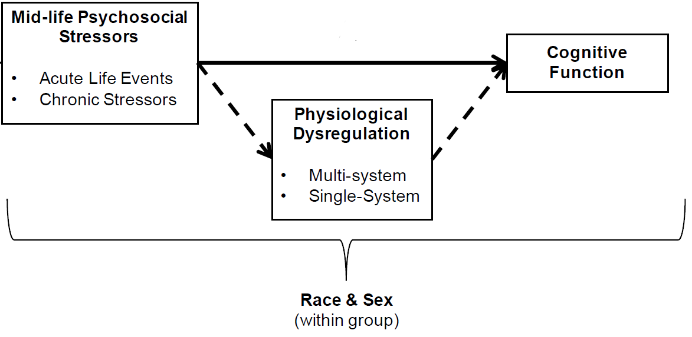
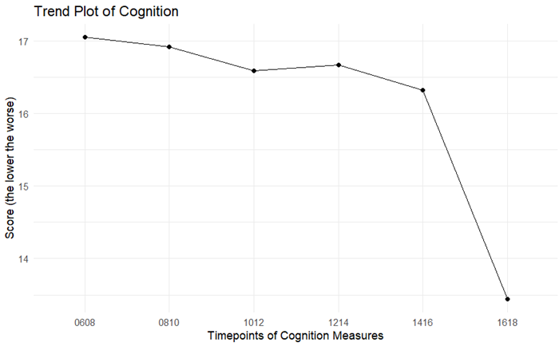
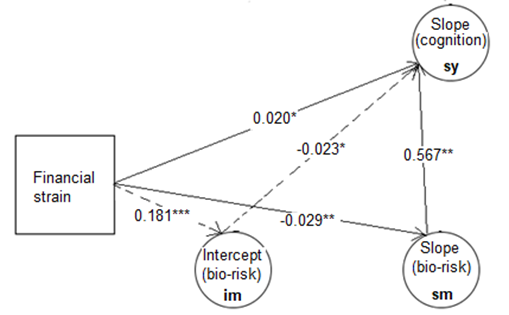

Conducting a study in social science is an art but can be quite complex. One of the initial steps involves considering how to measure "unmeasured objects," such as cognition, awareness, and deception.

Furthermore, to ensure the reliability and accuracy of measurement scales, they need to be established and validated using established scientific methods.

Recently, I conducted an analysis for a project titled ["Mid-life Stress Exposure, Physiological Dysregulation, and Cognitive Function: A Longitudinal Mediation Analysis with Latent Growth Models."](https://event.fourwaves.com/sphpostercompetition/abstracts/572b8cbb-9d81-4dd6-b044-2a1ec2bd923e) The project aims to explore the relationships between mid-life stress exposure, physiological dysregulation, and cognitive function using a longitudinal mediation analysis with latent growth models.

The project's topic led me to consider how we can measure exposure, outcome, and mediator variables both subjectively and objectively. Here are some of the details of the measurement process.

Finally, the figure shows the conceptual model used in the analysis.

## The outcome: Cognition

Cognitive function was processed as:

- Cognitive data are based on a modified version of the Telephone Interview of Cognitive Status (m-TICS; Table below).   
- Other measures of cognitive function, such as the Mini Mental State Examination (MMSE), exist, however, the TICS is the only measure available in the Health and Retirement Study (HRS) for the age range of interest, 51-64 years old and the TICS is a validated measure that has been shown to produce similar findings to the MMSE106 and to have a high interclass correlation coefficient.   
- The HRS uses 4 different cognitive tests from the m-TICS to assess different types of memory and function. These tests will be summed to create a 27-point measure of overall cognitive function, where __*higher values indicate greater functioning*__.

__Cognitive Measures__  

|Measures |Description |
|:--------|:-----------|
|Immediate word recall|Episodic Memory. Recall a list of 10 words in any order (range: 0-10)|
|Delayed word recall|Episodic Memory. Repeat the list of 10 words from the immediate recall test (range: 0-10)|
|Serial 7’s subtraction|Working Memory. Subtract 7 from 100 and continue subtracting 7 from each subsequent number 5 times (range: 0-5)|
|Backwards counting from 20|Mental Processing Speed. Count backwards from 20 (range: 0-2)|

## The exposure: Stressors

The proposed study will capitalize on the richness of the HRS data set by examining the effects of both acute and chronic stressors on cognitive decline (Table below). 

- All life events, traumas and major acts of discrimination that occurred in the past 5 years will be counted (range: 0-20) to measure acute stress exposure, such that a greater number of events corresponds with greater (i.e., more frequent) stress exposure.   
- There are three chronic stressors specific to three life domains -- work stress, family strain and financial hardship -- and chronic experiences of discrimination, which is not domain-specific.  
- Responses to these four measures will be averaged and internal reliability will be assessed. Incorporating acute and chronic stressors in mid-life, stressors that impact various life domains, and stressors particularly relevant to racial/ethnic minorities is a more valid representation of the stress universe that will lead to more rigorous findings.  
- All stressors will be time-invariant baseline measures

__Stress Measures__

|Measures	|Description |
|:----------|:-----------|
|Acute life events	 |Count of 6 life events, 7 traumas and |7 major experiences of discrimination that occurred in the past 5 years |
|Chronic work stress |Average of 6 items with 4 Likert-like response options (range: 1-4) |
|Chronic family strain |Average of 3 items with 4 Likert-like response options (range: 1-4) |
|Chronic financial hardship |	Two separate items assessing difficulty paying monthly bills (range: 1-5) and low sense of control over finances (range: 1-5) |
|Chronic discrimination |	Average of 6 items with 6 Likert-like response options (range: 1-6) |

## The mediator: Physiological dysregulators

Physiological dysregulation will be assessed using cumulative and system-specific measures (Table below). 

- Cumulative measures of dysregulation more accurately reflect the interconnectedness of the physiological response to stress, while system-specific measures allow for more nuanced understanding of change in physiological functioning.   
- The cumulative measure will incorporate seven/eight physical measures and biomarkers that represent the cardiovascular, metabolic and immune systems.   
- We will count the number of biomarkers with measured values considered "high-risk" based on clinical guidelines or established research.   
- The advantage of this approach is that the measure is clearly defined and easily replicated in other studies, and the use of clinical guidelines enhances the clinical relevance of the measure.   
- Analyses focused on the role of specific physiological systems will   
   (1) count the number of high-risk biomarkers within each physiological system and   
   (2) examine the effects of each biomarker individually.  
- __*The higher values of he cumulative biomarker measure indicate greater risk*__

__Physiological Dysregulation__

|Measures	|Cut-point/Range |
|:----------|:---------------|
|C-Reactive protein (CRP immune) |	≥ 3.0 mg/L |
|Systolic blood pressure (SBP; cardiovascular) |	≥ 135 mmHg |
|Diastolic blood pressure (DBP; cardiovascular) |	≥ 80 mmHg or < 60 mmHg |
|Heart rate (cardiovascular) |	≥ 90 bpm |
|Glycosylated hemoglobin A1c (metabolic) |	≥ 6.5% |
|HDL cholesterol (metabolic) |	< 40 mg/dL |
|Total cholesterol (metabolic) |	≥ 240 mg/dL |
|Waist circumference (metabolic) |	>	35 in. (women); >	40 in. (men) |
|Body mass index (BMI metabolic) |	≥ 30 kg/m2 (class I obesity) |
|Cumulative physiological dysregulation (count) |	0-9 |

## Sum up

To determine whether changes in physiological functioning mediate the relationship between stressors and cognitive decline, it is necessary to establish alignment across all three measurement scales at the outset.

## Q&A

### T.P.'s 

Thank you, T. for asking such interesting questions.

__(1) How long everyday discrimination and financial strain needed to occur to be considered as chronic stressors? Additionally, in table 1, you presented both everyday and lifetime discrimination, could you provide further clarification on these two variables?__ 

Lazarus & Folkman, 1984, defined stressors, in a psychosocial context, are the demands from the internal or external environment that we perceive as harmful or threatening. Those can be categorized into 2 groups:  

- discrete, major, short-term stressful life events  
- ongoing, everyday chronic stressors  

Hence, the chronic stressors were occurring on a daily basis of an event (or events) develop as continuing problematic conditions, have a longer course of duration (weeks, months, maybe years), and do not end with a self-limiting resolution. McLean and Link (1994), have divided it into 5 types: persistent life difficulties, role strains, chronic strains, community-wide strains, and daily hassles.  

To conclude, everyday discrimination and financial strain happened on a daily basis, maintained through weeks, months, and even years can be considered chronic stressors.  

Regarding the everyday vs lifetime discrimination, based on Ayalon, L., & Gum, A. M. (2011):  

*"two types of perceived discrimination differ based on their magnitude (e.g., major life events vs. minor daily hassles), but they also differ based on their timeframe, with the former concerning events that might have happened many years ago and the latter concerning more recent events. In addition, major lifetime discrimination concerns primarily events of impact on one’s socioeconomic status, whereas everyday discrimination is focused primarily on assaults to one’s character. The frequency of the two types of discrimination is also expected to differ, with everyday discrimination being more frequent than major lifetime discrimination."*

I can list an example here:  

- everyday discrimination scale: 

In your day-to-day life, how often do any of the following things happen to you? 

1.    You are treated with less courtesy than other people are.  
2.    You are treated with less respect than other people are.  
3.    You receive poorer service than other people at restaurants or stores.  
4.    People act as if they think you are not smart.  
5.    People act as if they are afraid of you.  
6.    People act as if they think you are dishonest.  
7.    People act as if they’re better than you are.  
8.    You are called names or insulted.  
9.    You are threatened or harassed.  

Recommended response categories for all items:  

   Almost everyday   
   At least once a week  
   A few times a month  
   A few times a year  
   Less than once a year  
   Never  

- lifetime discrimination scale(major life events):  

1.    At any time in your life, have you ever been unfairly fired from a job or been unfairly denied a promotion?  
2.    For unfair reasons, have you ever not been hired for a job?  
3.    Have you ever been unfairly stopped, searched, questioned, physically threatened or abused by the police?  
4.    Have you ever been unfairly discouraged by a teacher or advisor from continuing your education?   
5.    Have you ever been unfairly prevented from moving into a neighborhood because the landlord or a realtor refused to sell or rent you a house or apartment?  
6.    Have you ever been unfairly denied a bank loan?   

Read more at: https://scholar.harvard.edu/davidrwilliams/node/32397  

__(2) I noticed that for acute stressors, you counted the number of events but did not examine their severity or duration of experience. Could you explain the reasoning behind this choice?__  

Good catch. Acute stressors meant discrete, major, stressful life events or life change events. Thus, the acute stressor itself instinctively got embraced its severe magnitude.  

__*References:*__  

Lazarus R. S., Folkman S. (1984). Stress, Appraisal and Coping. New York: Springer.    

McLean, D. E., & Link, B. G. (1994). Unraveling complexity: Strategies to refine concepts, measures, and research designs in the study of life
events and mental health. In W. R. Avison, & I. H. Gotlib (Eds.), Stress and mental health: Contemporary issues and prospects for the future
(pp. 15-42). New York, NY: Plenum Press.    

Ayalon, L., & Gum, A. M. (2011). The relationships between major lifetime discrimination, everyday discrimination, and mental health in three racial and ethnic groups of older adults. Aging & mental health, 15(5), 587–594.  

### J.K.'s

Thank you, Dr. K., for these interesting questions.  

__(1) How are everyday discrimination, lifetime discrimination, and total financial strain measured? How do participants select a numeric score (e.g., count, Likert scale)? Similarly, how is the cognition score measured?__ 

We measured those stressors, such as: 

- Everyday discrimination is an average of 5 items with 6 Likert-like response options (range: 1-6);   
- Lifetime discrimination is an average of 6 items with 6 Likert-like response options (range: 1-6);   
- Total financial strain included 2 separate items assessing difficulty paying monthly bills (range: 1-5) and low sense of control over finances (range: 1-5);   

Further reference, here is the codebook https://hrs.isr.umich.edu/sites/default/files/meta/2006/core/codebook/h06lb_r.htm  

For example: everyday discrimination (names edisc) would be the average of those variables klb030a, klb030b, klb030c, klb030d, and klb030e from codebook.  

For the cognition function measure, we used 4 different cognitive tests from the m-TICS to assess different types of memory and function. These tests will be summed to create a 27-point measure of overall cognitive function, where higher values indicate greater functioning.  

__(2) In the first statistical analysis in the Methods section, why did you choose to impose a linearity constraint for the first five timepoints but not the last time point in the Latent Growth Model (LGM)? Do the second and third statistical analyses in the Methods section continue to apply the constraint? Are there alternative constraints that you could have used, and if so, how did you select LGM models (e.g., based on fit)?__ 

Very good catch.   

Researchers may fix the loadings for some indicators in a structural equation model to ensure that the model is properly identified and the parameters can be estimated. This is usually done when there is prior theoretical or empirical evidence to suggest that the indicators are measuring the same underlying construct (such as linear, quadratic, ... trend) and have similar loadings.   

Regarding the decision not to fix the loading for the last wave as a linear trend:  

- The observed data (description and figure) showed not a linear trend in the last wave, so fixing the loading may not have been necessary.   

- One possibility is that there may diversity of evidence or theoretical justification to suggest that cognition trend following linear or non-linear trend (Robitaille et al. (2012) suggested 0,2,4,6,8 for slope; McArdle et all (2007) showed the freely slope estimates).   

- Finally, the decision was made based on the fit statistics or model comparisons, indicating that fixing the loading as a linear trend did not improve the overall model fit. I observed that model fits (including CFI, TLI, RMSEA, and SRMR) of the version improved much compared with fixed all loadings as a linear trend.   

As such, the 2nd and 3rd modelings continued to apply the same constraint in the 1st modeling.  

I conducted 2 versions of modeling: constraint all loadings as a linear trend (0,1,2,3,4 and 5) and the 2nd version of constrain linearity for slopes of first 5 timepoints but freely slope estimate for the last timepoint. Model fits in terms of __CFI (>0.95), TLI (>0.95), RMSEA (<0.05), and SRMR (<0.05)__ became much better at 2nd version modeling.  

__(3) How would you interpret the magnitudes of the effects that you find? This question is related to question 1 in that it would be useful to know more about the measures to understand strengths of the relationships beyond their statistical significance.__

First of all, I focused on the indirect effect due to the rate of increasing in bio-risks and due to the baseline of bio-risk level. I saw that the financial strain exposure caused the statistically significant of both indirect effects pathways. I can interpret, for example: The effect of financial strain stressor on cognition slope/trend was partially mediated via rate of increase in bio-risks. As Figure illustrates, the regression coefficient between financial strain stressor and the slope of bio-risks and the regression coefficient between the slope of bio-risks and slope of cognition was significant. The indirect effect was (.567)x(-.029) = -.017. We tested the significance of this indirect effect using bootstrapping procedures. Unstandardized indirect effects were computed for each of 10000 bootstrapped samples, and the 95% confidence interval was computed by determining the indirect effects at the 2.5th and 97.5th percentiles. The bootstrapped unstandardized indirect effect was -.017, and the 95% confidence interval ranged from -0.032 to -0.001. Thus, the indirect effect was statistically significant (p=.036).

Thus, we got the __*Statistical significance*__. 

How about the __*effect size*__ and __*practical significance*__?

I could say the mediation pathway explained 8% (the ratio of the mediation pathways caused -0.017 decreasing in cognition comparing to the overall cognition deteriorating in crude model (without covariates) of -0.218). If I treated 8% as the Absolute Risk Reduction (ARR), so The Number Needed to Treat (NNT) = 1/ARR = 1/0.08 = 12 (Mendes et al (2017)). It means I have to treat 12 people by ceasing the increase in bio-risks to prevent one additional bad cognition function. It’s worth practical significance.  

__*References:*__  

Robitaille A, Muniz G, Piccinin AM, Johansson B, Hofer SM. Multivariate Longitudinal Modeling of Cognitive Aging: Associations Among Change and Variation in Processing Speed and Visuospatial Ability. GeroPsych (Bern). 2012;25(1):15-24. doi: 10.1024/1662-9647/a000051. PMID: 23589712; PMCID: PMC3625423.

McArdle, John J., et al. “Latent Variable Analyses of Age Trends of Cognition in the Health and Retirement Study, 1992-2004.” Psychology and Aging, vol. 22, no. 3, 2007, pp. 525–45, https://doi.org/10.1037/0882-7974.22.3.525.

Mendes D, Alves C, Batel-Marques F. Number needed to treat (NNT) in clinical literature: an appraisal. BMC Med. 2017 Jun 1;15(1):112. doi: 10.1186/s12916-017-0875-8. PMID: 28571585; PMCID: PMC5455127.

